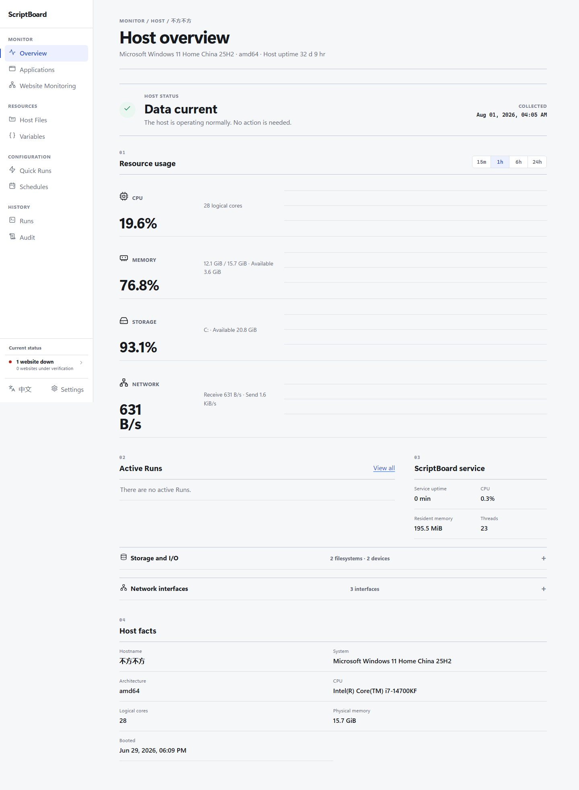

# ScriptBoard

[简体中文](./README.md) | [English](./README_EN.md)

> 把一台主机上的可信脚本，变成可浏览、可执行、可计划、可审计的操作台。

ScriptBoard 是面向单台 Windows 或 Linux 主机、单管理员场景的自托管脚本管理器。它直接管理指定目录中的现有文件，让管理员通过浏览器完成宿主状态观察、文件管理、脚本执行、实时日志、快捷执行、定时计划、审计追踪与本地版本恢复。

ScriptBoard 不要求注册脚本，不复制脚本到独立工作区，也不引入代理集群、消息队列或生产环境 Node.js 运行时。

> [!WARNING]
> ScriptBoard 不是安全沙箱。脚本会继承 ScriptBoard 服务进程的操作系统身份、权限和环境变量。默认安装的 Windows 服务使用 LocalSystem，Linux systemd 服务使用 root。请只运行完全可信的脚本。



## 能做什么

### 观察一台主机

- 展示 CPU、内存、存储、磁盘 I/O、网络与 ScriptBoard 进程状态
- 每 5 秒采样，提供 15 分钟、1 小时、6 小时和 24 小时视图
- 明确区分数据正常、采集失败、数据过期和关键卷空间不足
- 在概览中直接查看活动执行与最近执行

### 管理受管文件

- 浏览、搜索、排序和分页查看受管根目录
- 选择文件或拖放上传；支持新建目录、下载、移动和重命名
- 安全预览文本、Markdown、代码与常见光栅图片
- 在线编辑不超过 1 MiB 的 UTF-8 文本，并通过摘要检查避免覆盖外部修改
- 删除内容先进入应用回收站，可恢复或永久清理
- 拒绝进入符号链接、Junction、Reparse Point 和跨卷挂载边界

### 运行可信脚本

- 直接执行受管目录中的 PowerShell、Python、Shell、Batch 和 CMD 脚本
- 以脚本所在目录作为工作目录，无需预先注册
- 通过 SSE 实时查看 stdout 与 stderr，刷新页面后可继续读取
- 支持参数模板、普通文本变量、执行超时和两阶段停止
- Windows 使用 Job Object、Linux 使用进程组清理子进程树
- 保留不可从 Web 界面删除的执行历史

默认执行器链：

| 平台 | 扩展名 | 默认候选 |
| --- | --- | --- |
| Windows | `.ps1` | `pwsh.exe` → `powershell.exe` |
| Windows | `.py` | `py.exe -3` → `python.exe` |
| Windows | `.bat`、`.cmd` | `cmd.exe` |
| Windows | `.sh` | `bash.exe` |
| Linux | `.sh` | `bash` → `sh` |
| Linux | `.py` | `python3` → `python` |
| Linux | `.ps1` | `pwsh` |

实例只会使用宿主机实际存在的执行器。也可以在配置文件中按扩展名覆盖执行器链。

### 复用与计划

- 从文件或历史执行保存快捷执行项
- 对快捷执行项分组、排序、复制和软锁，减少误编辑与误删除
- 使用标准五字段 Cron 表达式创建计划，并预览未来五次触发
- 对计划分组、排序、启停或立即执行
- 为每个计划配置超时与重叠策略
- 服务停机期间不补跑错过的计划，也不使用系统 crontab

### 追踪与恢复

- 记录认证、文件、执行、变量、快捷执行、计划和版本保护操作
- 按条件筛选运行与审计记录，并导出完整审计 CSV
- 可选启用本地 Git 版本保护，自动建立变更检查点
- 查看单文件历史，并以新提交恢复指定版本
- 执行批次前后建立检查点，避免把运行中的文件变化错误归因

版本保护只使用本地仓库，不会执行 `push`、`pull`、`fetch` 或其他远程操作。它用于恢复误改，不是异机备份。

## 产品边界

ScriptBoard 有意保持单机、可信边界和低运行复杂度。当前不提供：

- 多用户、RBAC 或逐脚本权限
- 脚本沙箱、容器隔离或运行身份切换
- 多主机编排、队列、DAG 或全局并发限制
- 公共 API、插件、通知或交互式终端
- Git 远程同步、Git LFS、整仓恢复或用户侧备份命令
- Docker 正式部署、自动更新或高可用部署

## 支持的平台

| 操作系统 | 架构 | 发布内容 |
| --- | --- | --- |
| Windows 10/11、Windows Server 2019+ | amd64、arm64 | ZIP，包含服务程序和托盘程序 |
| 使用 systemd 的 Linux | amd64、arm64 | tar.gz，包含服务程序 |

从 [GitHub Releases](https://github.com/backinfile/ScriptBoard/releases/latest) 下载适合当前系统的压缩包，并使用同一发布中的 `SHA256SUMS` 验证文件完整性。

## 快速开始

### Windows

解压发布包，在 PowerShell 中运行：

```powershell
.\scriptboard.exe serve
```

打开 <http://127.0.0.1:8787>。默认用户名为 `admin`，初始一次性密码位于：

```text
C:\ProgramData\ScriptBoard\state\secrets\initial-admin-password
```

首次登录后必须设置新密码。直接运行模式下请保持 PowerShell 窗口开启；需要开机自动运行时，请安装 Windows 服务。

### Linux

解压发布包并安装二进制：

```bash
tar -xzf scriptboard-v1.0.0-linux-amd64.tar.gz
chmod +x scriptboard
sudo install -m 0755 scriptboard /usr/local/bin/scriptboard
sudo scriptboard serve
```

打开 <http://127.0.0.1:8787>。默认用户名为 `admin`，初始一次性密码位于：

```text
/var/lib/scriptboard/state/secrets/initial-admin-password
```

## 安装为系统服务

服务安装会记录当前 `scriptboard` 可执行文件和配置文件的位置。请先把程序放到长期使用的位置，再创建并验证配置。

### Windows 服务

将以下内容保存为 `C:\ProgramData\ScriptBoard\config.yaml`：

```yaml
managed_root: C:\ProgramData\ScriptBoard\managed
state_root: C:\ProgramData\ScriptBoard\state
listen: 127.0.0.1:8787
run_timeout_grace_seconds: 30
```

在管理员 PowerShell 中运行：

```powershell
.\scriptboard.exe config validate --config C:\ProgramData\ScriptBoard\config.yaml
.\scriptboard.exe service install --config C:\ProgramData\ScriptBoard\config.yaml
.\scriptboard.exe service start
.\scriptboard.exe service status
```

安装服务后可以启动托盘控制器：

```powershell
.\scriptboard-tray.exe --config C:\ProgramData\ScriptBoard\config.yaml
```

托盘程序可以查看服务与 HTTP 就绪状态、启停服务、打开管理页面及数据目录。退出托盘不会停止 ScriptBoard 服务。

### Linux systemd 服务

将以下内容保存为 `/etc/scriptboard/config.yaml`：

```yaml
managed_root: /var/lib/scriptboard/managed
state_root: /var/lib/scriptboard/state
listen: 127.0.0.1:8787
run_timeout_grace_seconds: 30
```

然后安装并启动服务：

```bash
sudo scriptboard config validate --config /etc/scriptboard/config.yaml
sudo scriptboard service install --config /etc/scriptboard/config.yaml
sudo scriptboard service start
sudo scriptboard service status
```

卸载服务不会删除配置、受管文件、数据库、日志或本地 Git 历史。

## 配置

配置优先级从低到高为：

```text
内置默认值 → YAML 配置 → SCRIPTBOARD_* 环境变量 → 命令行参数
```

完整配置示例：

```yaml
managed_root: C:\ProgramData\ScriptBoard\managed
state_root: C:\ProgramData\ScriptBoard\state
listen: 127.0.0.1:8787

tls_cert: C:\ProgramData\ScriptBoard\tls\server.crt
tls_key: C:\ProgramData\ScriptBoard\tls\server.key
trusted_proxies:
  - 127.0.0.1/32

git_executable: C:\Program Files\Git\cmd\git.exe
run_timeout_grace_seconds: 30

admin_username: admin
admin_password_file: C:\ProgramData\ScriptBoard\secrets\admin-password

executor_chains:
  .py:
    - C:\Python313\python.exe
```

| 配置项 | 作用 |
| --- | --- |
| `managed_root` | 浏览器可以管理的唯一文件目录 |
| `state_root` | SQLite、会话、日志、密钥与内部状态目录 |
| `listen` | HTTP/HTTPS 监听地址，默认 `127.0.0.1:8787` |
| `tls_cert`、`tls_key` | 非回环监听时必须同时提供 |
| `trusted_proxies` | 可以提供转发头的可信代理 IP 或 CIDR |
| `git_executable` | 可选的系统 Git CLI 绝对路径 |
| `run_timeout_grace_seconds` | 自动超时后强制结束进程树前的宽限秒数 |
| `admin_username` | 启动时的权威管理员用户名覆盖 |
| `admin_password` | 启动时的权威明文密码覆盖，不建议写入配置文件 |
| `admin_password_file` | 从权限受限文件读取权威管理员密码 |
| `executor_chains` | 按扩展名覆盖执行器；路径必须是绝对路径 |

YAML 使用严格字段校验，未知配置项会导致启动或验证失败。

支持的环境变量：

```text
SCRIPTBOARD_MANAGED_ROOT
SCRIPTBOARD_STATE_ROOT
SCRIPTBOARD_LISTEN
SCRIPTBOARD_GIT_EXECUTABLE
SCRIPTBOARD_TLS_CERT
SCRIPTBOARD_TLS_KEY
SCRIPTBOARD_TRUSTED_PROXIES
SCRIPTBOARD_RUN_TIMEOUT_GRACE_SECONDS
SCRIPTBOARD_ADMIN_USERNAME
SCRIPTBOARD_ADMIN_PASSWORD
SCRIPTBOARD_ADMIN_PASSWORD_FILE
```

常用命令：

```text
scriptboard serve
scriptboard service install|uninstall|start|stop|restart|status
scriptboard admin reset
scriptboard config validate
scriptboard doctor
scriptboard version
```

## 网络与安全

- 默认只监听 `127.0.0.1:8787`，不会直接暴露到局域网或互联网。
- 无 TLS 时只允许回环监听；非回环地址必须同时配置 `tls_cert` 与 `tls_key`。
- 同机 HTTPS 反向代理可以通过 `trusted_proxies` 接入；只有可信代理传入的转发头会被接受。
- 所有受保护页面、文件、日志、SSE 与执行入口都要求有效管理员 Session。
- 状态修改使用 CSRF 防护；响应设置 CSP、`X-Frame-Options`、`nosniff` 等安全头。
- 密码使用 Argon2id 保存；会话凭据只保存哈希。
- 变量值以明文保存。标记为密码只会让界面默认隐藏显示，不会加密数据。
- 同一 State Root 只允许一个 ScriptBoard 实例运行。

如果忘记管理员密码，请停止服务，并使用相同配置执行：

```powershell
.\scriptboard.exe admin reset --config C:\ProgramData\ScriptBoard\config.yaml
```

新的一次性密码会写入 State Root 下的 `secrets/initial-admin-password`。

## 数据与升级

默认目录：

| 内容 | Windows | Linux |
| --- | --- | --- |
| 受管文件 | `C:\ProgramData\ScriptBoard\managed` | `/var/lib/scriptboard/managed` |
| 内部状态 | `C:\ProgramData\ScriptBoard\state` | `/var/lib/scriptboard/state` |
| 配置文件 | `C:\ProgramData\ScriptBoard\config.yaml` | `/etc/scriptboard/config.yaml` |

升级前停止服务，用新版本替换原二进制，再重新启动：

```text
scriptboard service stop
scriptboard service start
```

ScriptBoard 启动时会自动执行只向前兼容的 SQLite 迁移，并在迁移旧数据库前创建内部快照。不要使用旧版本打开已经由新版本升级过的 State Root。

## 技术架构

ScriptBoard 的生产运行时是一个 Go 服务进程：

```text
浏览器
  └─ 服务端渲染 HTML + 原生 JavaScript + SSE
       └─ ScriptBoard
            ├─ 受管文件系统
            ├─ 脚本进程与事件日志
            ├─ 内置 Cron 调度器
            ├─ SQLite 内部状态
            ├─ 可选本地 Git 仓库
            └─ 宿主资源采样
```

主要目录：

| 路径 | 内容 |
| --- | --- |
| `cmd/scriptboard/` | CLI、HTTP 服务和系统服务入口 |
| `cmd/scriptboard-tray/` | Windows 托盘控制器 |
| `internal/app/` | 认证、数据库、Web 路由、模板与业务编排 |
| `internal/managedfiles/` | 受管目录边界与文件操作 |
| `internal/runmanager/` | 执行状态机、进程树、参数与事件日志 |
| `internal/scheduler/` | 五字段 Cron 解析与内置调度 |
| `internal/gitprotect/` | 本地 Git 检查点与单文件恢复 |
| `internal/hoststatus/` | 宿主指标采样、聚合与状态判断 |
| `internal/platformservice/` | Windows Service 与 systemd 管理 |
| `integration/browser/` | Playwright Chromium 回归门禁与界面快照 |
| `docs/adr/` | 架构决策记录 |

核心依赖包括 Go 标准库、SQLite、Argon2id、`robfig/cron`、`gopsutil` 和 Windows `systray`。Web 使用 `html/template`、原生 CSS/JavaScript 与内嵌静态资源，不需要生产前端构建链。

## 从源码开发

需要 Go 1.26：

```powershell
go test ./... -count=1
go build ./cmd/scriptboard
```

Windows 托盘程序：

```powershell
go build ./cmd/scriptboard-tray
```

浏览器回归门禁仅用于开发，需要 Node.js、pnpm 与 Playwright Chromium：

```powershell
cd integration/browser
pnpm install
pnpm test
```

构建 Windows/Linux、amd64/arm64 的便携发布包：

```powershell
./scripts/build-release.ps1 -Version development
```

产物写入 `dist/`，同时生成 `SHA256SUMS`。

## 项目文档

- [产品需求](./docs/PRD.md)
- [验收标准](./docs/ACCEPTANCE.md)
- [数据模型与状态机](./docs/DATA-MODEL.md)
- [领域词汇](./CONTEXT.md)
- [产品与界面原则](./PRODUCT.md)
- [设计系统](./DESIGN.md)
- [架构决策](./docs/adr/README.md)
- [Chromium 浏览器门禁](./integration/browser/README.md)
