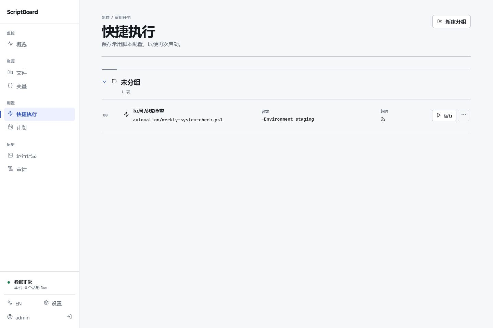

# ScriptBoard

简体中文 | [English](./README_EN.md)

> 在浏览器里管理、运行和计划一台主机上的可信脚本。

ScriptBoard 是一款面向单台 Windows 或 Linux 主机的自托管脚本操作台。无需登记或搬迁已有脚本，打开浏览器即可管理主机文件、运行脚本、查看日志并安排定时任务。

[下载最新版本](https://github.com/backinfile/ScriptBoard/releases/latest) · [快速开始](#快速开始) · [安装为系统服务](#安装为系统服务) · [常见问题](#常见问题)

> [!WARNING]
> ScriptBoard 不是安全沙箱。脚本会使用 ScriptBoard 服务的系统身份、权限和环境变量运行。请只运行可信脚本，只向可信用户开放，并且不要将服务直接暴露到公网。



## 主要功能

- 浏览、搜索、上传、下载、预览和编辑主机文件；
- 运行 PowerShell、Python、Shell、Batch 和 CMD 脚本，实时查看输出；
- 将常用脚本保存为快捷执行，复用参数与变量；
- 使用五字段 Cron 创建计划任务；
- 查看宿主资源、本机应用、Docker 容器、网站状态、运行历史和审计记录；
- 通过可选的 AI 助手引用当前资源并辅助分析；
- 从 ScriptBoard 回收站恢复通过网页误删的文件；
- 在网页中检查、下载并安装经过签名验证的正式更新。

网页支持简体中文和美式英语，可在桌面或移动浏览器中使用。

## 支持环境

| 系统 | 架构 | 发布包 |
| --- | --- | --- |
| Windows 10/11、Windows Server 2019+ | amd64、arm64 | ZIP，包含服务、托盘和更新程序 |
| 使用 systemd 的 Linux | amd64、arm64 | tar.gz，包含服务和更新程序 |

请在主机上安装脚本所需的解释器，例如 PowerShell、Python 或 Bash。ScriptBoard 不提供 Docker 部署包。

## 快速开始

### 1. 下载并解压

从 [GitHub Releases](https://github.com/backinfile/ScriptBoard/releases/latest) 下载与系统和架构匹配的完整压缩包，并解压到独立目录。

### 2. 启动便携实例

Windows PowerShell：

```powershell
New-Item -ItemType Directory -Force .\state
.\scriptboard.exe serve --state-root "$PWD\state"
```

Linux：

```bash
chmod +x ./scriptboard
mkdir -p ./state
./scriptboard serve --state-root "$PWD/state"
```

### 3. 登录

打开 <http://127.0.0.1:8787>，用户名为 `admin`。初始密码位于：

```text
state/secrets/initial-admin-password
```

登录后请先在“账户”中更换密码，然后前往“文件”选择已有脚本，或上传脚本并运行。

## 安装为系统服务

安装前，请准备一个 YAML 配置文件。仅使用本机默认设置时，内容可以是：

```yaml
{}
```

> [!IMPORTANT]
> 请从完整的正式发布包执行安装。若主机上仍有旧式 ScriptBoard 服务，请先停止并卸载，再进行全新安装。

### Windows

将配置保存为 `C:\ProgramData\ScriptBoard\config.yaml`，在管理员 PowerShell 中运行：

```powershell
.\scriptboard.exe config validate --config C:\ProgramData\ScriptBoard\config.yaml
.\scriptboard.exe service install --config C:\ProgramData\ScriptBoard\config.yaml
.\scriptboard.exe service start
.\scriptboard.exe service status
```

服务默认安装到 `C:\Program Files\ScriptBoard`，状态数据保存在 `C:\ProgramData\ScriptBoard\state`。安装时会为当前 Windows 用户配置托盘自启动。

### Linux

将配置保存为 `/etc/scriptboard/config.yaml`，运行：

```bash
sudo ./scriptboard config validate --config /etc/scriptboard/config.yaml
sudo ./scriptboard service install --config /etc/scriptboard/config.yaml
sudo /opt/scriptboard/current/scriptboard service start
sudo /opt/scriptboard/current/scriptboard service status
```

服务默认安装到 `/opt/scriptboard`，状态数据保存在 `/var/lib/scriptboard/state`。

## 使用提示

### 文件与脚本

Windows 从各个可用卷开始浏览，Linux 从 `/` 开始浏览。文件页中的操作直接作用于主机文件；通过网页删除或替换的文件会先进入 ScriptBoard 回收站。

脚本参数用空格分隔，包含空格的参数可使用单引号或双引号。参数框不会展开管道、重定向、通配符或命令替换。

### 快捷执行与计划

运行脚本后，可将脚本路径、参数模板和超时保存为快捷执行项。计划使用标准五字段 Cron，例如 `0 2 * * *` 表示每天 02:00 运行。服务停止期间错过的计划不会补跑。

### AI 助手

AI 功能默认关闭。管理员可在“系统设置 → AI”安装与当前版本匹配的 Pi Runtime，再添加 OpenAI、Anthropic 或 OpenAI 兼容服务。

对话内容和明确引用的资源会发送到所选模型服务，可能产生费用。启用前请确认服务商的隐私、费用和数据驻留政策。

### 用户角色

| 角色 | 适合人群 |
| --- | --- |
| 管理员 | 管理全部功能、用户和系统设置 |
| 维护员 | 管理文件、运行、计划、监控和系统设置 |
| 执行员 | 查看普通文件并运行脚本 |
| 观察员 | 只读查看监控和历史 |

角色为实例级固定权限，暂不支持自定义角色或逐脚本授权。

## 网络与配置

默认只监听 `127.0.0.1:8787`。如需远程访问，请使用可信 VPN、零信任网络或 HTTPS 反向代理；直接监听非本机地址时必须配置 TLS 证书和私钥。

常用配置：

```yaml
state_root: C:\ProgramData\ScriptBoard\state
listen: 127.0.0.1:8787
update_check: true
update_check_interval_hours: 6
```

Linux 请将 `state_root` 改为 `/var/lib/scriptboard/state`。修改配置后运行：

```text
scriptboard config validate --config CONFIG_PATH
scriptboard doctor --config CONFIG_PATH
```

配置优先级为：内置默认值 → YAML 配置 → `SCRIPTBOARD_*` 环境变量 → 命令行参数。

## 更新与备份

正式版本会定期检查 GitHub Releases，但不会自动安装。管理员可在“系统设置 → 更新”中下载、验证并安装新版本；有脚本正在运行时不会切换版本。

请定期备份：

- 需要保留的主机文件；
- `state_root`，其中包含数据库、运行日志、会话、审计和 AI 数据；
- 服务使用的 `config.yaml`。

从旧版本升级前请先备份。当前版本可自动升级 schema 20 数据库；更早版本的数据库和旧式配置不会自动迁移。

## 常见问题

先运行只读诊断：

```text
scriptboard doctor --config CONFIG_PATH
```

| 问题 | 优先检查 |
| --- | --- |
| 页面无法打开 | 服务状态、监听地址、端口占用和 TLS/反向代理设置 |
| 脚本无法启动 | 对应解释器是否安装，服务身份是否有权访问脚本和工作目录 |
| 文件写入或运行被拒绝 | 路径是否受保护或占用，目标磁盘可用空间是否不足 |
| 计划没有补跑 | 服务停止期间错过的计划不会补跑 |

重置管理员密码前先停止服务，然后运行：

```text
scriptboard admin reset --config CONFIG_PATH
```

新的一次性密码会写入 `state_root/secrets/initial-admin-password`。

更多命令可运行 `scriptboard help` 查看。开发、测试和发布说明请参阅 [项目文档](./docs/)。
