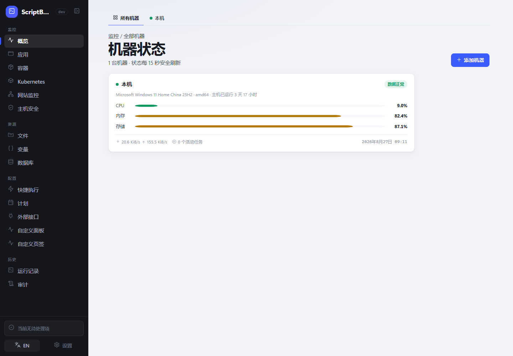
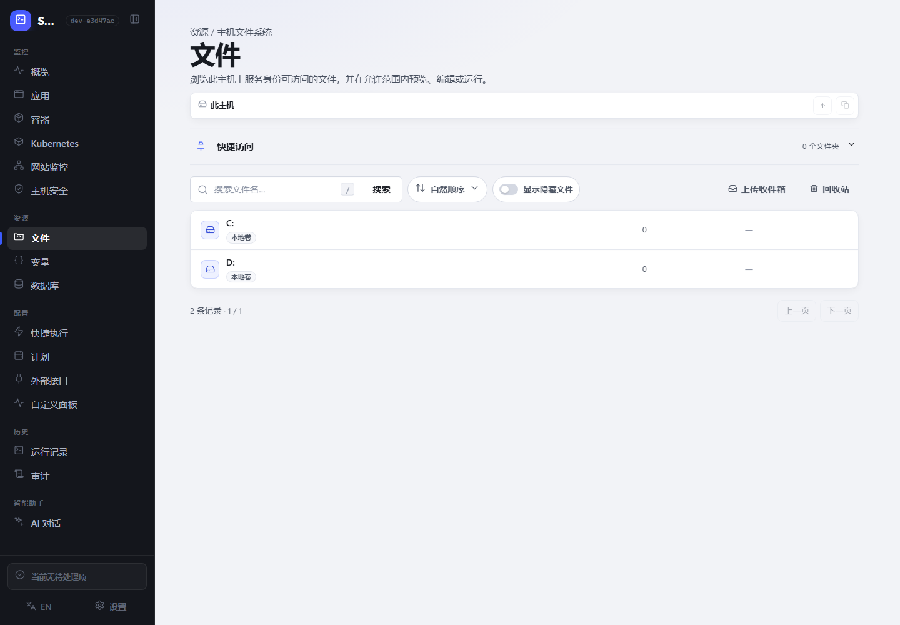
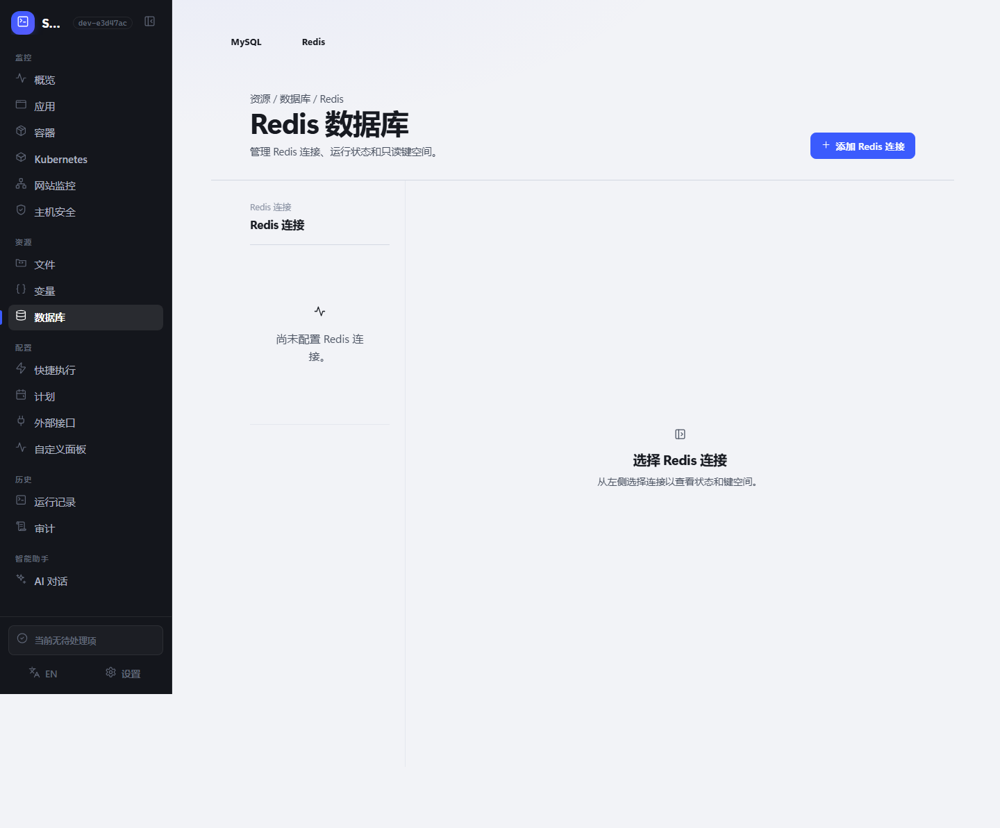

# ScriptBoard

简体中文 | [English](./README_EN.md)

**在浏览器里管理一台 Windows 或 Linux 主机上的文件、脚本和运行状态。**

ScriptBoard 适合个人服务器、小团队工具机和内部运维主机。它直接使用主机上已有的脚本，不要求先迁移到专用仓库，也不把常见操作藏在复杂的编排流程里。

[下载最新版本](https://github.com/backinfile/ScriptBoard/releases/latest) · [安装](#安装) · [快速上手](#快速上手) · [常见问题](#常见问题)

> [!WARNING]
> ScriptBoard 不是不可信代码沙箱。请只运行可信脚本，只向可信用户开放，并避免把管理界面直接暴露到公网。



## 能做什么

- **管理文件**：浏览、搜索、预览、编辑、批量上传和下载主机文件；网页删除的文件可从回收站恢复。
- **运行脚本**：支持 PowerShell、Python、Shell、Batch 和 CMD，实时查看输出、耗时和结果。
- **复用任务**：把常用脚本保存为快捷执行，配置参数、变量、超时和五字段 Cron 计划。
- **查看主机**：集中查看 CPU、内存、存储、应用、Docker、Kubernetes、网站状态和运行历史。
- **管理数据连接**：备份和恢复 MySQL/MariaDB；只读查看 Redis 状态、键类型、TTL 和内存占用。
- **保护操作边界**：提供固定角色、审计、主机安全检查、受限外部接口和签名更新。

<p align="center">
  
  
</p>

界面支持简体中文和美式英语，并适配桌面与移动浏览器。

## 支持环境

| 系统 | 架构 | 发布包 |
| --- | --- | --- |
| Windows 10/11、Windows Server 2019+ | amd64、arm64 | 单文件 `*-setup.exe` |
| 使用 systemd 的 Linux | amd64、arm64 | 单文件 `.run` |

主机需要自行安装脚本使用的解释器，例如 PowerShell、Python 或 Bash。ScriptBoard 不提供 Docker 部署包。

## 安装

推荐安装为系统服务。安装器会完成解包、校验、服务注册和启动；默认只监听 `127.0.0.1:8787`，无需提前创建配置文件。

### Windows

从 [GitHub Releases](https://github.com/backinfile/ScriptBoard/releases/latest) 下载匹配架构的 Setup，在管理员 PowerShell 中运行：

```powershell
.\scriptboard-vX.Y.Z-windows-amd64-setup.exe
```

程序安装到 `C:\Program Files\ScriptBoard`，数据保存在 `C:\ProgramData\ScriptBoard\state`。

### Linux

下载匹配架构的 `.run` 文件后运行：

```bash
chmod +x ./scriptboard-vX.Y.Z-linux-amd64.run
sudo ./scriptboard-vX.Y.Z-linux-amd64.run
```

程序安装到 `/opt/scriptboard`，数据保存在 `/var/lib/scriptboard/state`。

安装成功会显示版本号和 `STATE: RUNNING`。需要复核服务时运行：

```text
scriptboard service status
scriptboard service verify
```

### 便携体验

便携模式适合先体验文件、脚本和监控功能。它只启动当前用户身份下的 Web 进程，不提供防火墙、主机安全等特权操作。

```powershell
.\scriptboard-vX.Y.Z-windows-amd64-setup.exe --extract-to C:\ScriptBoard-Portable
Set-Location C:\ScriptBoard-Portable
New-Item -ItemType Directory -Force .\state
.\scriptboard.exe serve --state-root "$PWD\state"
```

```bash
chmod +x ./scriptboard-vX.Y.Z-linux-amd64.run
./scriptboard-vX.Y.Z-linux-amd64.run --extract-to "$PWD/scriptboard-portable"
cd ./scriptboard-portable
mkdir -p state
./scriptboard serve --state-root "$PWD/state"
```

## 快速上手

1. 打开 <http://127.0.0.1:8787>。
2. 使用用户名 `admin` 登录。初始密码位于 `state_root/secrets/initial-admin-password`。
3. 在“设置 → 账户”修改密码，并按需配置 passkey 或 TOTP。
4. 打开“资源 → 文件”，选择已有脚本，或上传文件后创建快捷执行。

上传多个文件时，ScriptBoard 会先校验整个批次，再统一写入；失败不会留下半个批次。文件与目录都可固定到实例级“快捷访问”；固定文件会打开其所在目录并定位到该文件，条目名称和顺序可直接编辑。

## 常用功能

### 快捷执行与计划

快捷执行保存脚本路径、参数、超时和脚本摘要。脚本内容变化后，旧配置会拒绝运行，需由有权限的用户重新发布。“调整顺序”会在当前页面原地开启所有分组的拖动状态。计划使用标准五字段 Cron，例如 `0 2 * * *` 表示每天 02:00 运行；服务停止期间错过的计划不会补跑。

外部接口的每个调用功能都可单独开启“需要审批”（默认关闭）。开启后，变量、日志、文件上传和快捷执行调用先进入“审批”页签；上传内容在调用时写入私有缓存，只有人工批准后才写入目标文件系统。拒绝、配置变化或恢复失败都不会执行目标动作，批准操作只会领取一次。

### 监控与连接

ScriptBoard 可查看本机资源、应用、Docker 容器、多个 Kubernetes 集群、网站和其他 ScriptBoard 机器。Kubernetes 连接默认仅观察，可明确开启有限操作。

MySQL、Redis、Kubernetes 和网站连接均保留协议支持的安全与明文模式。选择明文会暴露凭据和数据；显式跳过证书验证会带来中间人攻击风险，界面会保留并提示你的选择。

### 用户角色

| 角色 | 适合的使用方式 |
| --- | --- |
| 管理员 | 管理全部功能、用户和系统设置 |
| 维护员 | 管理文件、运行、计划、监控和连接 |
| 执行员 | 查看普通文件并运行脚本 |
| 观察员 | 只读查看监控和历史 |

角色作用于整个实例。当前不支持自定义角色或逐脚本授权。

## 网络与配置

默认配置适合本机访问。只有需要修改监听地址、TLS、状态目录或反向代理设置时，才需要 YAML 文件。

```yaml
state_root: C:\ProgramData\ScriptBoard\state
listen: 127.0.0.1:8787
allowed_hosts:
  - 127.0.0.1
  - localhost
update_check: true
```

Linux 的 `state_root` 通常为 `/var/lib/scriptboard/state`。修改后先检查：

```text
scriptboard config validate --config CONFIG_PATH
scriptboard doctor --config CONFIG_PATH
scriptboard audit verify --config CONFIG_PATH
```

若需要远程访问，请优先使用可信 VPN、零信任网络或 HTTPS 反向代理。非回环监听必须明确配置允许的 Host；不要依赖未受信代理传入的转发头。

## 更新与备份

管理员可在“系统设置 → 更新”下载并安装正式版本。更新包会校验签名、平台、大小和 SHA-256；有脚本正在运行时不会切换版本。

请定期备份：

- 需要保留的主机文件；
- `state_root`；
- 自定义 `config.yaml`；
- 与 State Root 配套的外部凭据主密钥和审计签名材料。

内置 CLI 可创建认证加密的私有状态备份。恢复前必须停止全部 ScriptBoard 服务；完整命令和跨主机恢复要求见 [项目文档](./docs/)。升级前请先备份，数据库迁移只向前执行。

## 常见问题

先运行只读诊断：

```text
scriptboard doctor --config CONFIG_PATH
```

| 问题 | 优先检查 |
| --- | --- |
| 页面打不开 | 服务状态、监听地址、端口和 TLS/反向代理 |
| 脚本无法运行 | 解释器是否安装，服务身份是否能读取脚本和工作目录 |
| 文件操作被拒绝 | 路径是否受保护、被占用或磁盘空间不足 |
| 计划没有补跑 | 停机期间错过的计划不会自动重放 |

重置管理员密码前先停止服务，再运行：

```text
scriptboard admin reset --config CONFIG_PATH
```

新的一次性密码会写入 `state_root/secrets/initial-admin-password`。

## 更多信息

- [发布说明](./docs/RELEASE_NOTES.md)
- [安全报告方式](./SECURITY.md)
- [项目文档](./docs/)
- `scriptboard help`：查看全部本地命令
