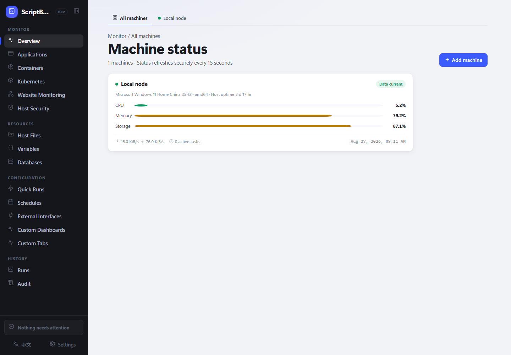
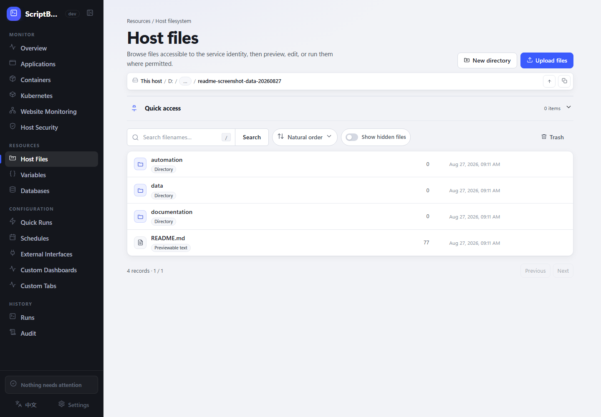
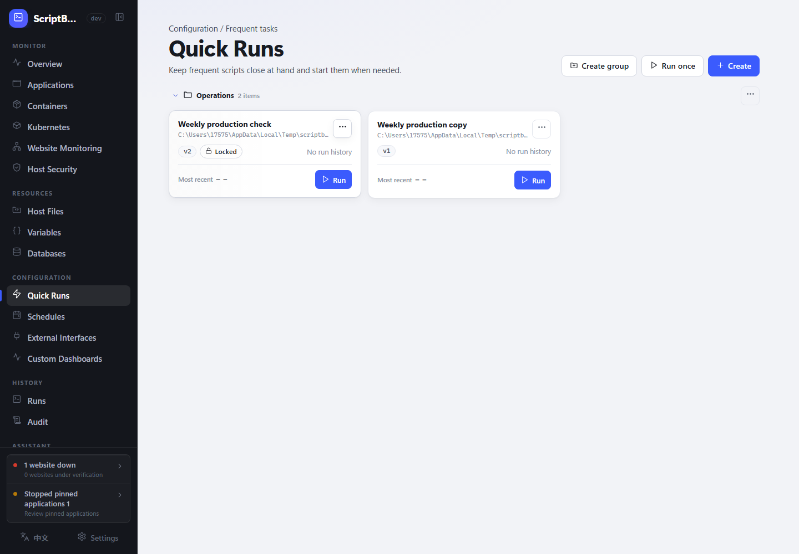

# ScriptBoard

[简体中文](./README.md) | English

**Manage one Windows or Linux host—files, scripts, and runtime status—from a browser.**

ScriptBoard is built for personal servers, small-team utility hosts, and internal operations machines. It works with scripts already on the host, without requiring you to move them into a special repository or build an orchestration stack first.

[Download the latest release](https://github.com/backinfile/ScriptBoard/releases/latest) · [Install](#install) · [First steps](#first-steps) · [Troubleshooting](#troubleshooting)

> [!WARNING]
> ScriptBoard is not a sandbox for untrusted code. Run only trusted scripts, grant access only to trusted users, and do not expose the management interface directly to the public internet.



## What it does

- **Manage files:** browse, search, preview, edit, batch-upload, and download host files; restore web-deleted files from Trash.
- **Run scripts:** execute PowerShell, Python, Shell, Batch, and CMD scripts with live output, duration, and results.
- **Reuse tasks:** save scripts as Quick Runs with parameters, variables, timeouts, and five-field Cron schedules.
- **Observe the host:** inspect CPU, memory, storage, applications, Docker, Kubernetes, websites, and run history.
- **Manage data connections:** back up and restore MySQL/MariaDB; inspect Redis health, key types, TTLs, and memory without mutation.
- **Keep boundaries visible:** use fixed roles, audit records, host-security checks, bounded external triggers, and signed updates.

<p align="center">
  
  
</p>

The interface is available in Simplified Chinese and US English and works on desktop and mobile browsers.

## Supported environments

| System | Architectures | Release package |
| --- | --- | --- |
| Windows 10/11 and Windows Server 2019+ | amd64, arm64 | Single-file `*-setup.exe` |
| Linux with systemd | amd64, arm64 | Single-file `.run` |

Install the interpreters your scripts need, such as PowerShell, Python, or Bash. ScriptBoard does not provide a Docker deployment package.

## Install

A system-service installation is recommended. The installer extracts, verifies, registers, and starts the services. Defaults listen only on `127.0.0.1:8787`, so no configuration file is required first.

### Windows

Download the matching Setup from [GitHub Releases](https://github.com/backinfile/ScriptBoard/releases/latest), then run it from an elevated PowerShell window:

```powershell
.\scriptboard-vX.Y.Z-windows-amd64-setup.exe
```

Program files go to `C:\Program Files\ScriptBoard`; state is stored under `C:\ProgramData\ScriptBoard\state`.

### Linux

Download the matching `.run` file, then execute:

```bash
chmod +x ./scriptboard-vX.Y.Z-linux-amd64.run
sudo ./scriptboard-vX.Y.Z-linux-amd64.run
```

Program files go to `/opt/scriptboard`; state is stored under `/var/lib/scriptboard/state`.

A successful installation reports the version and `STATE: RUNNING`. To verify it later, run:

```text
scriptboard service status
scriptboard service verify
```

### Portable trial

Portable mode is useful for trying files, scripts, and monitoring. It runs only the Web process as the current user, so privileged host-security and firewall operations are unavailable.

```powershell
.\scriptboard-vX.Y.Z-windows-amd64-setup.exe --extract-to C:\ScriptBoard-Portable
Set-Location C:\ScriptBoard-Portable
New-Item -ItemType Directory -Force .\state
.\scriptboard.exe serve --state-root "$PWD\state"
```

```bash
chmod +x ./scriptboard-vX.Y.Z-linux-amd64.run
./scriptboard-vX.Y.Z-linux-amd64.run --extract-to "$PWD/scriptboard-portable"
cd ./scriptboard-portable
mkdir -p state
./scriptboard serve --state-root "$PWD/state"
```

## First steps

1. Open <http://127.0.0.1:8787>.
2. Sign in as `admin`. The initial password is in `state_root/secrets/initial-admin-password`.
3. Change the password under Settings → Account, then add a passkey or TOTP if needed.
4. Open Resources → Host Files, select an existing script, or upload files and create a Quick Run.

For multi-file uploads, ScriptBoard validates the whole batch before committing it, so a failed batch does not leave partial results. Files and directories can both be pinned to instance-wide Quick access. A pinned file opens its containing directory and focuses the file; display names and ordering can be edited in place.

## Everyday use

### Quick Runs and schedules

A Quick Run stores a script path, arguments, timeout, and script digest. If the script changes, the old configuration refuses to start until an authorized user republishes it. Reorder switches every group into draggable mode on the current page. Schedules use standard five-field Cron; for example, `0 2 * * *` runs every day at 02:00. Missed schedules are not replayed after downtime.

Each External Interface function can independently require approval; the default is off. Variable, log, upload, and Quick Run calls that require approval first appear on the Approvals tab. Every approval has a type-specific detail drawer showing variable before/after values, pending log content, Quick Run configuration, or the cached upload content together with its target directory and name-conflict outcome. Reviewers can download a pending cached upload without claiming it or writing it to the target directory. Upload content reaches the target filesystem only after approval. Rejection, configuration drift, and failed recovery do not execute the target action, and each approval can be claimed only once.

### Monitoring and connections

ScriptBoard can show local resources, applications, Docker containers, multiple Kubernetes clusters, websites, and other ScriptBoard machines. Kubernetes connections start in observe-only mode; limited operations must be enabled explicitly.

MySQL, Redis, Kubernetes, website, and model endpoints preserve the secure and plaintext modes supported by their protocols. Plaintext exposes credentials and data. Explicitly skipping certificate verification risks man-in-the-middle attacks; the UI preserves and warns about that choice.

### Roles

| Role | Intended use |
| --- | --- |
| Administrator | All features, users, and system settings |
| Maintainer | Files, runs, schedules, monitoring, and connections |
| Operator | Read regular files and start scripts |
| Viewer | Read-only monitoring and history |

Roles apply to the whole instance. Custom roles and per-script permissions are not currently supported.

## Network and configuration

The defaults are suitable for local access. Create a YAML file only when you need to change the listen address, TLS, state directory, or reverse-proxy settings.

```yaml
state_root: C:\ProgramData\ScriptBoard\state
listen: 127.0.0.1:8787
allowed_hosts:
  - 127.0.0.1
  - localhost
update_check: true
```

On Linux, `state_root` is normally `/var/lib/scriptboard/state`. Validate changes before restarting:

```text
scriptboard config validate --config CONFIG_PATH
scriptboard doctor --config CONFIG_PATH
scriptboard audit verify --config CONFIG_PATH
```

For remote access, prefer a trusted VPN, zero-trust network, or HTTPS reverse proxy. A non-loopback listener requires an explicit Host allowlist; forwarded headers from untrusted proxies are ignored.

## Updates and backups

Administrators can download and install stable releases under System Settings → Updates. Every package is checked against its signature, platform, size, and SHA-256. ScriptBoard will not switch versions while a script is running.

Back up these items regularly:

- host files that must be retained;
- `state_root`;
- a custom `config.yaml`;
- the external credential master key and audit-signing material paired with the State Root.

The CLI can create an authenticated encrypted Private State Backup. Stop all ScriptBoard services before restoring. See the [project documentation](./docs/) for complete commands and cross-host recovery requirements. Back up before upgrading; database migrations are forward-only.

## Troubleshooting

Start with the read-only diagnostic:

```text
scriptboard doctor --config CONFIG_PATH
```

| Problem | Check first |
| --- | --- |
| The page does not open | Service state, listen address, port, and TLS/reverse proxy |
| A script does not run | Required interpreter and service-identity access to the script and working directory |
| A file operation is rejected | Protected or busy path, or insufficient disk space |
| A schedule did not catch up | Missed schedules are not replayed after downtime |

Stop the service before resetting the Administrator password, then run:

```text
scriptboard admin reset --config CONFIG_PATH
```

The new one-time password is written to `state_root/secrets/initial-admin-password`.

## More information

- [Release notes](./docs/RELEASE_NOTES.md)
- [Security reporting](./SECURITY.md)
- [Project documentation](./docs/)
- `scriptboard help` for all local commands
