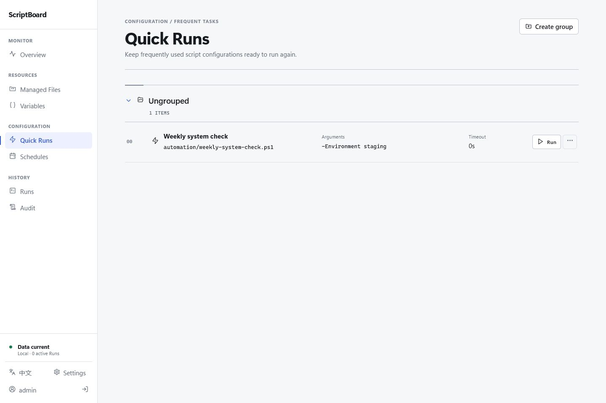

# ScriptBoard

[简体中文](./README.md) | English

> Manage, run, and schedule trusted scripts on one host from your browser.

ScriptBoard is a self-hosted script console for a single Windows or Linux host. You can work with existing scripts in place, manage host files, run scripts, follow logs, and create schedules without registering or moving every script first.

[Download the latest release](https://github.com/backinfile/ScriptBoard/releases/latest) · [Quick start](#quick-start) · [Install as a system service](#install-as-a-system-service) · [Troubleshooting](#troubleshooting)

> [!WARNING]
> ScriptBoard is not a sandbox for untrusted code. Scripts run under the separate Runner identity with a minimal ScriptBoard-provided environment, resource bounds, and default-deny networking. Run only trusted scripts, grant access only to trusted users, and never expose Web directly to the public internet.



## What you can do

- Browse, search, upload, download, preview, and edit host files;
- run PowerShell, Python, Shell, Batch, and CMD scripts with live output;
- save frequently used scripts as Quick Runs with reusable parameters and variables, then review recent results at a glance;
- type Variables as text, Boolean, integer, float, or an `x.y.z` version while still expanding every value as one string argument at runtime;
- create schedules with five-field Cron expressions;
- expose bounded inbound triggers for logs, uploads, Quick Runs, and constrained variable updates;
- review remote-login activity and manage Windows Defender Firewall or Linux UFW and Fail2Ban;
- view host resources, local applications, Docker containers, multiple Kubernetes clusters, websites, run history, and audit records, and compose importable custom monitoring dashboards, including multi-image Registry version cards;
- manage local or remote MySQL/MariaDB instances with checksummed logical backups and safety rollback;
- use the optional AI assistant with resources you choose to reference;
- restore files deleted through the web interface from ScriptBoard Trash;
- check, download, and install signed stable updates from the web interface.

The web interface is available in Simplified Chinese and US English and works on desktop and mobile browsers.

## Supported environments

| System | Architectures | Release package |
| --- | --- | --- |
| Windows 10/11 and Windows Server 2019+ | amd64, arm64 | Single-file `*-setup.exe` installer |
| Linux with systemd | amd64, arm64 | Single executable `.run` installer |

Install the interpreters required by your scripts, such as PowerShell, Python, or Bash. ScriptBoard does not provide an official Docker deployment package.

## Quick start

### 1. Download and extract for portable use

Download the single-file installer for your system and architecture from [GitHub Releases](https://github.com/backinfile/ScriptBoard/releases/latest). For portable mode, extract its embedded complete release into a dedicated directory:

```powershell
.\scriptboard-vX.Y.Z-windows-amd64-setup.exe --extract-to C:\ScriptBoard-Portable
Set-Location C:\ScriptBoard-Portable
```

```bash
chmod +x ./scriptboard-vX.Y.Z-linux-amd64.run
./scriptboard-vX.Y.Z-linux-amd64.run --extract-to "$PWD/scriptboard-portable"
cd ./scriptboard-portable
```

### 2. Start a portable instance

Windows PowerShell:

```powershell
New-Item -ItemType Directory -Force .\state
.\scriptboard.exe serve --state-root "$PWD\state"
```

Linux:

```bash
chmod +x ./scriptboard
mkdir -p ./state
./scriptboard serve --state-root "$PWD/state"
```

Portable mode starts only the Web process, so privileged writes such as host firewall, Fail2ban, UFW, and system component installation are unavailable by default. Use the system-service installation below when those capabilities are required; the installer registers the protected `scriptboard-broker` service as well.

### 3. Sign in

Open <http://127.0.0.1:8787> and sign in as `admin`. The initial password is stored at:

```text
state/secrets/initial-admin-password
```

Change the password under Account, then open Files to select an existing script or upload and run one.

## Install as a system service

No YAML configuration file is needed when using the built-in defaults. ScriptBoard listens only on `127.0.0.1:8787` by default.

> [!IMPORTANT]
> Run installation from a complete stable release package. If the host still has a legacy ScriptBoard service, stop and uninstall it before performing a clean installation.

### Windows

Download the stable Setup for the matching architecture, then run it in an elevated PowerShell window:

```powershell
.\scriptboard-vX.Y.Z-windows-amd64-setup.exe
```

Setup safely extracts the embedded release, then installs, verifies, and starts ScriptBoard as one product. Success reports the product version and `STATE: RUNNING`. Advanced diagnostics remain available through the installed `scriptboard.exe service status` and `service verify`. Pass configuration options through Setup when needed, for example `.\scriptboard-vX.Y.Z-windows-amd64-setup.exe --config C:\secure\scriptboard.yaml`.

The service is installed under `C:\Program Files\ScriptBoard`, and state is stored under `C:\ProgramData\ScriptBoard\state`. Installation initializes state and registers Web, `ScriptBoardBroker`, `ScriptBoardAI`, and `ScriptBoardRunner` as one versioned product. Web runs as low-privilege `LocalService`, while the LocalSystem Broker owns Docker named-pipe and Kubernetes cluster access through the protected local IPC interface; Web does not need membership in `docker-users`. AI Host and Runner use separate restricted service SIDs, default-deny network policy, bounded SCM crash recovery, and demand-start; Web receives only `START + QUERY_STATUS` on those two services. Installation also enables the tray app for the current Windows user.

### Linux

Download the stable `.run` for the matching architecture, then execute it:

```bash
chmod +x ./scriptboard-vX.Y.Z-linux-amd64.run
sudo ./scriptboard-vX.Y.Z-linux-amd64.run
```

The `.run` safely extracts the embedded release, then installs, verifies, and starts ScriptBoard as one product. Success reports the product version and `STATE: RUNNING`. Advanced diagnostics remain available through `sudo /opt/scriptboard/current/scriptboard service status` and `service verify`. Pass configuration options through the installer when needed, for example `sudo ./scriptboard-vX.Y.Z-linux-amd64.run --config /etc/scriptboard/custom.yaml`.

The service is installed under `/opt/scriptboard`, and state is stored under `/var/lib/scriptboard/state`. Installation creates separate Web, Broker, AI Host, and Runner service identities as one versioned product. Web and Broker stay resident; protected systemd sockets activate AI Host and Runner on demand. Web does not run as root; host mutations, the local Docker socket, and Kubernetes cluster access are owned by the root Broker and reached only through a local Unix socket with peer-UID verification.

Create a YAML configuration file only when you need to change settings such as the listen address, TLS, or the state directory, then pass it during installation with `--config CONFIG_PATH`. Without that flag, ScriptBoard uses the platform's default configuration path (`C:\ProgramData\ScriptBoard\config.yaml` on Windows or `/etc/scriptboard/config.yaml` on Linux); if the file does not exist, the built-in defaults are used.

After installing ScriptBoard as a system service, Administrators and Maintainers can restart it from System Settings → Updates. A restart briefly disconnects the page and stops every active Run; the page reconnects when the service is ready. This control is not available to portable instances.

System Settings → Service Logs reads only the four fixed managed services from systemd journal or the Windows System Event Log. A query scans at most 2,000 entries and returns 500, supports service/time/severity/message filters, and exports the current CSV. Messages are redacted before display and export; arbitrary units, Windows service names, and file paths are not accepted.

## Using ScriptBoard

### Files and scripts

On Windows, Files starts from the available volumes. On Linux, it starts from `/`. File operations affect the host filesystem directly. Files deleted or replaced through the web interface first go to ScriptBoard Trash. Files with unknown extensions also receive a read-only preview when bounded content detection recognizes safe UTF-8 text; files that do not pass detection remain download-only.

After a multi-file upload, a dialog reports every successful, skipped, or failed item. Closing it refreshes the current directory without leaving Files.

Separate script arguments with spaces and quote arguments that contain spaces. The argument field does not expand pipes, redirections, wildcards, or command substitutions.

Run details keep output navigation, TXT download, and live pause controls in the log toolbar, so you can move directly to the top or bottom without changing the whole-page scroll position.

### Quick Runs and schedules

After running a script, save its path, argument template, and timeout as a Quick Run. The Quick Runs list shows the five most recent results and latest duration, with direct links to each Run and the script directory. Schedules use standard five-field Cron expressions; for example, `0 2 * * *` runs every day at 02:00. Missed triggers are not replayed after the service restarts.

### Kubernetes monitoring

Administrators and maintainers can configure multiple clusters in the **Cluster connections** tab under **Monitor → Kubernetes**, then switch the active cluster from the **Cluster monitor** tab. Managed installations have the Privileged Broker read the kubeconfig; enter an absolute host path readable by the Broker and optionally select a context. The kubeconfig `current-context` is used by default. A kubeconfig being registered or tested for the first time must embed token, CA, client-certificate, and private-key data instead of referencing external credential files; saved connections are then bound exactly to their database path, context, and mode. Connections start in observe-only mode. Limited operations can be explicitly enabled for rolling redeploys, single-step replica changes, and running a CronJob now. Portable mode continues to use the identity that started ScriptBoard.

The **Local management** tab manages kubeconfigs for the ScriptBoard service identity. It can switch between the default config and paths already registered as cluster connections; import and merge entries by name; inspect, search, use, edit, rename, or delete Contexts; and download the complete config or an isolated Context YAML. Imports are limited to 2 MiB and published through an atomic same-directory replacement. Every mutation requires Administrator or Maintainer permission, CSRF validation, and an audit record.

The kubeconfig `server` may use `http://` or `https://`. HTTPS connections validate the kubeconfig CA and client certificate or system trust. HTTP connections may still use static tokens or basic authentication, but credentials and cluster data travel in plaintext. ScriptBoard does not store kubeconfig tokens, certificates, or private keys, and rejects `exec`/`auth-provider` login plugins and `insecure-skip-tls-verify`. For managed installations, ensure that the Broker identity can read the kubeconfig and any referenced CA, token, or client-certificate files.

### Custom dashboards and website monitoring

Administrators and Maintainers can combine external JSON data with existing Website Monitoring results under Configuration → Custom Dashboards, create number, percentage, quota, key-value, website, and Registry cards, and import or export dashboard configurations. JSON sources and registries support HTTP and HTTPS, and a Registry Bearer token service may independently use either mode. HTTP sends request headers, credentials, and responses in plaintext. Unsaved card settings can be tested and mapped from the returned JSON structure. Failed refreshes retain the last successful value and expose redacted request diagnostics only to authorized operators; test responses are not written to the database or audit records. Imports and exports preserve URL schemes, while Registry passwords are excluded from exports. Public dashboards expose only generic result states without revealing sources, request headers, formulas, diagnostics, or management controls.

Website checks support HTTP, HTTPS, WS, and WSS. They can send custom HTTP or handshake headers and resolve `{{VARIABLE_NAME}}` references when a check runs; imports and exports preserve the scheme and TLS-verification setting. For secrets, use password variables instead of writing credentials directly into an exportable monitor configuration. To consolidate multiple ScriptBoard hosts, use the bounded external interface below over HTTP or HTTPS; HTTP sends the Key and monitoring response in plaintext.

### External Interfaces

Administrators and Maintainers can create time-limited keys under Configuration → External Interfaces. Each key may contain multiple named function entries for recording a log, uploading one file to a fixed directory, starting one existing Quick Run, updating one non-password variable under Boolean, integer, enum, or short-text constraints, or exposing a read-only Website Monitoring snapshot.

Call an entry with `POST /trigger/GROUP_NAME/ENTRY_NAME` and `Authorization: Bearer KEY`. Administrators and Maintainers can copy the complete key from the key-management area; Operators and Viewers cannot view it. HTTP and HTTPS are both supported; HTTP sends the Key and request content in plaintext. Keep the Key in a secret store, prefer HTTPS or a trusted network, and disable or rotate it when the calling system no longer needs access.

Website Monitoring entries use `GET` instead of `POST`. To view one ScriptBoard instance from another, copy the complete call URL and Key, open Monitor → Websites on the receiving instance, and choose Connect ScriptBoard. Remote monitors appear in a separate read-only ledger; the receiving instance cannot check, pause, edit, reorder, or delete them. The remote Key is encrypted in the receiving instance's State Root.

### Host security

Monitoring → Host Security brings together Windows login events or Linux SSH login records, remote-login configuration, and firewall status. Its Security Updates tab reads pending security updates from existing Windows Update Agent or Debian/Ubuntu APT metadata without refreshing sources, downloading, or installing packages. Security Baseline aggregates runtime privilege, firewall state, update metadata, plus Linux SSH/Fail2Ban or Windows firewall profiles into evidence-backed checks and a read-only score. Only available checks are scored; this is not compliance certification and it never changes the system automatically. On Windows, it can manage Windows Defender Firewall rules. On Linux, it can install Fail2Ban and UFW, inspect or remove SSH bans, and synchronize UFW rules and default policies after a change review.

Every role can inspect the detected state; only Administrators and Maintainers can change host defenses. Firewall, remote-login, and ban operations can interrupt access to the host. Confirm that the Privileged Broker runs as LocalSystem or root, preserve an allow rule for the active management port, and keep an out-of-band recovery path; do not elevate Web, Runner, or AI Host for these operations.

### MySQL backup and restore

Administrators and Maintainers can register local or remote MySQL/MariaDB instances under Resources → Databases, inspect databases and core status, run manual or five-field Cron logical backups, and restore `.sql` or `.sql.gz` files. Each connection can explicitly disable TLS, prefer TLS, require TLS, or verify the certificate and host identity; disabling TLS sends credentials and database traffic in plaintext. ScriptBoard does not bundle database clients; install `mysqldump` and `mysql` on the host PATH or configure their absolute paths in the page.

Each database is stored in a separate `.sql.gz` file with a SHA-256 digest. Replacing or deleting a database requires a successful safety backup and full-name confirmation; a failed replacement automatically attempts rollback. Artifacts default to `state_root/database-backups/mysql`, and a custom directory is also protected from host-file operations. Keep an independent off-host copy for disaster recovery.

### AI assistant

AI is disabled by default. An Administrator can install the matching Pi Runtime under System Settings → AI, then add an OpenAI, Anthropic, or OpenAI-compatible provider. Model endpoints support HTTP and HTTPS; HTTP sends the API Key, prompts, and model responses in plaintext.

Conversation content and explicitly referenced resources are sent to the selected provider and may incur charges. Review the provider's privacy, pricing, and data-residency terms before enabling AI.

### User roles

| Role | Intended access |
| --- | --- |
| Administrator | All features, users, and system settings |
| Maintainer | Files, runs, schedules, monitoring, and system settings |
| Operator | Read regular files and start scripts |
| Viewer | Read-only monitoring and history |

Roles are fixed for the whole instance. Custom roles and per-script permissions are not currently supported.

## Network and configuration

ScriptBoard listens only on `127.0.0.1:8787` by default. You can explicitly select another address through configuration, environment variables, or `--listen`. A non-loopback listener exposes the privileged management interface to the network; in production, configure TLS or restrict access through a trusted VPN, zero-trust network, or HTTPS reverse proxy.

Common settings:

```yaml
state_root: C:\ProgramData\ScriptBoard\state
listen: 127.0.0.1:8787
update_check: true
update_check_interval_hours: 6
```

On Linux, use `/var/lib/scriptboard/state` for `state_root`. After changing the configuration, run:

```text
scriptboard config validate --config CONFIG_PATH
scriptboard doctor --config CONFIG_PATH
```

Configuration precedence is: built-in defaults → YAML file → `SCRIPTBOARD_*` environment variables → command-line flags.

Administrator startup credentials no longer accept plaintext `admin_password`, `SCRIPTBOARD_ADMIN_PASSWORD`, or `--admin-password`; legacy configuration is rejected with migration guidance. To override credentials at startup, use only an absolute `admin_password_file`, `SCRIPTBOARD_ADMIN_PASSWORD_FILE`, or `--admin-password-file`. First start and `scriptboard admin reset` still create a permission-restricted one-time credential file inside the State Root, which is deleted after the password is changed.

## Updates and backups

Stable releases periodically check GitHub Releases but never install updates automatically. An Administrator can download, verify, and install an update under System Settings → Updates. ScriptBoard will not switch versions while a script is running.

Back up these locations regularly:

- host files that must be retained;
- `state_root`, which contains the database, run logs, sessions, audit records, and AI data;
- the service `config.yaml` file, if you created a custom configuration.

The local CLI can create an authenticated encrypted Private State Backup. The
passphrase must be stored in an absolute regular-file path and contain at least
16 bytes; the output must be outside the State Root and is never overwritten.
Stop all ScriptBoard services before restore, then repeat the Backup ID returned
by `inspect`:

```text
scriptboard backup create --output ABSOLUTE_BACKUP_PATH --passphrase-file ABSOLUTE_PASSPHRASE_FILE --config CONFIG_PATH
scriptboard backup inspect --archive ABSOLUTE_BACKUP_PATH --passphrase-file ABSOLUTE_PASSPHRASE_FILE
scriptboard backup restore --archive ABSOLUTE_BACKUP_PATH --passphrase-file ABSOLUTE_PASSPHRASE_FILE --confirm-backup-id BACKUP_ID --config CONFIG_PATH
```

The package contains a consistent SQLite snapshot, Broker ciphertexts, and a
fixed allowlist of private evidence. It excludes the external master key, audit
signing key, configuration, TLS material, diagnostic logs, upload inbox, and
MySQL backups. The current restore flow requires the matching external keys and
the current signed checkpoint for the same State Root path. It revokes restored
web sessions, preserves the previous private state and checkpoint, and records
an audit-continuity event before issuing a new checkpoint.

Back up before upgrading from an older version. The current release uses database schema 49 and can migrate schemas 20–48 automatically; older databases and legacy configuration files are not migrated automatically. Schema 45 adds the durable Registry connection operation log, schema 46 adds its crash-safe completion phase, schema 47 separates External Interface display labels from URL call names, schema 48 converts the single Kubernetes connection and its retained history into independently monitored multiple connections, and schema 49 adds Variable value types while migrating existing Variables to `text`.

When the panel is unavailable or compromise is suspected, use the local out-of-band emergency commands below. Mutations require an exact fixed confirmation or the complete Key ID and are atomically appended to the audit chain as `local-administrator`; evidence export verifies the chain first, creates only a new file, and never overwrites existing evidence:

```text
scriptboard emergency pause-external --confirm PAUSE-EXTERNAL --config CONFIG_PATH
scriptboard emergency revoke-key --key-id KEY_ID --confirm-key-id KEY_ID --config CONFIG_PATH
scriptboard emergency export-evidence --output ABSOLUTE_JSONL_PATH --config CONFIG_PATH
```

On an isolated or offline host, provide the formal single-file installer together with `release-manifest.json` and `release-manifest.json.sig`. The command below verifies the embedded signing trust root, platform, file name, size, SHA-256, embedded payload boundaries, and `RELEASE.json` without installing or changing the current version:

```text
scriptboard update verify-package --archive ABSOLUTE_ARCHIVE_PATH --manifest ABSOLUTE_MANIFEST_PATH --signature ABSOLUTE_SIGNATURE_PATH
```

If the current managed release files are intact but the service pointer is damaged, stop the service, revalidate the formal current release, and rebuild the pointer. The command leaves the service stopped:

```text
scriptboard update repair-current --confirm REPAIR-CURRENT --config CONFIG_PATH
```

Every successful update retains that operation's pre-update database snapshot. To roll back a committed update, stop the service and repeat the operation ID. Rollback restores both the prior release and that snapshot, so it discards State Root database changes made after the update; preserve current evidence and state first:

```text
scriptboard update recover --operation OPERATION_ID --confirm-operation OPERATION_ID --config CONFIG_PATH
```

Formal releases follow the [update signing key runbook](./docs/UPDATE-SIGNING-KEY-RUNBOOK.md) for rotation, dual signing, revocation, and compromise response. The revocation list is embedded in client binaries; an older client that has not received it needs an independently authenticated manual upgrade and cannot trust revocation information asserted by the compromised key itself.

## Troubleshooting

Start with the read-only diagnostic:

```text
scriptboard doctor --config CONFIG_PATH
```

| Problem | Check first |
| --- | --- |
| The page does not open | Service status, listen address, port conflicts, and TLS/reverse-proxy settings |
| A script does not start | Required interpreter installation and service-account access to the script and working directory |
| A file write or run is rejected | Protected or busy paths and available disk space |
| A schedule did not catch up | Missed triggers are not replayed while the service is stopped |

Stop the service before resetting the Administrator password, then run:

```text
scriptboard admin reset --config CONFIG_PATH
```

The new one-time password is written to `state_root/secrets/initial-admin-password`.

Run `scriptboard help` for more commands. See the [project documentation](./docs/) for development, testing, and release details.
