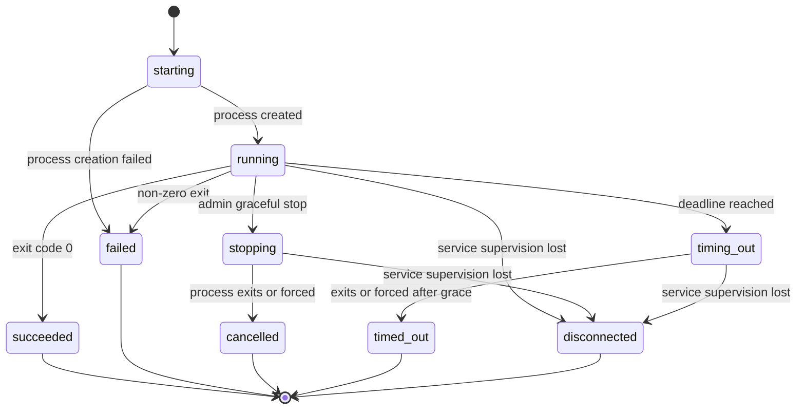
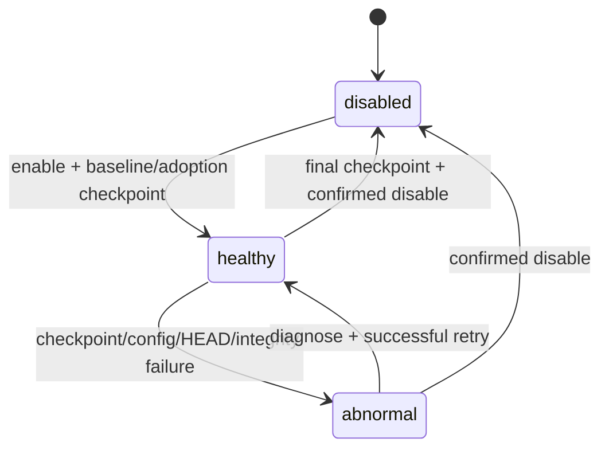

# ScriptBoard 数据模型与状态机

本文描述冻结 MVP 的逻辑数据模型。字段类型用于表达约束，具体 SQL 类型由实现选择；所有 ID 建议使用不可预测的 UUID，所有绝对时间以 UTC 保存。

## 1. 核心原则

- 文件系统是受管条目的事实来源，不建立通用 File 表。
- 数据库只保存应用身份、引用、执行、计划、审计与 Git 管理状态。
- 文件引用保存相对受管根目录的规范路径，并在使用时重新验证真实路径、设备/卷与文件类型。
- Run 是不可删除的执行事实；日志是有保留期的外部文件。
- 参数同时保存模板与实际展开值，因为变量全部是普通明文数据。

## 2. 实体

### Admin

| 字段 | 约束 |
|---|---|
| id | 唯一固定管理员 ID |
| username | 唯一；默认 `admin` |
| password_hash | 版本化 Argon2id 编码 |
| must_change_password | 首次登录为 true |
| credential_version | 凭据变更时递增，用于撤销 Session |
| created_at / updated_at | UTC |

### Session

| 字段 | 约束 |
|---|---|
| id | 内部 ID |
| admin_id | 固定关联 Admin |
| token_hash | 唯一；不保存浏览器原 Token |
| csrf_secret | 服务端 CSRF 派生材料 |
| credential_version | 必须等于 Admin 当前版本 |
| created_at / last_seen_at / expires_at | 12 小时空闲、7 天绝对期限 |
| source_ip / user_agent | 审计辅助；按最小必要保存 |
| revoked_at | 可空 |

### LoginThrottle

| 字段 | 约束 |
|---|---|
| key_type / key_value_hash | IP 或 admin 维度；避免保存不必要原值 |
| failure_count | 成功登录后清零 |
| blocked_until | 最长 5 分钟 |
| updated_at | UTC |

### Variable

| 字段 | 约束 |
|---|---|
| id | UUID |
| name | 唯一；`[A-Z][A-Z0-9_]{0,63}` |
| value | 普通明文；最大 4 KiB；允许空 |
| created_at / updated_at | UTC |

删除前必须检查 QuickRun 和 Schedule 引用；重命名在同一事务更新活动引用。

### QuickRun

| 字段 | 约束 |
|---|---|
| id | UUID |
| name | 管理员定义 |
| script_path | 规范相对路径 |
| argument_text | 原始模板文本 |
| argument_template | 解析后的模板数组 |
| timeout_seconds | 可空代表无超时 |
| always_confirm | 默认 false |
| source_run_id | 关联不可删除 Run |
| sort_order | 管理员排序 |
| validity | 派生值，不作为唯一事实来源 |
| created_at / updated_at | UTC |

### Schedule

| 字段 | 约束 |
|---|---|
| id | UUID |
| name | 管理员定义 |
| script_path | 规范相对路径 |
| argument_text / argument_template | 变量引用模板 |
| cron_expression | 标准五段 cron |
| timeout_seconds | 可空代表无超时 |
| overlap_policy | `allow` 或 `skip_if_same_script_running` |
| enabled | 删除脚本时自动 false |
| next_fire_at | UTC 派生缓存，可重算 |
| created_at / updated_at | UTC |

### ScheduleTrigger

| 字段 | 约束 |
|---|---|
| id | UUID |
| schedule_id | 计划删除后可保留历史关系或快照 |
| schedule_name_snapshot | 永久可解释 |
| scheduled_for / observed_at | UTC |
| outcome | `run_created`、`skipped_overlap`、`missed_downtime`、`failed_pre_start` |
| run_id | outcome 为 run_created 时必填 |
| reason | 可空，不含秘密 |

未创建 Run 的明细保留一年，之后进入 ScheduleTriggerAggregate。

### ScheduleTriggerAggregate

| 字段 | 约束 |
|---|---|
| schedule_id / schedule_name_snapshot | 历史身份 |
| local_date | 按实例时区归档日期 |
| outcome | 聚合结果 |
| count | 正整数 |

### Run

| 字段 | 约束 |
|---|---|
| id | UUID |
| script_path_snapshot | 启动时规范相对路径 |
| script_file_id_snapshot | 平台文件身份，用于诊断 |
| script_sha256 | 启动瞬间摘要 |
| script_versioned | 启动时 Git 保护状态 |
| argument_text | 原始参数模板 |
| argument_template | 模板参数数组 |
| resolved_arguments | 启动时实际参数数组 |
| source_type | `manual`、`quick_run`、`schedule` |
| source_id / source_name_snapshot | 可空；历史解释 |
| runtime_identity_name / runtime_identity_id | 用户名/UID 或账号/SID |
| executor | 实际可执行文件与固定前缀参数 |
| executor_fallback_failures | 更早候选无法启动原因 |
| working_directory_snapshot | 启动时绝对路径或安全相对表达 |
| status | 见状态机 |
| pid / process_group_or_job_id | 活动期信息 |
| exit_code | 可空 |
| timeout_seconds | 可空 |
| created_at / started_at / finished_at | UTC；按状态允许为空 |
| stop_requested_at / force_kill_requested_at | 可空 |
| termination_reason | 可空 |
| error_message | 可空；不得包含秘密 |
| log_manifest_path | 状态目录相对路径 |
| log_expired / log_incomplete / log_truncated | 布尔标记 |

Run 不允许删除。

### RunLogManifest

存于每个 Run 私有日志目录，可同时在数据库保存摘要索引：

- format_version
- first_sequence / last_sequence
- persisted_bytes / discarded_bytes
- head_bytes / tail_bytes
- truncated
- incomplete
- segment 列表及摘要

事件包含 sequence、captured_at、stream、raw bytes。浏览器展示是安全解码视图，不是日志事实来源。

### RunLease

主要为内存态，可在数据库保存恢复提示：

- platform_file_id
- normalized_script_path
- protected_ancestor_paths
- active_run_ids

同一文件多个活动 Run 共享租约计数；最后一个结束才释放。

### TrashEntry

| 字段 | 约束 |
|---|---|
| id | UUID |
| original_path | 删除前相对路径 |
| trash_path | 回收站内部随机路径 |
| entry_type | file 或 directory |
| size | 删除时估算 |
| deleted_at | UTC |
| deleted_by | 固定 admin |
| affected_quick_run_ids / schedule_ids | 可存快照或通过审计关联 |

### AuditEvent

| 字段 | 约束 |
|---|---|
| id | UUID/有序 ID |
| occurred_at | UTC |
| actor_type | `admin`、`scheduler`、`system`、`startup_config` |
| action | 稳定英文标识 |
| target_type / target_id / target_snapshot | 最小必要信息 |
| outcome | success / failure |
| source_ip | Web 操作时保存 |
| details | 结构化、已脱敏 |

不保存密码、Session、CSRF、变量值、文件内容或请求正文。默认保留一年，不允许逐条修改。

### GitProtection

单实例单记录：

| 字段 | 约束 |
|---|---|
| enabled | 管理员开关 |
| state | `disabled`、`healthy`、`abnormal` |
| repository_id | ScriptBoard 仓库标记 |
| branch | 固定 `scriptboard-managed` |
| git_executable | 最终解析路径 |
| max_tracked_file_bytes | 默认 10 MiB |
| max_repository_bytes | 默认 5 GiB |
| last_commit | 可空 |
| pending_batch_run_ids | 活动批次摘要 |
| abnormal_reason | 可空 |
| updated_at | UTC |

Git 是文件系统中的版本事实来源，数据库保存管理状态与审计关联。

## 3. Run 状态机



### 状态不变量

- 启动前路径、参数、变量、执行器和 Git 安全门校验失败时不创建 Run，只写审计。
- Run 创建后初始为 starting；进程创建失败才产生 starting → failed。
- stopping 的最终结果固定为 cancelled；timing_out 的最终结果固定为 timed_out。
- disconnected 是 ScriptBoard 失去监督后的终态，不重新接管 PID。
- 终态 Run 不可删除或回到活动状态。

## 4. Git 保护状态机



### Git 状态不变量

- healthy 才允许新的脚本执行和受保护文件修改。
- 未跟踪文件资格不使仓库 abnormal。
- 任意 Run 活动期间不执行 Git add/commit/restore/gc 或启停。
- abnormal 不自动清理、reset 或切换分支。

## 5. 文件引用不变量

- QuickRun 与 Schedule 引用规范相对路径，不引用任意绝对路径。
- 网页移动在文件系统变更和引用更新间提供补偿回滚。
- 外部移动使引用失效，不按名称、摘要或 inode 猜测新路径。
- Run 保存路径快照，不随当前文件移动。
- 变量重命名更新 QuickRun 与 Schedule；Run 历史不改写。

## 6. 建议索引

- Session(token_hash), Session(expires_at)
- Variable(name)
- QuickRun(sort_order), QuickRun(script_path)
- Schedule(enabled, next_fire_at), Schedule(script_path)
- ScheduleTrigger(schedule_id, scheduled_for), ScheduleTrigger(run_id)
- Run(created_at DESC), Run(status, started_at), Run(script_path_snapshot, status)
- Run(source_type, source_id)
- AuditEvent(occurred_at DESC), AuditEvent(action, occurred_at)
- TrashEntry(original_path), TrashEntry(deleted_at)

## 7. 文件布局

```text
managed-root/
  .git/                       # 可选、受保护且不经网页暴露
  .scriptboard-trash/         # 保留回收站
  ...                         # 管理员文件与脚本

state-root/
  app.db
  app.db-wal
  app.db-shm
  instance.lock
  secrets/
  runs/{run-id}/
    events-*.log
    manifest.json
  logs/
    scriptboard.log
    scriptboard.log.1 ...
  migrations/
    pre-upgrade.db            # 最近一次升级前内部快照
  tmp/
```

受管根目录与状态目录可覆盖，但必须互不包含；`.git/` 与回收站不得成为状态数据库或秘密存储位置。
