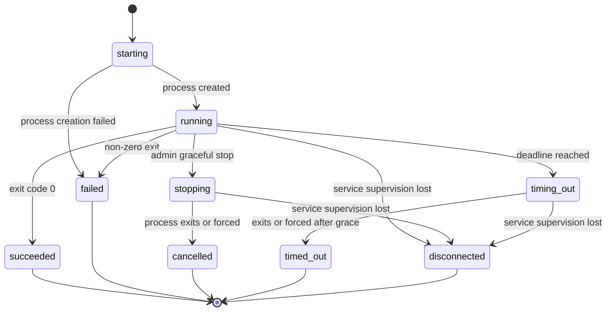
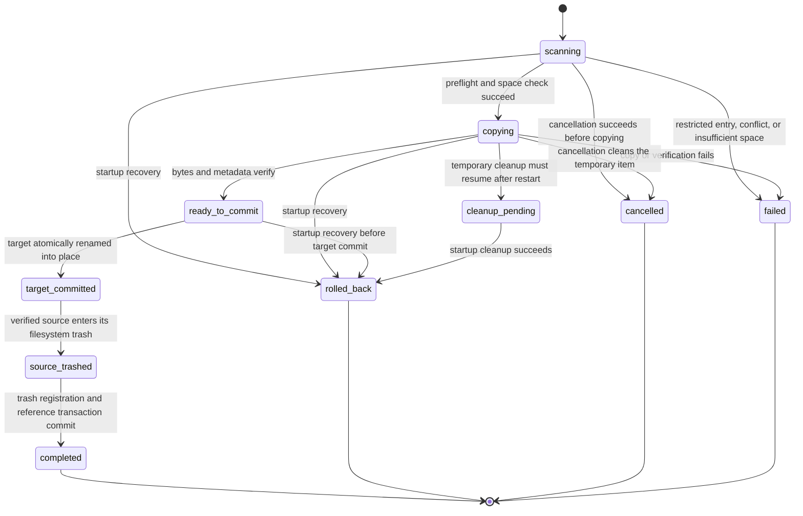
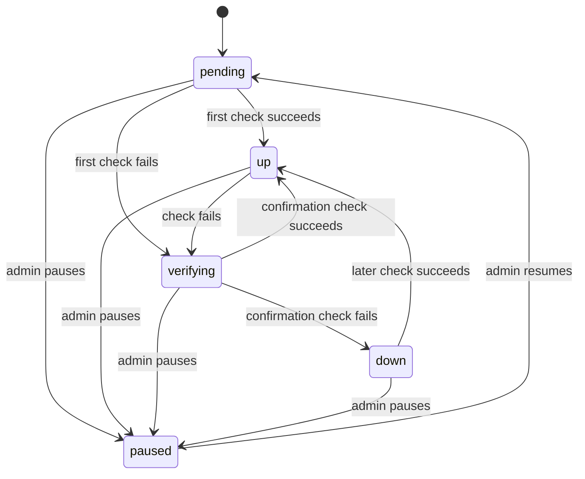

# ScriptBoard 数据模型与状态机

本文描述冻结 MVP 的逻辑数据模型。字段类型用于表达约束，具体 SQL 类型由实现选择；所有 ID 建议使用不可预测的 UUID，所有绝对时间以 UTC 保存。

## 自定义页签（Custom Tab）

`custom_tabs` 保存页签稳定 ID、名称、目标 HTTP/HTTPS URL、启用状态、凭据模式、可见角色与顺序。`credential_mode` 为 `isolated`、`target_state` 或 `key`；`visibility_roles` 保存系统管理员、维护员、执行员和观察员中的非空子集。Key 模式只保存由主机密钥按页签 ID 和目标 Origin 密封的密文。目标 URL 由浏览器直接访问，服务端不会抓取或代理该地址。

启用项按 `sort_order` 出现在“外部”导航，并按当前用户固定角色过滤；无权角色直接访问稳定路由时表现为不存在。Key 模式在角色配置之上继续限制为具备运行配置管理权限的用户。Key 交付 challenge 是进程内短期状态，不进入持久数据模型，消费或过期后立即失效。

## 宿主分钟指标（Host Metric Minute）

宿主状态以五秒实时样本形成完整自然分钟聚合，固定保留 24 小时：

| 字段 | 约束与语义 |
| --- | --- |
| bucket_at | UTC 自然分钟起点，主键 |
| sample_count | 参与聚合的有效五秒样本数 |
| average_json | 公共资源与设备维度的分钟平均值 |
| maximum_json | 同一组指标的分钟峰值 |

未完成分钟不持久化；服务停止或异常退出会形成明确历史缺口。设备消失后的分钟历史保留至自然过期，当前状态标记为离线。该表属于可自动清理的诊断数据，不是审计记录。

## 应用 Pin（Application Pin）

| 字段 | 约束与语义 |
| --- | --- |
| id | 稳定应用 ID，主键 |
| kind / identity | `host` 或 `docker` 与规范身份；组合唯一 |
| name / technical | 最近一次显示名称与可执行路径或镜像 |
| sort_order | 无上限 Pin 列表中的稳定顺序 |
| created_at / updated_at | UTC |

Pin 是展示状态，不赋予应用控制能力。Docker Pin 的 `identity` 固定使用规范化容器名称，不使用镜像标签或容器 ID；因此重建容器和镜像版本变化仍属于同一条观察记录。当前快照存在时由实时事实覆盖保存的名称与技术信息；应用停止或 Docker 数据源不可用时仍保留 Pin 身份。

## 应用分钟指标（Application Metric Minute）

| 字段 | 约束与语义 |
| --- | --- |
| application_id / bucket_at | 应用 ID 与 UTC 自然分钟起点，组合主键 |
| sample_count | 参与聚合的有效五秒样本数 |
| cpu_average / cpu_maximum | 整机归一 CPU 平均值与峰值 |
| memory_average / memory_maximum | 使用字节平均值与峰值 |
| read_average / read_maximum | 读取速率平均值与峰值 |
| write_average / write_maximum | 写入速率平均值与峰值 |

该表只服务已 Pin 应用的 24 小时诊断历史，不是审计记录或长期监控存储。

## 容器版本记录（Application Version）

| 字段 | 约束与语义 |
| --- | --- |
| application_id / observed_at | 按规范化容器名称派生的稳定应用 ID 与观测时间，组合主键 |
| image | 当前镜像引用 |
| container_id | 当前 Docker 容器 ID |

只为已 Pin 容器记录镜像或容器 ID 变化，每个容器最多保留 100 条；版本变化不会改变索引身份。

## 1. 核心原则

- 主机文件系统是文件与目录的事实来源，不建立通用 File 表。
- 数据库只保存应用身份、绝对路径引用、执行、计划、审计、回收条目与持久化文件操作。
- 文件引用同时保存规范绝对路径与平台比较键，并在每次使用时由主机文件模块重新验证保护策略、权限、文件系统和条目类型。
- Run 是不可删除的执行事实；日志是有保留期的外部文件。
- 参数同时保存模板与实际展开值，因为变量全部是普通明文数据。

## 2. 实体

### User

| 字段 | 约束 |
|---|---|
| id | 稳定、不可预测 ID |
| username | 实例内唯一；系统管理员初始默认 `admin` |
| password_hash | 版本化 Argon2id 编码 |
| role | `administrator`、`maintainer`、`operator`、`viewer` 之一 |
| enabled | 系统管理员始终为 true |
| auth_version | 密码、用户名、角色或状态变更时递增，用于撤销 Session |
| created_at / updated_at | UTC |

数据库约束最多一个 `administrator`。普通用户不能提升为系统管理员；账号不永久删除。

### Session

| 字段 | 约束 |
|---|---|
| token_hash | 唯一；不保存浏览器原 Token |
| user_id | 关联 User |
| csrf_token | 随机 CSRF Token |
| auth_version | 必须等于 User 当前版本 |
| created_at / last_seen_at / expires_at | 12 小时空闲、7 天绝对期限 |

### LoginThrottle

| 字段 | 约束 |
|---|---|
| key_type / key_value | 来源 IP 或目标用户名维度 |
| failure_count | 成功登录后清零 |
| blocked_until | 最长 5 分钟 |
| updated_at | UTC |

### Variable

| 字段 | 约束 |
|---|---|
| id | UUID |
| name | 唯一；`[A-Z][A-Z0-9_]{0,63}` |
| value | 普通明文；最大 4 KiB；按 `value_type` 校验格式 |
| note | 可选文字注释；最大 500 个字符；不参与变量解析 |
| value_type | `text`、`bool`、`integer`、`float` 或严格 `x.y.z` 的 `version`；不保存业务范围约束 |
| is_password | 仅控制变量页面默认遮罩，不改变明文存储或解析 |
| created_at / updated_at | UTC |

删除前必须检查 QuickRun 和 Schedule 引用；重命名在同一事务更新活动引用。

### RecordGroup

| 字段 | 约束 |
|---|---|
| id | UUID |
| name | 管理员定义；忽略大小写唯一 |
| sort_order | 分组显示顺序 |
| created_at / updated_at | UTC |

`quick_run_groups` 是共享内容分组目录的兼容物理表；`schedule_groups` 仅作为旧外键的同步影子表，不再拥有独立目录语义。QuickRun、Schedule、Variable、FileQuickAccessPin 与 WebsiteMonitor 都以可空 `group_id` 引用同一目录，并在各自分组内维护 `sort_order`。“未分组”是空引用的派生展示区域，不保存为真实分组。删除真实分组时，五类内容按各自原组内相对顺序追加到“未分组”，不会级联删除。

### QuickRun

| 字段 | 约束 |
|---|---|
| id | UUID |
| name | 管理员定义 |
| script_path / script_path_key | 规范绝对路径及平台比较键 |
| argument_text | 原始模板文本 |
| argument_template | 解析后的模板数组 |
| timeout_seconds | 可空代表无超时 |
| always_confirm | 默认 false |
| source_run_id | 可空；从历史创建时关联不可删除 Run，从文件创建时为空 |
| group_id | 可空；引用 RecordGroup，删除分组时置空 |
| sort_order | 当前分组内排序；未分组条目共享独立排序域 |
| locked | 默认 false；仅阻止管理员编辑和删除 |
| validity | 派生值，不作为唯一事实来源 |
| created_at / updated_at | UTC |

复制 QuickRun 时保留脚本路径、参数模板、超时与可空来源 Run ID，但生成新 ID 且 `locked=false`。复制到原分组时新项紧随来源项；移动到其他分组或“未分组”时追加到目标排序域。软锁不阻止启动、复制、分组移动、排序或系统维护路径引用。

### Schedule

| 字段 | 约束 |
|---|---|
| id | UUID |
| name | 管理员定义 |
| group_id | 可空；引用 RecordGroup，删除分组时置空 |
| sort_order | 当前分组内排序；未分组条目共享独立排序域 |
| script_path / script_path_key | 规范绝对路径及平台比较键 |
| argument_text / argument_template | 变量引用模板 |
| cron_expression | 标准五段 cron |
| timeout_seconds | 可空代表无超时 |
| overlap_policy | `allow` 或 `skip_if_same_script_running` |
| enabled | 删除脚本时自动 false |
| next_fire_at | UTC 派生缓存，可重算 |
| created_at / updated_at | UTC |

### ScheduleTrigger

| 字段 | 约束 |
|---|---|
| id | UUID |
| schedule_id | 计划删除后可保留历史关系或快照 |
| schedule_name_snapshot | 永久可解释 |
| scheduled_for / observed_at | UTC |
| outcome | `run_created`、`skipped_overlap`、`missed_downtime`、`failed_pre_start` |
| run_id | outcome 为 run_created 时必填 |
| reason | 可空，不含秘密 |

未创建 Run 的明细保留一年，之后进入 ScheduleTriggerAggregate。

### ScheduleTriggerAggregate

| 字段 | 约束 |
|---|---|
| schedule_id / schedule_name_snapshot | 历史身份 |
| local_date | 按实例时区归档日期 |
| outcome | 聚合结果 |
| count | 正整数 |

### Run

| 字段 | 约束 |
|---|---|
| id | UUID |
| script_path / script_path_key | 启动时规范绝对路径及平台比较键 |
| script_sha256 | 启动瞬间摘要 |
| script_kind | `host_file` 或 `one_time` |
| argument_text | 原始参数模板 |
| argument_template | 模板参数数组 |
| resolved_arguments | 启动时实际参数数组 |
| source_type | `manual`、`quick_run`、`schedule` |
| source_id / source_name_snapshot | 可空；历史解释 |
| initiator_user_id / initiator_username_snapshot | 系统计划触发时为空 |
| runtime_identity_name / runtime_identity_id | 用户名/UID 或账号/SID |
| executor | 实际可执行文件与固定前缀参数 |
| executor_fallback_failures | 更早候选无法启动原因 |
| working_directory / working_directory_key | 启动时规范绝对路径及平台比较键 |
| status | 见状态机 |
| pid / process_group_or_job_id | 活动期信息 |
| exit_code | 可空 |
| timeout_seconds | 可空 |
| created_at / started_at / finished_at | UTC；按状态允许为空 |
| stop_requested_at / force_kill_requested_at | 可空 |
| termination_reason | 可空 |
| error_message | 可空；不得包含秘密 |
| log_manifest_path | 状态目录相对路径 |
| log_expired / log_incomplete / log_truncated | 布尔标记 |

Run 不允许删除。

### RunLogManifest

存于每个 Run 私有日志目录，可同时在数据库保存摘要索引：

- format_version
- first_sequence / last_sequence
- persisted_bytes / discarded_bytes
- head_bytes / tail_bytes
- truncated
- incomplete
- segment 列表及摘要

事件包含 sequence、captured_at、stream、raw bytes。浏览器展示是安全解码视图，不是日志事实来源。

### RunLease

主要为内存态，可在数据库保存恢复提示：

- platform_file_id
- normalized_script_path
- protected_ancestor_paths
- active_run_ids

同一文件多个活动 Run 共享租约计数；最后一个结束才释放。

### TrashEntry

| 字段 | 约束 |
|---|---|
| id | UUID |
| original_path / original_path_key | 删除前规范绝对路径及平台比较键 |
| stored_path / stored_path_key | 源文件系统私有回收区中的规范绝对路径及比较键 |
| entry_type | file 或 directory |
| size | 删除时估算 |
| deleted_at | UTC |
| affected_quick_run_ids / schedule_ids | 通过确认页和审计关联 |

### AuditEvent

| 字段 | 约束 |
|---|---|
| id | UUID/有序 ID |
| occurred_at | UTC |
| actor_user_id | Web 用户稳定 ID；系统操作为空 |
| actor_username / actor_role | 操作者当时的用户名和角色快照 |
| action | 稳定英文标识 |
| target_type / target_id / target_snapshot | 最小必要信息 |
| outcome | success / failure |
| source_ip | Web 操作时保存 |
| details | 结构化、已脱敏 |

不保存密码、Cookie、Session、CSRF、变量值、文件内容或请求正文。默认保留一年，不允许逐条修改。

### FileOperation

跨文件系统移动的持久化恢复记录：

| 字段 | 约束 |
|---|---|
| id | UUID |
| kind | 当前固定为 `cross_filesystem_move` |
| source_path / source_path_key | 源规范绝对路径及平台比较键 |
| destination_path / destination_path_key | 目标规范绝对路径及平台比较键 |
| temporary_path | 目标同目录临时项；尚未建立时为空 |
| trash_path | 源文件系统回收项；尚未提交源时为空 |
| phase | 预扫描、复制、校验、提交目标、回收源、更新引用、完成或失败 |
| bytes_total / bytes_completed | 扫描后总量与已复制进度 |
| verification_digest | 内容校验摘要 |
| cancel_requested | 持久化取消请求 |
| error | 终态或待恢复错误，不含文件内容与秘密 |
| created_at / updated_at | UTC |

记录必须足以在进程崩溃后判断源、临时项、已提交目标和源回收项的状态，并幂等继续或回滚。

## 3. Run 状态机


```mermaid
stateDiagram-v2
    [*] --> starting
    starting --> running: process created
    starting --> failed: process creation failed
    running --> succeeded: exit code 0
    running --> failed: non-zero exit
    running --> stopping: admin graceful stop
    stopping --> cancelled: process exits or forced
    running --> timing_out: deadline reached
    timing_out --> timed_out: exits or forced after grace
    running --> disconnected: service supervision lost
    stopping --> disconnected: service supervision lost
    timing_out --> disconnected: service supervision lost
    succeeded --> [*]
    failed --> [*]
    cancelled --> [*]
    timed_out --> [*]
    disconnected --> [*]
```

### 状态不变量

- 启动前路径、保护策略、权限、参数、变量或执行器校验失败时不创建 Run，只写审计。
- Run 创建后初始为 starting；进程创建失败才产生 starting → failed。
- stopping 的最终结果固定为 cancelled；timing_out 的最终结果固定为 timed_out。
- disconnected 是 ScriptBoard 失去监督后的终态，不重新接管 PID。
- 终态 Run 不可删除或回到活动状态。

## 4. 跨文件系统移动状态机


```mermaid
stateDiagram-v2
    [*] --> scanning
    scanning --> copying: preflight and space check succeed
    scanning --> failed: restricted entry, conflict, or insufficient space
    scanning --> cancelled: cancellation succeeds before copying
    copying --> ready_to_commit: bytes and metadata verify
    copying --> failed: copy or verification fails
    copying --> cancelled: cancellation cleans the temporary item
    copying --> cleanup_pending: temporary cleanup must resume after restart
    ready_to_commit --> target_committed: target atomically renamed into place
    target_committed --> source_trashed: verified source enters its filesystem trash
    source_trashed --> completed: trash registration and reference transaction commit
    scanning --> rolled_back: startup recovery
    copying --> rolled_back: startup recovery
    ready_to_commit --> rolled_back: startup recovery before target commit
    cleanup_pending --> rolled_back: startup cleanup succeeds
    completed --> [*]
    rolled_back --> [*]
    cancelled --> [*]
    failed --> [*]
```

### 文件操作状态不变量

- 目标提交前失败或取消必须清理临时项并保持源不变。
- 目标只通过同目录原子重命名变为可见；源只移动到带实例所有权标记的同文件系统回收区。
- 目标提交后不得把操作伪装成未发生；重启恢复必须依据磁盘事实继续源回收和引用事务，或报告可解释失败。
- 目录预扫描发现链接、特殊文件或无法无损保留的平台元数据时，在复制前拒绝。
- 源和目标路径租约覆盖祖先与后代，阻止 Run 和其他文件事务竞争。

## 5. 文件引用不变量

- QuickRun 与 Schedule 引用规范绝对路径和平台比较键，路径解释只能经过主机文件模块。
- 同文件系统移动以原子重命名与数据库事务更新引用；跨文件系统移动由 FileOperation 恢复协议保证可解释状态。
- 外部移动使引用失效，不按名称、摘要或 inode 猜测新路径。
- Run 保存路径快照，不随当前文件移动。
- 变量重命名更新 QuickRun 与 Schedule；Run 历史不改写。

## 6. 建议索引

- Session(token_hash), Session(expires_at)
- Variable(name)
- QuickRun(sort_order), QuickRun(script_path_key)
- Schedule(enabled, next_fire_at), Schedule(script_path_key)
- ScheduleTrigger(schedule_id, scheduled_for), ScheduleTrigger(run_id)
- Run(created_at DESC), Run(status, started_at), Run(script_path_key, status)
- Run(source_type, source_id)
- AuditEvent(occurred_at DESC), AuditEvent(action, occurred_at)
- TrashEntry(original_path_key), TrashEntry(deleted_at)
- FileOperation(phase, updated_at), FileOperation(source_path_key), FileOperation(destination_path_key)

## 7. 文件布局

```text
host-filesystems/
  <ordinary host files>       # 文件系统本身是事实来源，不由 ScriptBoard 建表镜像
  .scriptboard-trash/         # 每个发生删除的文件系统各自建立，带实例所有权标记并受保护

state-root/
  app.db
  app.db-wal
  app.db-shm
  instance.lock
  secrets/
  runs/{run-id}/
    events-*.log
    manifest.json
  logs/
    scriptboard.log
    scriptboard.log.1 ...
  runtime.json                # 当前进程写入的精确构建运行标记
  updates/
    cache.json                # 最近一次有效检查、ETag 与错误摘要
    check.json                # 最近一次检查时间与错误（包括首次失败）
    active.json               # 当前 Update Operation
    operations/{id}/
      operation.json          # 持久阶段、目标与恢复信息
      result.json             # 提交、回滚或人工恢复结果
      database-before-update.db # helper 在旧进程退出后创建的一致快照
      release-manifest.json
      release-manifest.json.sig
      scriptboard-v*.{exe,run} # 与首次安装相同的自解包安装器，更新器直接验证并提取其 ZIP 载荷
      extracted/              # 安全解压后的 Release 内容
      helper/                 # Windows 本次事务使用的独立 helper
  tmp/
```

State Root、State Root 同级的外部凭据主密钥目录、Install Root、活动配置、管理员密码文件、TLS 私钥和各文件系统回收区均为受保护路径。文件页面不显示这些路径；其祖先不能执行会影响后代的写入、移动、删除、覆盖或执行。磁盘上已有 `.git/` 不属于应用状态，ScriptBoard 不修改或删除它。

正式系统服务另有独立程序布局，不属于 State Root：

```text
install-root/
  install.json
  current -> versions/<version>    # Linux 原子符号链接；Windows 服务配置指向版本目录
  versions/<version>/
    RELEASE.json
    scriptboard[.exe]
    scriptboard-broker[.exe]       # 固定主机写动作的独立特权进程
    scriptboard-runner[.exe]       # 复核摘要并按配置身份执行 Run 的 Worker
    scriptboard-updater[.exe]
    ...                            # 对应平台完整 Release 内容
  scriptboard-updater              # 仅 Linux；切换前原子刷新、供恢复使用的独立 helper
  scriptboard-tray-launcher.exe    # 仅 Windows；稳定托盘入口
```

受管 Linux Web 服务以无登录 `scriptboard-web` 运行，Windows Web 服务以 `LocalService` 加独立
`NT SERVICE\ScriptBoard` SID 运行；它们只获 Install Root 读/执行、配置读取以及 State Root 和
State Root 中的 Web-owned 数据修改权限。特权 Broker 分别保留 root/LocalSystem，并只通过受保护
本机 IPC 接受该 Web 服务身份；Broker-owned 外部密钥、`broker-secrets` 与 Host Files 不向 Web
授予读取权限。Run 由独立 Runner 服务执行，默认使用 root/LocalSystem；配置
`runner_identity_mode: isolated` 时改用独立受限 Runner 身份与额外网络/系统调用边界。
Linux Runner 使用 systemd socket activation，Windows Runner 使用 demand-start 服务 ACL；
isolated Runner 使用 seccomp 或 Windows Service Hardening。三个组件的版本、摘要和 IPC 协议
由同一 Installed Release 绑定。

Update Operation 是文件系统持久化事务，不写入 SQLite 作为事实来源，以便数据库本身被恢复时仍能继续判断更新阶段。终态结果由应用在正常启动后幂等导入审计一次。

主机安全写操作使用独立 Broker 的内存 capability，不新增 SQLite capability 表。Broker 收到
authorize 请求后直接用原始会话 token 的 SHA-256 查询 `sessions`/`users`，重新检查认证版本、
角色、期限与近期 step-up；随机 capability 只在 Broker 内存保留 30 秒并在任何 execute 尝试时
先消费。`privileged_broker.<action>` 的 `attempted` 与终态事件由 Broker 自己写入审计链并刷新
外部签名 checkpoint，Web 的同层业务审计不作为 Broker 执行授权或成功事实来源。

## 8. 网站监控

| 实体 | 关键字段与保留 |
| --- | --- |
| WebsiteMonitor | 配置 JSON（包括仅保存变量引用模板的自定义请求头）、服务位置、协议、管理员顺序、状态、失败计数、配置代次、下一检查时间；删除后保留一年 |
| WebsiteCheckResult | 成功、状态码、耗时、错误类别、技术证据、证书快照；保留 24 小时 |
| WebsiteHourlyAggregate | 每小时检查数、成功/失败数、平均/最大耗时与错误类别计数；保留 30 天 |
| WebsiteIncident | 确认故障的开始、结束、首个错误事实与关闭原因；完成后保留一年 |


```mermaid
stateDiagram-v2
    [*] --> pending
    pending --> up: first check succeeds
    pending --> verifying: first check fails
    up --> verifying: check fails
    verifying --> down: confirmation check fails
    verifying --> up: confirmation check succeeds
    down --> up: later check succeeds
    pending --> paused: admin pauses
    up --> paused: admin pauses
    verifying --> paused: admin pauses
    down --> paused: admin pauses
    paused --> pending: admin resumes
```

配置更新递增 generation、清除旧证据并立即重新检查；较旧 generation
的在途结果不得回写。管理员暂停或删除时同样递增 generation。WebSocket
应用消息规则只处理文本帧和二进制帧；Ping/Pong 规则只处理 RFC 6455
控制帧。

网站探测的 TLS 验证例外不是永久配置。管理员每次保存关闭验证的监控时只签发一小时
例外，到期后读取和执行配置都会恢复验证；创建和更新审计目标记录例外到期时间。远程
ScriptBoard 网站状态来源只接受 HTTPS，且仍经过共享出站地址策略并禁止重定向。

网站监控与 Custom Dashboard 配置导入共享“JSON 配置文件”外层安全约束，但继续使用
独立的领域 schema：文件名必须是安全的单一 `.json` 目标，MIME 只接受 JSON、纯文本或
通用 multipart 二进制，内容必须是 UTF-8、无 NUL 且以 JSON 对象开始。之后分别执行
网站监控最多 100 项/128 MiB 与 Dashboard 最多 100 卡片/2 MiB 的未知字段拒绝、版本和
领域字段校验；外层策略不能替代领域解码。

Custom Dashboard 的 HTTP 数据源继续允许保存 `Authorization`、`Cookie` 等业务凭据头，
但 URL 不得内嵌凭据或片段，请求头不得覆盖 Host、代理认证、连接或传输语义。运行时使用
共享出站策略固定经校验的公网目标，不读取环境代理、不跟随重定向，并限制请求头、响应
大小和超时；默认不能访问回环、私网、链路本地或云元数据服务。

## 9. 一次性 Run 源码

`Run.script_kind` 区分 `host_file` 与 `one_time`。一次性 Run 额外保存：

| 字段 | 语义 |
| --- | --- |
| working_directory / working_directory_key | 允许的普通主机目录规范绝对路径及平台比较键 |
| source_filename | 私有 Run 目录内固定的 `source.{ext}` |
| source_expired | 源码已回收，源码入口返回 410 |
| source_audit_event_id | 回收前关联的 `start_one_time_run` 审计主键 |
| script_sha256 | 实际执行源码的内容摘要，源码回收后仍保留 |

源码不是 Host Entry 或 Trash Entry。审计清理先删除源码，再在同一数据库事务中
设置 `source_expired=1`、清空审计引用并删除审计条目。文件删除失败时三个数据库
变更均不得发生。RunLogManifest 的 90 天/容量清理不处理源码文件。

## 11. 文件快捷访问

`file_quick_access_pins` 持久化当前实例的全局文件页快捷访问条目，最多 30 项：

| 字段 | 约束 |
|---|---|
| path / path_key | 固定时由 Host Filesystem 规范化的文件或目录绝对路径及平台比较键 |
| label | 初始从规范路径派生、之后可独立编辑的显示名称 |
| target_kind | `directory` 或 `file`；文件链接进入父目录并携带定位参数 |
| sort_order | 实例范围内可拖动调整的稳定顺序 |
| created_at | UTC |

全局按 `path_key` 唯一，所有有文件页权限的用户读取和修改同一列表。目标暂时离线或权限变化时保留记录，展示时重新验证可访问性；固定时必须通过 Host Filesystem 的现存路径边界。schema 28 最初增加用户级固定项，schema 29 将其按路径去重合并为全局列表，schema 59 增加文件目标类型；旧浏览器本地目录固定项仍作为一次性兼容迁移来源。

## 12. External Interfaces

schema 27 增加 `external_trigger_keys`、`external_trigger_entries` 和 `external_trigger_requests`。Key 在 SQLite 中只保存标签、Token 的不可逆摘要与提示、启用状态、到期时间和最近成功使用时间；完整 Token 仅在创建或轮换后返回一次，不持久化。Entry 保存动作类型、固定目标与经过类型校验的 JSON 约束；schema 37 将其收紧为每个 Key 唯一绑定一个不可变能力。Request 保存不可变的调用结果摘要，不通过外键级联删除，以便 Key 删除后仍保留审计上下文。

schema 38 增加持久化单例 `external_trigger_control`，用于全局紧急暂停所有有效外部调用。schema 39 在 Entry 上增加 `require_signature`，并用 `external_trigger_nonces` 原子消费短期 nonce；nonce 按 Key 唯一并带过期时间。迁移的旧 Entry 默认保持 Bearer 兼容，新 Entry 默认要求 5 分钟时间戳、唯一 nonce 和 HMAC-SHA256 签名。schema 40 在 `sessions` 增加 `authentication_assurance` 和 `reauthenticated_at`；高风险声明式路由要求 10 分钟内的浏览器会话近期认证，未配置 MFA 时使用当前密码，已配置 TOTP 或 passkey 时使用第二因素。schema 41 在 `audit_events` 增加 `request_id` 与 `authentication_assurance`；新事件把两者纳入 v2 哈希，历史空字段事件继续按 v1 验证。schema 42 曾在 `users` 增加 `mfa_required_at`；schema 53 删除该字段及强制注册策略。schema 43 在 `audit_events` 增加 `resource_revision` 与 `resource_digest_sha256`；字段存在的事件使用 v3 哈希，Broker、Quick Run 和一次性 Run 从自己的领域事实填充。

schema 44 收敛了并行开发期间重复使用 35–43 版本号的两条数据库历史：一条包含实例品牌、Registry 卡片与 Kubernetes/容器监控，另一条包含上述安全能力。迁移会检查实际表和列，并在事务中补齐缺失部分，因此任一 schema 20–43 前身都可前向升级；更早或更新的未知 schema 会拒绝启动并提示使用新的 State Root，而不会尝试猜测性修改数据。

schema 45 增加 `custom_dashboard_registry_operations`。Registry 连接在 Broker 中 prepare 后，卡片配置和操作 ID 在同一 SQLite 事务提交；随后 Broker 幂等激活连接并删除操作行。启动时残留行会被重放，因此数据库不会把尚未激活的连接误报为已经完成，也不会把新 Endpoint 与旧密码组合使用。

schema 54 增加 `redis_instances`；schema 64 将逻辑数据库改为读取操作参数。连接仅保存名称、环境、地址、ACL 用户、TLS 策略、CA 路径、凭据已配置事实和最近连接状态，同一连接可按需选择不同数据库。密码使用用途绑定的 AES-GCM 密封保存在独立凭据文件中，不进入 SQLite、HTML、审计或错误信息。受管部署的 Web 只提交元数据，Privileged Broker 在执行前将完整连接配置与已提交行逐项校验；凭据写入和删除要求近期身份验证并记录不含明文密码的摘要审计。

schema 58 在 Entry 增加默认关闭的 `require_approval`，并增加 `external_trigger_approvals`。需要审批的调用先保存动作类型、配置修订快照和经过类型校验的输入；上传内容以私有固定文件缓存并记录实际大小与 SHA-256。审批详情只读解析这些快照；上传预览从对应审批目录读取有界前缀，完整下载以只读句柄流式返回，两者都不移动、不领取 payload。批准先原子领取 `pending` 行，再复核全局开关、Key、分组、Entry 和配置修订后执行一次；拒绝直接删除缓存。进程在执行中退出时，审批与调用记录恢复为 `failed/unknown`，处理中或孤立 payload 会被删除以避免重放。

`audit_events` 按 ID 顺序链接 `previous_hash` 与 `event_hash`，`audit_chain_state` 保存保留锚点和
当前链尾。为防止事件尾部与同库链尾状态一起回退后仍通过本地校验，每个 State Root 另有一份
Ed25519 签名 checkpoint，记录实例路径身份、最后事件 ID/摘要、签名时间和公钥。签名私钥密文
`../secrets/audit-checkpoint-signing-<实例摘要>.enc` 与
`../secrets/audit-checkpoint-<实例摘要>.json` 均位于 State Root 外；私钥由统一外部主密钥以
独立用途密封。启动、`audit verify` 和取证导出同时验证本地链、签名、公钥绑定与 checkpoint
成员关系；只读命令缺失材料时失败而不初始化。正常关闭、保留清理后和每五分钟刷新 checkpoint。
它限制 State Root 单独回退，不等同于远端不可变日志；最近刷新后的尾部窗口与拥有外部 secrets
目录权限的高权限攻击者仍需由后续远端转发和告警覆盖。

账户 TOTP 状态不新增 SQLite 明文秘密列，而是保存在 `state-root/secrets/account-mfa.enc`：整个
用户映射由 State Root 外的统一主密钥以用途绑定 AES-GCM 密封。每个账户记录已确认或待确认的
TOTP secret、最后接受的时间步与恢复码 SHA-256 摘要；恢复码具有独立 128 bit 随机熵、只显示
一次并在使用时原子移除。已配置账户的登录与 step-up 均接受 TOTP 或未使用恢复码，成功会话记录
`aal2`；同一 TOTP 时间步不能重放。本机管理员重置会清除管理员 MFA 并撤销会话。

WebAuthn 凭据保存在 `state-root/secrets/account-passkeys.enc`，使用与 TOTP 不同的用途绑定整体密封。记录包含 credential ID、公钥、attestation 元数据、flags 与 authenticator counter；每次成功断言后原子写回更新后的 counter/flags。注册、登录和 step-up challenge 只存在于进程内存，绑定 ceremony 类型、用户、浏览器会话与精确 Origin，五分钟过期且在 finish 时先消费。注册要求 user verification，优先创建 discoverable credential；登录仍先验证账户密码，passkey 作为第二因素达到 `aal2`。

只读远程网站来源等仍需恢复的 External Interface 相关秘密使用统一 credential store 密封；
旧 `external-interface.master-key` 与逐项密文启动时解密、重封并先删除旧原始 key。一次显示
Trigger Key 本身只保留不可逆 verifier，不进入这套可恢复秘密存储。

变量与快捷执行条目使用 `target` 建立领域引用：目标被引用时禁止删除；变量被引用时也禁止改名或转为密码变量。日志文件与上传目录都在配置和调用时通过 Host Filesystem 边界重新验证；日志动作将规范化后的文件绝对路径保存在 `target` 与 `config_json.file` 中。到期 Key 不需要后台任务修改数据库；鉴权时根据当前时间派生为不可用状态。

旧上传收件箱、路由、模板与暂存目录已删除。文件页上传使用既有批次原子提交；外部上传在未要求审批时直接走受限 Host Filesystem 批次写入，在要求审批时只使用 `approvals/uploads` 私有缓存，并在批准后重新校验摘要再发布。

## 13. MySQL 备份恢复管理

schema 30 增加独立的 `mysqlmanager` 领域表；Web 层只调用领域服务，不直接执行管理 SQL 或拼装客户端参数。

| 实体 | 关键字段与语义 |
| --- | --- |
| MySQLInstance | 名称、TCP 地址、用户名、TLS 模式、CA 路径和凭据已配置事实；SQLite 不保存密码 |
| MySQLBackupPlan | 实例、数据库集合、五字段 Cron、保留数量、启用状态和下次触发时间 |
| MySQLBackup | 单库产物路径、SHA-256、字节数、来源类别、计划引用和成功时间 |
| MySQLOperation | 操作类型、目标库、阶段、进度、安全备份引用、错误摘要、取消请求和起止时间 |
| MySQLSetting | 备份根目录以及宿主 `mysqldump`/`mysql` 客户端路径 |

实例密码由 State Root 外的统一主密钥使用用途绑定 AES-GCM 密封后保存到独立凭据文件；Windows 主密钥 blob 再受机器级 DPAPI 保护，Unix 使用 root-only 外部 key。旧 State Root 内 MySQL 原始 key 在启动迁移时先删除。CLI 每次只读取临时、权限受限的 option file，完成后立即删除；参数、错误、审计和 HTML 均不得包含密码。默认备份根目录是 `state-root/database-backups/mysql`，自定义绝对目录同样进入 Host Filesystem Protected Path。

每个成功备份对应一个原子提交的 `.sql.gz` 和 SHA-256。现有库恢复在替换前强制创建 `safety` 备份；导入失败自动从该产物回滚，回滚失败进入 `needs_attention`。服务启动会删除未提交的 `.partial`，并根据持久化阶段恢复破坏性操作。计划只轮换自身成功产物，手动、导入和安全备份不参与轮换。

## 14. 实例显示设置

schema 36 增加单例 `instance_settings`，保存当前实例左上角导航使用的 `display_name`、更新时间和最后修改用户。显示名称最多 32 个 Unicode 字符，不接受控制字符或不可见格式字符；空值表示恢复产品默认名称 `ScriptBoard`。该设置只改变网页导航中的实例标识，不改变产品名、发布资产、服务名称或更新身份。

## 15. Kubernetes 多连接监控

schema 38 增加以下实例级表；schema 48 将连接改为多条记录，并为历史表增加 `connection_id`。每个连接拥有稳定 ID；工作负载在连接范围内以 `namespace/kind/name` 为稳定键，不使用短生命周期 Pod 或容器 ID。

| 表 | 关键字段与边界 |
| --- | --- |
| `kubernetes_connection` | 稳定连接 ID、唯一显示名称、kubeconfig 主机路径、context、操作模式、API Server/CA 指纹、能力检测结果和最近错误；不保存 token、客户端证书或私钥正文 |
| `kubernetes_versions` | 连接 ID、工作负载稳定键、观测时间、镜像集合和 revision；自动记录所有工作负载变化，每个连接的每个工作负载最多保留 100 个版本 |
| `kubernetes_metric_minutes` | 连接 ID、工作负载稳定键与分钟桶中的 CPU、内存、就绪/期望副本和重启数；自动为每个连接的工作负载保留有界 24 小时历史 |

保存连接时若 API Server/CA 指纹改变，只清空该连接在 `kubernetes_versions` 与 `kubernetes_metric_minutes` 中的记录，避免不同集群共享身份和时间线，同时保留其他连接的历史。schema 38–47 的单例连接升级时使用固定旧连接 ID，并把已有历史归入该连接。
导入只接受 `.sql` 或 `.sql.gz`。gzip 在接收时及每次恢复前完整解码验证，解压后 SQL
最多 8 GiB，避免小型压缩包造成无界 CPU/磁盘输入。恢复客户端固定使用
`--binary-mode --batch --skip-reconnect`，数据库参数放在 `--` 后；MySQL 与 MariaDB 的
非交互 binary mode 会禁用 `system`、`source`、pager、tee 等本地客户端命令，同时保留
dump 所需的字符集与 delimiter 语义。

## 16. 文档管理

schema 65 增加 `documents`，持久化当前实例的文档收藏条目（每条指向一个主机文件）：

| 字段 | 约束 |
|---|---|
| path / path_key | 添加时由 Host Filesystem 规范化的文件绝对路径及平台比较键 |
| group_id | 共享分组（`quick_run_groups`）；分组删除时回到“未分组” |
| sort_order | 分组内手动拖动调整的稳定顺序 |
| created_at | UTC |

全局按 `path_key` 唯一，重复添加只刷新路径不产生重复行。目标文件离线或被删除时保留记录并在页面标注不存在；添加时必须通过 Host Filesystem 的现存路径边界且只接受普通文件。排序提交分组内完整清单，并发增删时整体拒绝部分覆盖。
