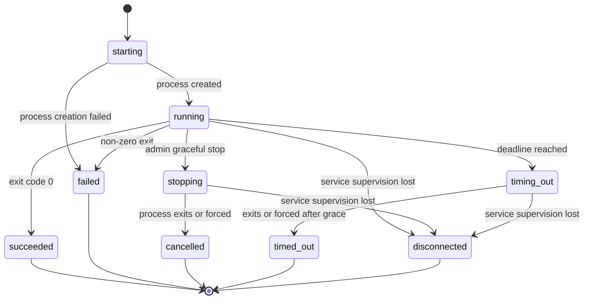
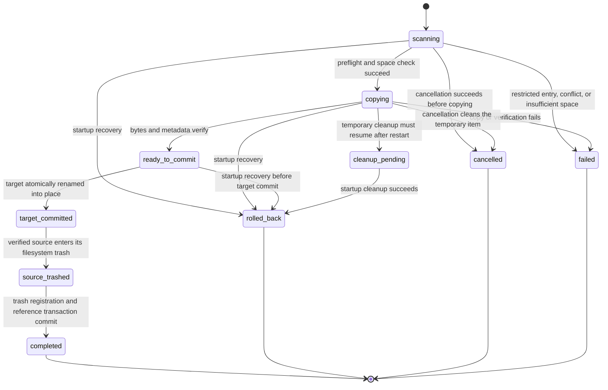
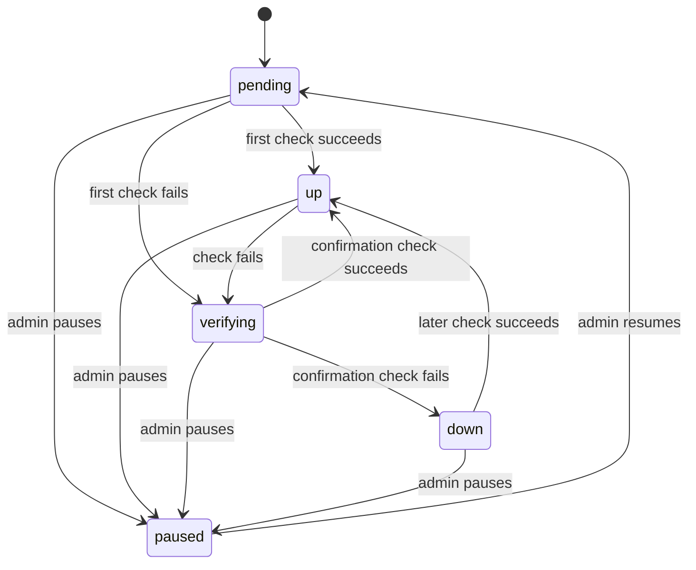

# ScriptBoard 数据模型与状态机

本文描述冻结 MVP 的逻辑数据模型。字段类型用于表达约束，具体 SQL 类型由实现选择；所有 ID 建议使用不可预测的 UUID，所有绝对时间以 UTC 保存。

## 宿主分钟指标（Host Metric Minute）

宿主状态以五秒实时样本形成完整自然分钟聚合，固定保留 24 小时：

| 字段 | 约束与语义 |
| --- | --- |
| bucket_at | UTC 自然分钟起点，主键 |
| sample_count | 参与聚合的有效五秒样本数 |
| average_json | 公共资源与设备维度的分钟平均值 |
| maximum_json | 同一组指标的分钟峰值 |

未完成分钟不持久化；服务停止或异常退出会形成明确历史缺口。设备消失后的分钟历史保留至自然过期，当前状态标记为离线。该表属于可自动清理的诊断数据，不是审计记录。

## 应用 Pin（Application Pin）

| 字段 | 约束与语义 |
| --- | --- |
| id | 稳定应用 ID，主键 |
| kind / identity | `host` 或 `docker` 与规范身份；组合唯一 |
| name / technical | 最近一次显示名称与可执行路径或镜像 |
| sort_order | 无上限 Pin 列表中的稳定顺序 |
| created_at / updated_at | UTC |

Pin 是展示状态，不赋予应用控制能力。当前快照存在时由实时事实覆盖保存的名称与技术信息；应用停止或 Docker 数据源不可用时仍保留 Pin 身份。

## 应用分钟指标（Application Metric Minute）

| 字段 | 约束与语义 |
| --- | --- |
| application_id / bucket_at | 应用 ID 与 UTC 自然分钟起点，组合主键 |
| sample_count | 参与聚合的有效五秒样本数 |
| cpu_average / cpu_maximum | 整机归一 CPU 平均值与峰值 |
| memory_average / memory_maximum | 使用字节平均值与峰值 |
| read_average / read_maximum | 读取速率平均值与峰值 |
| write_average / write_maximum | 写入速率平均值与峰值 |

该表只服务已 Pin 应用的 24 小时诊断历史，不是审计记录或长期监控存储。

## 1. 核心原则

- 主机文件系统是文件与目录的事实来源，不建立通用 File 表。
- 数据库只保存应用身份、绝对路径引用、执行、计划、审计、回收条目与持久化文件操作。
- 文件引用同时保存规范绝对路径与平台比较键，并在每次使用时由主机文件模块重新验证保护策略、权限、文件系统和条目类型。
- Run 是不可删除的执行事实；日志是有保留期的外部文件。
- 参数同时保存模板与实际展开值，因为变量全部是普通明文数据。

## 2. 实体

### User

| 字段 | 约束 |
|---|---|
| id | 稳定、不可预测 ID |
| username | 实例内唯一；系统管理员初始默认 `admin` |
| password_hash | 版本化 Argon2id 编码 |
| role | `administrator`、`maintainer`、`operator`、`viewer` 之一 |
| enabled | 系统管理员始终为 true |
| auth_version | 密码、用户名、角色或状态变更时递增，用于撤销 Session |
| created_at / updated_at | UTC |

数据库约束最多一个 `administrator`。普通用户不能提升为系统管理员；账号不永久删除。

### Session

| 字段 | 约束 |
|---|---|
| token_hash | 唯一；不保存浏览器原 Token |
| user_id | 关联 User |
| csrf_token | 随机 CSRF Token |
| auth_version | 必须等于 User 当前版本 |
| created_at / last_seen_at / expires_at | 12 小时空闲、7 天绝对期限 |

### LoginThrottle

| 字段 | 约束 |
|---|---|
| key_type / key_value | 来源 IP 或目标用户名维度 |
| failure_count | 成功登录后清零 |
| blocked_until | 最长 5 分钟 |
| updated_at | UTC |

### Variable

| 字段 | 约束 |
|---|---|
| id | UUID |
| name | 唯一；`[A-Z][A-Z0-9_]{0,63}` |
| value | 普通明文；最大 4 KiB；允许空 |
| created_at / updated_at | UTC |

删除前必须检查 QuickRun 和 Schedule 引用；重命名在同一事务更新活动引用。

### QuickRunGroup

| 字段 | 约束 |
|---|---|
| id | UUID |
| name | 管理员定义；忽略大小写唯一 |
| sort_order | 分组显示顺序 |
| created_at / updated_at | UTC |

“未分组”是 `QuickRun.group_id` 为空时的派生展示区域，不保存为 QuickRunGroup。删除分组时，其中快捷执行项按原组内顺序追加到“未分组”，不会级联删除。

### QuickRun

| 字段 | 约束 |
|---|---|
| id | UUID |
| name | 管理员定义 |
| script_path / script_path_key | 规范绝对路径及平台比较键 |
| argument_text | 原始模板文本 |
| argument_template | 解析后的模板数组 |
| timeout_seconds | 可空代表无超时 |
| always_confirm | 默认 false |
| source_run_id | 可空；从历史创建时关联不可删除 Run，从文件创建时为空 |
| group_id | 可空；引用 QuickRunGroup，删除分组时置空 |
| sort_order | 当前分组内排序；未分组条目共享独立排序域 |
| locked | 默认 false；仅阻止管理员编辑和删除 |
| validity | 派生值，不作为唯一事实来源 |
| created_at / updated_at | UTC |

复制 QuickRun 时保留脚本路径、参数模板、超时与可空来源 Run ID，但生成新 ID 且 `locked=false`。复制到原分组时新项紧随来源项；移动到其他分组或“未分组”时追加到目标排序域。软锁不阻止启动、复制、分组移动、排序或系统维护路径引用。

### ScheduleGroup

| 字段 | 约束 |
|---|---|
| id | UUID |
| name | 管理员定义；忽略大小写唯一 |
| sort_order | 分组显示顺序 |
| created_at / updated_at | UTC |

“未分组”是 `Schedule.group_id` 为空时的派生展示区域，不保存为 ScheduleGroup。删除分组只移除容器，其中计划保留并转为未分组。

### Schedule

| 字段 | 约束 |
|---|---|
| id | UUID |
| name | 管理员定义 |
| group_id | 可空；引用 ScheduleGroup，删除分组时置空 |
| script_path / script_path_key | 规范绝对路径及平台比较键 |
| argument_text / argument_template | 变量引用模板 |
| cron_expression | 标准五段 cron |
| timeout_seconds | 可空代表无超时 |
| overlap_policy | `allow` 或 `skip_if_same_script_running` |
| enabled | 删除脚本时自动 false |
| next_fire_at | UTC 派生缓存，可重算 |
| created_at / updated_at | UTC |

### ScheduleTrigger

| 字段 | 约束 |
|---|---|
| id | UUID |
| schedule_id | 计划删除后可保留历史关系或快照 |
| schedule_name_snapshot | 永久可解释 |
| scheduled_for / observed_at | UTC |
| outcome | `run_created`、`skipped_overlap`、`missed_downtime`、`failed_pre_start` |
| run_id | outcome 为 run_created 时必填 |
| reason | 可空，不含秘密 |

未创建 Run 的明细保留一年，之后进入 ScheduleTriggerAggregate。

### ScheduleTriggerAggregate

| 字段 | 约束 |
|---|---|
| schedule_id / schedule_name_snapshot | 历史身份 |
| local_date | 按实例时区归档日期 |
| outcome | 聚合结果 |
| count | 正整数 |

### Run

| 字段 | 约束 |
|---|---|
| id | UUID |
| script_path / script_path_key | 启动时规范绝对路径及平台比较键 |
| script_sha256 | 启动瞬间摘要 |
| script_kind | `host_file` 或 `one_time` |
| argument_text | 原始参数模板 |
| argument_template | 模板参数数组 |
| resolved_arguments | 启动时实际参数数组 |
| source_type | `manual`、`quick_run`、`schedule` |
| source_id / source_name_snapshot | 可空；历史解释 |
| initiator_user_id / initiator_username_snapshot | 系统计划触发时为空 |
| runtime_identity_name / runtime_identity_id | 用户名/UID 或账号/SID |
| executor | 实际可执行文件与固定前缀参数 |
| executor_fallback_failures | 更早候选无法启动原因 |
| working_directory / working_directory_key | 启动时规范绝对路径及平台比较键 |
| status | 见状态机 |
| pid / process_group_or_job_id | 活动期信息 |
| exit_code | 可空 |
| timeout_seconds | 可空 |
| created_at / started_at / finished_at | UTC；按状态允许为空 |
| stop_requested_at / force_kill_requested_at | 可空 |
| termination_reason | 可空 |
| error_message | 可空；不得包含秘密 |
| log_manifest_path | 状态目录相对路径 |
| log_expired / log_incomplete / log_truncated | 布尔标记 |

Run 不允许删除。

### RunLogManifest

存于每个 Run 私有日志目录，可同时在数据库保存摘要索引：

- format_version
- first_sequence / last_sequence
- persisted_bytes / discarded_bytes
- head_bytes / tail_bytes
- truncated
- incomplete
- segment 列表及摘要

事件包含 sequence、captured_at、stream、raw bytes。浏览器展示是安全解码视图，不是日志事实来源。

### RunLease

主要为内存态，可在数据库保存恢复提示：

- platform_file_id
- normalized_script_path
- protected_ancestor_paths
- active_run_ids

同一文件多个活动 Run 共享租约计数；最后一个结束才释放。

### TrashEntry

| 字段 | 约束 |
|---|---|
| id | UUID |
| original_path / original_path_key | 删除前规范绝对路径及平台比较键 |
| stored_path / stored_path_key | 源文件系统私有回收区中的规范绝对路径及比较键 |
| entry_type | file 或 directory |
| size | 删除时估算 |
| deleted_at | UTC |
| affected_quick_run_ids / schedule_ids | 通过确认页和审计关联 |

### AuditEvent

| 字段 | 约束 |
|---|---|
| id | UUID/有序 ID |
| occurred_at | UTC |
| actor_user_id | Web 用户稳定 ID；系统操作为空 |
| actor_username / actor_role | 操作者当时的用户名和角色快照 |
| action | 稳定英文标识 |
| target_type / target_id / target_snapshot | 最小必要信息 |
| outcome | success / failure |
| source_ip | Web 操作时保存 |
| details | 结构化、已脱敏 |

不保存密码、Cookie、Session、CSRF、变量值、文件内容或请求正文。默认保留一年，不允许逐条修改。

### FileOperation

跨文件系统移动的持久化恢复记录：

| 字段 | 约束 |
|---|---|
| id | UUID |
| kind | 当前固定为 `cross_filesystem_move` |
| source_path / source_path_key | 源规范绝对路径及平台比较键 |
| destination_path / destination_path_key | 目标规范绝对路径及平台比较键 |
| temporary_path | 目标同目录临时项；尚未建立时为空 |
| trash_path | 源文件系统回收项；尚未提交源时为空 |
| phase | 预扫描、复制、校验、提交目标、回收源、更新引用、完成或失败 |
| bytes_total / bytes_completed | 扫描后总量与已复制进度 |
| verification_digest | 内容校验摘要 |
| cancel_requested | 持久化取消请求 |
| error | 终态或待恢复错误，不含文件内容与秘密 |
| created_at / updated_at | UTC |

记录必须足以在进程崩溃后判断源、临时项、已提交目标和源回收项的状态，并幂等继续或回滚。

## 3. Run 状态机


```mermaid
stateDiagram-v2
    [*] --> starting
    starting --> running: process created
    starting --> failed: process creation failed
    running --> succeeded: exit code 0
    running --> failed: non-zero exit
    running --> stopping: admin graceful stop
    stopping --> cancelled: process exits or forced
    running --> timing_out: deadline reached
    timing_out --> timed_out: exits or forced after grace
    running --> disconnected: service supervision lost
    stopping --> disconnected: service supervision lost
    timing_out --> disconnected: service supervision lost
    succeeded --> [*]
    failed --> [*]
    cancelled --> [*]
    timed_out --> [*]
    disconnected --> [*]
```

### 状态不变量

- 启动前路径、保护策略、权限、参数、变量或执行器校验失败时不创建 Run，只写审计。
- Run 创建后初始为 starting；进程创建失败才产生 starting → failed。
- stopping 的最终结果固定为 cancelled；timing_out 的最终结果固定为 timed_out。
- disconnected 是 ScriptBoard 失去监督后的终态，不重新接管 PID。
- 终态 Run 不可删除或回到活动状态。

## 4. 跨文件系统移动状态机


```mermaid
stateDiagram-v2
    [*] --> scanning
    scanning --> copying: preflight and space check succeed
    scanning --> failed: restricted entry, conflict, or insufficient space
    scanning --> cancelled: cancellation succeeds before copying
    copying --> ready_to_commit: bytes and metadata verify
    copying --> failed: copy or verification fails
    copying --> cancelled: cancellation cleans the temporary item
    copying --> cleanup_pending: temporary cleanup must resume after restart
    ready_to_commit --> target_committed: target atomically renamed into place
    target_committed --> source_trashed: verified source enters its filesystem trash
    source_trashed --> completed: trash registration and reference transaction commit
    scanning --> rolled_back: startup recovery
    copying --> rolled_back: startup recovery
    ready_to_commit --> rolled_back: startup recovery before target commit
    cleanup_pending --> rolled_back: startup cleanup succeeds
    completed --> [*]
    rolled_back --> [*]
    cancelled --> [*]
    failed --> [*]
```

### 文件操作状态不变量

- 目标提交前失败或取消必须清理临时项并保持源不变。
- 目标只通过同目录原子重命名变为可见；源只移动到带实例所有权标记的同文件系统回收区。
- 目标提交后不得把操作伪装成未发生；重启恢复必须依据磁盘事实继续源回收和引用事务，或报告可解释失败。
- 目录预扫描发现链接、特殊文件或无法无损保留的平台元数据时，在复制前拒绝。
- 源和目标路径租约覆盖祖先与后代，阻止 Run 和其他文件事务竞争。

## 5. 文件引用不变量

- QuickRun 与 Schedule 引用规范绝对路径和平台比较键，路径解释只能经过主机文件模块。
- 同文件系统移动以原子重命名与数据库事务更新引用；跨文件系统移动由 FileOperation 恢复协议保证可解释状态。
- 外部移动使引用失效，不按名称、摘要或 inode 猜测新路径。
- Run 保存路径快照，不随当前文件移动。
- 变量重命名更新 QuickRun 与 Schedule；Run 历史不改写。

## 6. 建议索引

- Session(token_hash), Session(expires_at)
- Variable(name)
- QuickRun(sort_order), QuickRun(script_path_key)
- Schedule(enabled, next_fire_at), Schedule(script_path_key)
- ScheduleTrigger(schedule_id, scheduled_for), ScheduleTrigger(run_id)
- Run(created_at DESC), Run(status, started_at), Run(script_path_key, status)
- Run(source_type, source_id)
- AuditEvent(occurred_at DESC), AuditEvent(action, occurred_at)
- TrashEntry(original_path_key), TrashEntry(deleted_at)
- FileOperation(phase, updated_at), FileOperation(source_path_key), FileOperation(destination_path_key)
- AssistantModel(is_default), AssistantConversation(owner_user_id, archived_at, updated_at), AssistantMessage(conversation_id, sequence)
- AssistantToolCall(conversation_id, started_at), AssistantApproval(conversation_id, status, expires_at)

## 7. 文件布局

```text
host-filesystems/
  <ordinary host files>       # 文件系统本身是事实来源，不由 ScriptBoard 建表镜像
  .scriptboard-trash/         # 每个发生删除的文件系统各自建立，带实例所有权标记并受保护

state-root/
  app.db
  app.db-wal
  app.db-shm
  instance.lock
  secrets/
  runs/{run-id}/
    events-*.log
    manifest.json
  logs/
    scriptboard.log
    scriptboard.log.1 ...
  runtime.json                # 当前进程写入的精确构建运行标记
  updates/
    cache.json                # 最近一次有效检查、ETag 与错误摘要
    check.json                # 最近一次检查时间与错误（包括首次失败）
    active.json               # 当前 Update Operation
    operations/{id}/
      operation.json          # 持久阶段、目标与恢复信息
      result.json             # 提交、回滚或人工恢复结果
      database-before-update.db # helper 在旧进程退出后创建的一致快照
      release-manifest.json
      release-manifest.json.sig
      scriptboard-v*.{zip,tar.gz}
      extracted/              # 安全解压后的 Release 内容
      helper/                 # Windows 本次事务使用的独立 helper
  tmp/
```

State Root、Install Root、活动配置、管理员密码文件、TLS 私钥和各文件系统回收区均为受保护路径。文件页面不显示这些路径；其祖先不能执行会影响后代的写入、移动、删除、覆盖或执行。磁盘上已有 `.git/` 不属于应用状态，ScriptBoard 不修改或删除它。

正式系统服务另有独立程序布局，不属于 State Root：

```text
install-root/
  install.json
  current -> versions/<version>    # Linux 原子符号链接；Windows 服务配置指向版本目录
  versions/<version>/
    RELEASE.json
    scriptboard[.exe]
    scriptboard-updater[.exe]
    ...                            # 对应平台完整 Release 内容
  scriptboard-updater              # 仅 Linux；切换前原子刷新、供恢复使用的独立 helper
  scriptboard-tray-launcher.exe    # 仅 Windows；稳定托盘入口
```

Update Operation 是文件系统持久化事务，不写入 SQLite 作为事实来源，以便数据库本身被恢复时仍能继续判断更新阶段。终态结果由应用在正常启动后幂等导入审计一次。

## 8. 网站监控

| 实体 | 关键字段与保留 |
| --- | --- |
| WebsiteMonitor | 配置 JSON、服务位置、协议、管理员顺序、状态、失败计数、配置代次、下一检查时间；删除后保留一年 |
| WebsiteCheckResult | 成功、状态码、耗时、错误类别、技术证据、证书快照；保留 24 小时 |
| WebsiteHourlyAggregate | 每小时检查数、成功/失败数、平均/最大耗时与错误类别计数；保留 30 天 |
| WebsiteIncident | 确认故障的开始、结束、首个错误事实与关闭原因；完成后保留一年 |


```mermaid
stateDiagram-v2
    [*] --> pending
    pending --> up: first check succeeds
    pending --> verifying: first check fails
    up --> verifying: check fails
    verifying --> down: confirmation check fails
    verifying --> up: confirmation check succeeds
    down --> up: later check succeeds
    pending --> paused: admin pauses
    up --> paused: admin pauses
    verifying --> paused: admin pauses
    down --> paused: admin pauses
    paused --> pending: admin resumes
```

配置更新递增 generation、清除旧证据并立即重新检查；较旧 generation
的在途结果不得回写。管理员暂停或删除时同样递增 generation。WebSocket
应用消息规则只处理文本帧和二进制帧；Ping/Pong 规则只处理 RFC 6455
控制帧。

## 9. 一次性 Run 源码

`Run.script_kind` 区分 `host_file` 与 `one_time`。一次性 Run 额外保存：

| 字段 | 语义 |
| --- | --- |
| working_directory / working_directory_key | 允许的普通主机目录规范绝对路径及平台比较键 |
| source_filename | 私有 Run 目录内固定的 `source.{ext}` |
| source_expired | 源码已回收，源码入口返回 410 |
| source_audit_event_id | 回收前关联的 `start_one_time_run` 审计主键 |
| script_sha256 | 实际执行源码的内容摘要，源码回收后仍保留 |

源码不是 Host Entry 或 Trash Entry。审计清理先删除源码，再在同一数据库事务中
设置 `source_expired=1`、清空审计引用并删除审计条目。文件删除失败时三个数据库
变更均不得发生。RunLogManifest 的 90 天/容量清理不处理源码文件。

## 10. AI Assistant

schema 21 在 schema 20 主机文件基线上增加 Assistant 自有表；schema 24 在兼容的
schema 21–23 上增加 Conversation Profile、Session Telemetry 与模型图片输入事实。
迁移在同一事务内补列、建索引并更新 `user_version`；早于 20 或高于当前版本的状态库
仍在任何写入前拒绝。

| 实体 | 关键字段与语义 |
| --- | --- |
| AssistantSettings | 单例；功能启用、最大活动对话数、新对话自动审批默认值、更新者和时间 |
| AssistantModel | 名称、Provider、模型 ID、HTTPS/回环 Endpoint、凭据已配置事实、`supports_images` 管理员声明、唯一默认项；不保存 API Key |
| AssistantConversation | 所有者、标题、必选模型、审批模式、Pi session 相对标识、Runtime 版本、Conversation Profile 与版本、思考级别、Session Telemetry、状态、revision、归档时间 |
| AssistantMessage | 对话内稳定 sequence、user/assistant、正文、streaming/complete/interrupted/error 与完成时间 |
| AssistantContextRef | 对话、资源种类、稳定 ID、安全标签和展示顺序；不复制文件或日志正文 |
| AssistantToolCall | 工具名、目标/参数摘要、状态、稳定错误码、结果摘要、时间，以及对话内可检查的有界调用/返回 JSON；调用 JSON 不含 capability 或 Provider 凭据 |
| AssistantApproval | 工具调用、参数摘要、pending/approved/rejected/expired/cancelled、过期时间和决定者 |

AssistantConversation 只能由 `owner_user_id` 对应用户列出、读取、订阅和修改。每个对话
同一时间最多存在一个 streaming assistant message；服务启动时，仍为 running 或
waiting_approval 的对话及消息原位转为 interrupted，不创建重放任务。归档只设置时间，
不会级联删除消息、资源引用或 Pi session。

提交消息时，用户消息、streaming assistant message、conversation running 状态和该次
完整资源引用集合在一个事务内写入；遗漏的旧引用会被移除。每个 Agent Turn 随后重新校验
引用权限并生成有界快照。目录只包含逻辑名称与最多 48 个直接子项元数据；明确引用的普通
UTF-8 文本文件最多附带 16 KiB 正文并记录 SHA-256，不把宿主绝对路径送入 Prompt。
明确引用的 PNG、JPEG 或 WebP 在当前角色重新授权后进入 Safe Raster Processor；输入
最多 10 MiB/40 MP，输出最长边 2048、单图最多 4 MiB、每次最多四图，只在内存中保存
重新编码后的 base64。原图、EXIF、GPS 和处理后图片均不持久化到 Assistant 表、审计或日志。

Provider API Key 按 AssistantModel ID 保存到
`state-root/secrets/assistant-provider.json`，使用私有权限与同目录原子替换；它不进入
SQLite、HTML、审计、SSE 或普通日志。删除仍被对话引用的模型受外键和领域检查共同拒绝。

```text
state-root/
  secrets/
    assistant-provider.json
  assistant/
    runtime/
      active.json
      versions/<version>/
        pi[.exe]
        scriptboard-extension.ts     # 正式签名 Runtime 的唯一固定 Extension
        capabilities.json            # 版本、大小和 SHA-256 固定的能力清单
        playbooks/*.md                # 由清单显式列出的 Operational Playbook
        runtime.json                 # Pi/RPC/Broker 合同和上游 commit
        LICENSE
    pi-home/<user-id>/<conversation-id>/
      models.json                    # 只引用子进程环境变量，不含实际 API Key
    sessions/<user-id>/<conversation-id>/
    workspaces/<user-id>/<conversation-id>/
```

所有 Assistant 目录都属于 State Root 受保护范围，不显示为 Host Entry。活动 Runtime
解析只接受 `active.json` 指向自身版本目录内的普通文件，绝不查询 PATH 或用户 Pi 目录。
私有 session 目录已有非空 JSONL 时，下一次受管进程使用 `--continue` 恢复；每个 Turn
开始前仍通过 RPC `set_model` 重选该对话当前模型，避免保温进程沿用过期模型。
非通用 Conversation Profile 必须能在活动 Runtime 的 Capability Bundle 中解析出完全匹配
的版本；缺失、摘要不符或路径越界时拒绝本次 Turn，不回退到用户级 Skill。每个 Turn 还会
重设思考级别和自动压缩/重试策略；settled 后把 Pi session stats 写回 Conversation，手动
压缩只允许空闲的活动 session。

Tool Broker 使用每个受管 Pi 进程独有的 Named Pipe/Unix Socket 与 256-bit capability。
capability 不持久化；AssistantToolCall 记录规范参数、目标、有界结果摘要，以及不含
capability 和 Provider 凭据的有界调用/返回 JSON，
AssistantApproval 绑定用户、角色、授权版本、对话、Tool Call、参数和目标当前状态。
服务重启把尚未完成的工具标记为 interrupted，并取消 pending/approved 的状态修改。

Evidence Query 仍走相同 Tool Broker 和实时角色授权。日志搜索、日志窗口、Run 对比、计划
历史和审计列表都有结果条数与文本字节上限；继续读取使用带 HMAC、五分钟过期并绑定用户、
对话、工具、目标和查询的不透明游标，不能跨查询或跨对话复用。

## 11. External Interfaces

schema 27 增加 `external_trigger_keys`、`external_trigger_entries` 和 `external_trigger_requests`。Key 保存标签、Token 摘要与提示、启用状态、到期时间和最近成功使用时间；完整 Token 不持久化。Entry 通过 `(key_id, name)` 唯一，保存动作类型、固定目标与经过类型校验的 JSON 约束。Request 保存不可变的调用结果摘要，不通过外键级联删除，以便 Key 删除后仍保留审计上下文。

变量与快捷执行条目使用 `target` 建立领域引用：目标被引用时禁止删除；变量被引用时也禁止改名或转为密码变量。上传目录在配置和调用时均通过 Host Filesystem 边界重新验证。到期 Key 不需要后台任务修改数据库；鉴权时根据当前时间派生为不可用状态。
