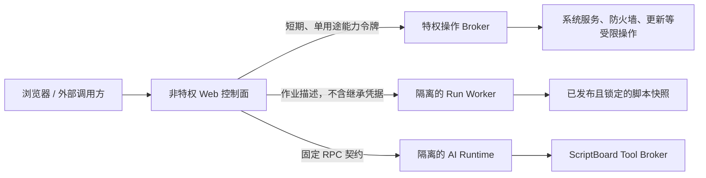

# ScriptBoard 运维面板安全加固与设计调整计划

状态：实施中（批次 A）  
创建日期：2026-08-11  
适用范围：ScriptBoard Web 服务、脚本执行、文件管理、网站监控、外部接口、MySQL、AI Runtime、更新与服务安装  
研究基线：截至 2026-08-11 已公开的运维面板漏洞、厂商公告和当前仓库实现

## 1. 结论先行

ScriptBoard 已有一批值得保留的安全基础：Argon2id 密码哈希、服务端会话、CSRF、CSP/HSTS、请求体和超时限制、非回环监听强制 TLS、受保护路径、文件原子替换与回收站、参数化 SQL、更新包 Ed25519 签名与摘要校验、归档路径穿越防护、外部 Key 哈希与限流、AI 工具审批和固定 Tool Broker。

当前最重要的问题不是缺少更多运维按钮，而是高权限边界仍然过宽：Web 服务、脚本执行和 AI 子进程最终处在同一个高权限服务身份下。Linux 服务明确使用 `root`，Windows 服务未指定低权限账户；一旦 Web、解析器、依赖或 Agent Runtime 出现可利用漏洞，影响容易直接扩大为整机接管。

实施顺序必须是：

1. 先完成 P0 安全边界重构和公开入口加固。
2. 再补充主机安全更新、服务日志、状态备份、通知等 P1 能力。
3. 网络、磁盘、容器和虚拟机能力先只读，写操作必须经过独立能力评审。
4. 不增加通用 Web Terminal、任意远程 SSH、多主机密码复用或动态任意插件。

本文是修复与架构实施计划，不等同于已经证实 ScriptBoard 存在下述 CVE，也不替代独立渗透测试。文中“缺口”表示从代码审查确认的设计风险；“预防项”表示根据同类产品漏洞提前建立的控制。

### 1.1 实施审阅记录（2026-08-11）

本计划方向正确，但不能作为单个提交或单个发布周期整体执行。P0-02 会直接取代 ADR-0023 的最高宿主权限模型，并影响主机文件管理、安装器、更新器和受信脚本语义；P0-07、P0-08、P0-10 与 P0-11 也分别需要数据迁移、平台隔离验证、发布基础设施和运维演练。它们必须保留为独立批次，不能用未验证的“加固配置”假装完成。

本分支落实第一个可发布切片：

| 计划项 | 本分支状态 | 说明 |
| --- | --- | --- |
| P0-01 | 完成 | 260 条路由均通过 fail-closed 注册器声明方法、认证方式、权限、CSRF 与请求体策略；运行时前缀权限推断已删除，角色/方法矩阵从 `RouteSpec` 清单自动验证。 |
| P0-02 | 三个迁移切片完成 | 正式包新增独立 `scriptboard-broker` 程序与受管服务；UFW、Fail2ban、Linux 组件安装及 Windows Firewall 写操作从生产 App 的直接系统调用路径移出。Unix socket 用 0600 owner + `SO_PEERCRED`，Windows Named Pipe 用服务 SID DACL。Broker 独立重新验证原始会话、角色、期限和十分钟 step-up，再签发绑定 Request ID/action/resource/revision/参数 SHA-256 的 30 秒单次 capability；执行器复核强类型参数与资源语义，规则改变、替换参数和重放均拒绝，执行前后独立审计并刷新外部签名 checkpoint。受管 Linux Web 已改为无登录 `scriptboard-web`，Windows Web 已改为带独立服务 SID 的 `LocalService`；AI Runtime 也迁入独立 Host/服务身份。Host Files、凭据解封与 Runner 仍在 Web 进程或其身份内，因此 P0-02 验收仍未完成。 |
| P0-03 | 四个切片完成 | Run 使用最小环境；执行器必须解析为规范绝对普通文件，Linux 校验 root/服务身份所有权及不可被组/其他用户写入，Windows 仅接受服务身份、SYSTEM、Administrators 或 TrustedInstaller 所有并拒绝不可信主体的写入型 ACL；参数控制字符被拒绝并有 fuzz 覆盖。所有生产 Go 子进程现经 `internal/processlaunch` 构造并显式选择继承或精确环境，仓库级 AST 门禁阻止包括别名导入在内的 `exec.Command*` 旁路。MySQL 导入参数由固定构造器生成，数据库名置于 `--` 后，并强制非交互 binary/batch 模式禁用 `system`、`source`、pager、tee 等本地客户端命令。各第三方 CLI 的剩余字段类型继续按领域收紧。 |
| P0-04 | 五个切片完成 | 建立共享出站策略并覆盖网站 HTTP/WebSocket 探测、远程监控聚合、GitHub 更新检查/下载、签名 Assistant Runtime 下载、Assistant Provider 代理及 Custom Dashboard 数据源；这些默认客户端不使用环境代理，DNS 解析后的实际 IP 由受控 Dialer 固定并拒绝私网、元数据和非常规端口。Provider 代理只转发当前会话绑定的 Provider、模型和推理 API 路径；Dashboard 数据源禁止重定向、URL 内嵌凭据及保留请求头；远程 ScriptBoard 聚合只接受 HTTPS，网站探测跳过 TLS 验证的例外最长一小时并记录到期时间。 |
| P0-05 | 两个切片完成 | 代理默认信任为空，非可信转发头被清理；新增 `allowed_hosts` 与 `canonical_external_url` 安全默认，可信代理 Host 仍须通过白名单，错误 Host/Origin 在业务 Handler 前拒绝。可信 peer 只接受单值 `X-Forwarded-*` 合同，拒绝标准 `Forwarded` 混用、重复字段、空值、非法 IP/Host/Proto 和超过 8 跳的链；黑盒 Handler 测试覆盖可信 HTTPS 的 HSTS/Secure Cookie、Host poisoning 421 以及非可信伪造不提升安全状态。真实 Nginx/Caddy/IIS 与 IPv6 部署矩阵仍待平台门禁。 |
| P0-06 | 四个切片完成 | 外部上传空 allowlist 及活动/双扩展一律拒绝；内容以随机无扩展名和 0600 权限进入 State Root 私有 inbox，管理员核对 SHA-256 与目标后才能经并发领取、原子写入和审计发布。普通 Host Files 上传识别内置及自定义执行器扩展，可执行内容同样只能先进入 inbox，需近期认证并明确核对摘要和目标后发布，普通上传不能直接覆盖现有可执行文件；文件移动也提升为 step-up 动作。MySQL 导入只接受 `.sql`/`.sql.gz`，gzip 在落库和每次恢复前校验流完整性、非空内容与 8 GiB 解压上限，客户端以禁用本地命令的模式消费。Dashboard 与网站监控配置导入只接受安全 `.json` 文件名、受限 JSON/text/octet-stream MIME、UTF-8 无 NUL 且对象根内容，并继续执行各自的 schema、字段、数量和大小限制。 |
| P0-07 | 六个切片完成 | 外部 Trigger Key 创建和轮换后只显示一次，完整 Key 不再可恢复保存或提供复制接口；启动时清理旧版本残留的可恢复 Key。schema 40 记录会话认证保证和最近认证时间，高风险声明式路由过期后必须在当前浏览器会话 step-up；失败/成功均审计，return URL 防开放重定向，Assistant UI Action 对这些路由 fail closed。YAML、环境变量和 CLI 的明文管理员密码入口均已删除，只保留绝对路径 password file、首次启动和本机重置的一次性凭据。日志、审计、错误、导出和 doctor 共用 secret redaction。Provider、MySQL 与远程网站 Key 使用 State Root 外主密钥统一 AEAD 密封。账户现可配置 TOTP：登录和 step-up 没有降级旁路，成功为 `aal2`，时间步不可重放；10 个 128 bit 恢复码只显示一次、仅保存摘要并逐个消费，启用/重置撤销会话，本机管理员重置同时清除 MFA。WebAuthn/passkey 与 Administrator/Maintainer 默认强制注册策略仍待结构性批次。 |
| P0-08 | 三个切片完成 | 每个受管 Pi 进程现只获得环回 Provider 代理地址和随机短期 capability；上游 Endpoint 与真实凭据不再进入 Pi 参数、环境或 `models.json`。代理只允许当前 Provider 对应的 POST 推理路径和精确模型，限制请求/响应大小、清理请求头、注入真实凭据、禁止重定向，并随进程停止撤销。Windows Pi Job Object 限制单进程、1 GiB 进程/作业内存和 15 分钟累计用户态 CPU，并隔离 UI。受管部署新增独立 `scriptboard-ai-host`：IPC 只接受不含 executable/workspace/env 的领域启动请求，Host 自行解析签名 Runtime；Linux 使用独立 `scriptboard-ai` UID、私有目录、只读 Runtime、systemd 保护及默认拒绝非环回网络；Windows 使用独立服务 SID 和 Assistant 目录 ACL。Windows 仍需内核级默认拒绝网络/受限 Token，Linux 仍需 seccomp/Landlock/AppArmor 验证，因此 P0-08 尚未完成。 |
| P0-09 | 五个切片完成 | Quick Run 记录脚本 SHA-256 与单调配置修订；外部入口只能绑定已锁定且摘要有效的发布修订，配置、锁定状态或脚本变化会使旧授权 fail-closed，Runner 在启动点复核摘要并将外部并发限制为每脚本一个 Run。每个 Key 现原子绑定一个不可变 Entry，绑定时轮换临时凭据，删除 Entry 同时删除 Key；旧多 Entry Key 被保留配置地拆分并 fail-closed。限流已覆盖每 Key、规范化来源、动作和全局四层原子请求/并发配额，并限制来源状态基数。外部接口提供持久化人工全局熔断；新功能默认启用 5 分钟时间戳、唯一 nonce 与 HMAC-SHA256 防重放，旧功能兼容迁移并可显式启用；拒绝均记录调用与审计。 |
| P0-12 | 部分完成 | 增加 vet、race、govulncheck、CodeQL、secret scan、SBOM 与 release provenance 门禁；race 覆盖 App、审计链、外部能力、Run、受控进程、上传/导入、出站策略及 Assistant Runtime/Provider 代理等并发安全边界。已加入出站地址、Host 和命令参数 fuzz target，更多真实代理、服务安装和故障注入黑盒不变量继续补充。 |
| P0-11 | 三个切片完成 | 新增覆盖 Web、Runner 与 Scheduler 的串行 SHA-256 审计链，保留策略通过锚点/链尾维持可验证性，启动时 fail-closed 校验，并提供不依赖 Web UI 的 `audit verify` 命令。schema 41 为每个 Web 请求生成服务端 Request ID，审计独立记录请求关联与认证保证，External Interface 复用 invocation ID；v2 摘要保护新字段且与 v1 历史链兼容。每个实例现把 Ed25519 私钥密文和签名 checkpoint 放在 State Root 外：启动、离线验证与取证导出都会验证签名及 checkpoint 事件仍属于本地链，可发现连同数据库链尾状态一起回退的有效外观截断；正常关闭、保留清理后和每五分钟刷新，doctor 检查三项外部信任材料。它仍是主机本地边界，远端不可回滚 checkpoint/转发、更多资源 revision/digest 字段和告警仍待后续切片。`SECURITY.md` 已明确私密报告、支持范围与应急控制。 |
| P0-10 | 四个恢复切片完成 | 新增不依赖 Web UI 的本机 `emergency` CLI：可持久暂停全部 External Interface、按完整 Key ID 吊销单个能力并保留取证元数据，两个写操作都需显式匹配确认并与本地管理员高危事件原子写入审计链；取证导出以只读模式验证同一 SQLite 快照后写入不可覆盖的 JSONL。`update verify-package` 可断网验证正式归档的内置签名信任根、平台、文件名、大小、SHA-256、安全归档边界、展开大小和 `RELEASE.json`，且不改变安装。成功更新保留更新前 SQLite 快照，已提交回滚在切换前验证快照完整性、当前目标版本和旧版本载荷；`repair-current` 可在服务停止时验证并重建当前版本服务指针。Manifest 保持旧单签兼容并支持 current/next 双签，发布二进制嵌入 fail-closed Key 撤销列表，runbook 规定离线/硬件保管、轮换和泄露处置。更完整的 updater/安装器故障注入仍待后续切片。 |

P0-02、P0-07 至 P0-11 的其余结构性工作以及 P1/P2 未在本分支宣称完成。

## 2. 产品边界与设计决策

### 2.1 产品定位

ScriptBoard 应继续定位为跨平台的“受管脚本与运维工作流控制面”，而不是复制一个跨平台 Cockpit。当前差异化能力包括：

- 受管脚本、一次性执行、快捷执行项和计划任务。
- 文件管理、网站监控、应用观测和 MySQL 备份恢复。
- 有限动作的外部接口与完整调用记录。
- 固定角色、审计和 AI 辅助运维。
- Windows 与 Linux 的统一使用体验。

Cockpit 值得借鉴的是它的权限分层、按需提权和系统原生接口复用，而不是通用终端或多主机 SSH。

### 2.2 必须修改的架构

目标架构拆为三个信任域：

- **Web 控制面**：低权限运行，只读 State Root 中必要数据，不能直接调用任意系统命令。
- **特权操作 Broker**：接口小、参数有类型、动作有 allowlist；每次调用重新鉴权并写审计，不接受 shell 字符串。
- **Run Worker**：按照执行配置使用专用 OS 身份、工作目录、环境白名单和资源配额运行。
- **AI Runtime**：与 Web 服务身份隔离，只能访问独立工作区和固定 Broker；“审批”不能代替操作系统沙箱。

### 2.3 明确不做

- 不提供浏览器中的任意 Shell、PTY 或 Web Terminal。
- 不允许用户输入任意可执行文件路径、任意 executor 前缀或任意系统命令模板。
- 不把远程主机名、用户名、SSH 参数直接传给命令行工具。
- 不在同一服务中加载未经签名的动态插件或第三方面板模块。
- 不把“管理员导入”“内部网络”“来自 Agent 的数据”视作可信输入。

### 2.4 Cockpit 功能与当前项目实现对照

| 能力域 | Cockpit 的典型实现 | ScriptBoard 当前实现 | 决策 |
| --- | --- | --- | --- |
| 主机概览与性能 | 读取系统原生接口，历史性能通常接入 PCP | 已有主机状态、应用观测、网站状态和自定义 Dashboard | 保留现状，后续统一指标 schema 和采样配额，不复制完整 PCP 栈 |
| 服务管理 | 通过 systemd D-Bus 查看和操作 unit | 已有应用发现、状态、详情、实时/历史日志；系统服务写操作不是通用能力 | P1 先补 systemd/Windows SCM 只读视图；启停只开放纳管服务并走 Broker |
| 系统日志 | 通过 journald 查询与流式读取 | 已有 Run 与应用日志、审计日志，没有统一系统事件日志入口 | P1 增加 journal/Event Log 只读查询，必须限制服务范围、字段和最大输出 |
| 网络与防火墙 | NetworkManager D-Bus、firewalld | 已有 Linux 防火墙草稿/应用、Fail2ban 和 Windows Firewall 操作 | 不再增加直接 shell 配置；现有写操作迁入特权 Broker，并补自动回滚和连通性保护 |
| 存储与磁盘 | UDisks/storaged，展示文件系统、RAID、LVM、SMART | 当前重点是主机文件管理和 MySQL 备份，不是块设备控制 | P2 只读展示容量、挂载和 SMART；不近期加入分区、格式化和 RAID 写操作 |
| 用户与身份 | OS 用户、组、realmd、PAM/Kerberos | 使用 ScriptBoard 自有用户、固定角色、会话和审计 | 保持应用身份与 OS 身份分离；P0 增加 MFA/step-up，P2 再评估 OIDC/SAML |
| 软件更新 | PackageKit 或 OSTree 管理系统包 | 只管理 ScriptBoard 和私有 AI Runtime 的签名更新/回滚 | P1 增加 OS 安全更新只读状态；系统包安装必须使用发行版 API 和独立 Broker |
| 终端 | 每用户 PTY，会话可按需提权 | 明确没有任意终端；只有受管脚本、快捷执行和一次性来源 | 保持不提供终端；把 Operator 收敛到管理员发布且 digest 锁定的 Quick Run |
| 容器 | cockpit-podman 通过 Podman API | 可发现/展示部分应用和日志，没有通用容器控制面 | P2 可增加纳管容器的只读状态和有限生命周期，不代理 Docker socket |
| 虚拟机 | cockpit-machines 通过 libvirt | 无 | 非核心方向；若立项，先独立威胁模型和只读原型 |
| SELinux、kdump、诊断 | 专用包调用 SELinux、kdump、sosreport 等系统服务 | 已有安全组件页、防火墙和 Fail2ban，但没有统一诊断包 | P1 增加安全基线和脱敏诊断包；禁止诊断包收集秘密和任意宿主文件 |
| 扩展机制 | manifest + 前端 package；后端通过 bridge/D-Bus 接系统能力 | Go 单体应用，模块直接注册路由和调用服务 | 不照搬任意插件；先建立声明式路由、能力注册表和固定 Broker 契约 |
| 多主机 | 历史上支持远程 SSH；Cockpit 新版本已弱化/调整该路径 | 仅有受限的远程网站状态汇聚 | 不扩展为通用多主机 SSH；未来只能采用独立 Agent、mTLS 和节点级能力授权 |

功能补充的优先结论是：P1 应先做 OS 安全更新只读视图、服务/系统日志、State Root 备份恢复、安全基线和通知；网络、磁盘、容器、虚拟机进入 P2；终端和任意远程 SSH 不进入产品路线。

## 3. 同类运维面板公开漏洞与前置防护

| 产品与漏洞 | 已公开根因与影响 | ScriptBoard 对应攻击面 | 必须提前建立的控制 |
| --- | --- | --- | --- |
| Cockpit CVE-2026-4631 | 登录前将攻击者控制的主机名和用户名交给 SSH，值可被解释为 SSH 选项，单个未认证请求可造成命令执行 | executor 参数、未来远程节点、systemctl/工具调用 | 严格语法 allowlist；拒绝 NUL、CR/LF、控制字符和前导 `-`；支持时使用 `--`；禁止任意远程 SSH；对 option injection 建立回归测试 |
| CyberPanel CVE-2024-51378 | 鉴权中间件只覆盖 POST，路径可通过其他方法绕过；随后 `statusfile` shell 元字符造成未认证命令执行，且已被实际利用 | `ServeMux` 路由、`/trigger` 多方法入口、未来新增接口 | 路由注册时声明方法、认证方式和权限；未知路由 fail closed；鉴权必须在解析、文件读取和命令前完成；为每条路由生成方法与角色矩阵测试 |
| CyberPanel 2.3.5 安全公告 | WebTerminal、CloudAPI、上传、命令过滤和 API Token 多处鉴权旁路；有接口在鉴权完成前先执行命令 | 文件上传、外部接口、系统操作、AI 动作 | 移除通用终端；不依赖黑名单式 `commandInjectionCheck`；公开入口只映射固定动作；Token 最小权限、过期和轮换；所有副作用位于鉴权之后 |
| CasaOS CVE-2023-37469 | SMB 字段拼入 shell 命令导致已认证命令注入；初次补丁仍可绕过 | 脚本参数、数据库工具参数、系统安全命令 | 全程 `exec.CommandContext(path, args...)`；不经过 shell；字段级约束；为 shell 元字符、换行、前导选项和补丁绕过建立表驱动测试 |
| Webmin 历史安全问题 | 包括 SSRF、2FA 旁路、代理证书头伪造、Host Header 注入、root 命令执行、附件覆盖、文件名/邮件/SVG 存储型 XSS，以及构建服务器被植入后门 | 网站监控、反向代理、未来 MFA、上传/预览、更新供应链 | 统一认证保证级别；默认不信任代理头；Host allowlist；SSRF 出站策略；所有文件名和远端字段转义；上传隔离；可复现构建、签名、SBOM、密钥轮换和离线恢复 |
| 1Panel CVE-2025-54424 | Core 与 Agent 间证书校验不完整，未授权访问高权限接口并导致 RCE | 未来多节点/Broker、远程网站状态汇聚 | 不引入弱校验 Agent；如需跨节点，使用双向 TLS、完整证书链与名称校验、独立应用层授权、节点身份绑定和可撤销能力令牌 |
| 1Panel CVE-2024-2352 | 路径中的换行进入系统配置/命令，造成命令注入 | 文件路径、systemd 参数、执行参数、导入配置 | 所有跨进程和配置边界拒绝控制字符；配置文件使用结构化写入；系统命令只接受类型化字段和 allowlist |
| 1Panel CVE-2024-39907 / CVE-2024-39911 | 多处 SQL 注入可进一步任意文件写入/RCE；User-Agent 等 HTTP Header 也成为输入 | 审计、过滤、Header、搜索和导入数据 | SQL 值全部参数化；动态排序/列名只用枚举；Header 按不可信数据处理；CodeQL 与 SQL 注入回归测试覆盖日志和审计路径 |
| aaPanel CVE-2026-29859 | 任意文件上传最终造成代码执行 | 文件管理、外部上传、AI Runtime 离线包、数据库导入 | 上传写入非执行目录；文件名与目标路径由服务端决定；内容/大小/格式校验；隔离、原子发布、禁止上传后自动执行；执行文件另走签名发布流程 |
| Pterodactyl CVE-2024-34067 | 恶意导入配置或受控远端 Agent 字段形成存储型 XSS，可夺取管理员账户 | 监控导入、远端快照、日志、文件名、自定义面板 | 服务端模板转义；Markdown 禁原生 HTML 后再净化；SVG/HTML 默认下载而非内联；远端和导入字段长度/字符限制；CSP 与 XSS 回归测试 |
| MaxKB 2026 安全修复 | MCP 恶意配置命令注入、SSRF hook 绕过、`LD_PRELOAD`/`ctypes`/syscall 沙箱逃逸、结果伪造和存储型 XSS | Pi Runtime、Tool Broker、自定义模型 Endpoint、AI 输出 | AI 进程使用 OS 级隔离和网络策略；清空危险环境；不可由 Agent 配置 MCP/插件；Broker 不信任进程返回的“成功”；工具结果由服务端事实校验 |

跨产品的共同规律是：**低级输入验证错误之所以变成整机接管，是因为请求处理进程本身拥有 root/SYSTEM 或能无约束调用高权限工具。** 因此 P0 的核心不是再增加一层字符串过滤，而是缩小高权限接口和爆炸半径。

## 4. 当前实现审查

### 4.1 已确认需要修改

| 区域 | 当前实现 | 风险判断 |
| --- | --- | --- |
| 路由授权 | `internal/app/authorization.go:142` 对未匹配路径默认返回 `permissionObserve`；`requireSession` 再按该结果放行 | 新增路由若忘记分类，Viewer 可能意外获得访问；应改为未知即拒绝 |
| 服务身份 | `internal/platformservice/service_unix.go:37` 使用 `User=root`；Windows 安装未声明专用低权限账户 | Web 漏洞、依赖漏洞和子进程漏洞的主机影响过大 |
| 脚本执行 | `internal/runmanager/manager.go:435` 从 `os.Environ()` 继承完整服务环境；子进程使用服务身份 | 可能泄露代理、凭据和服务环境；没有 CPU、内存、进程数、文件句柄和网络配额 |
| AI 隔离 | Linux 仅设置进程组和父进程死亡信号；Windows Job Object 目前主要用于随父进程终止 | 私有目录和固定 Broker 是好基础，但尚不是安全沙箱；Runtime 仍与服务共享 OS 权限 |
| 反向代理 | `internal/config/config.go:156,166` 默认信任回环代理；`applyTrustedProxy` 采信 `X-Forwarded-For/Proto` | 同机非特权进程可伪造来源 IP 和 HTTPS 状态；默认应完全关闭代理信任 |
| Host/Origin | 当前未建立请求 Host allowlist；状态改变主要依靠 CSRF | 容易为未来绝对 URL、代理部署和 WebSocket 功能留下 Host/Origin 类漏洞 |
| 网站探测 | HTTP 重定向只限制最多 5 跳；WebSocket 走环境代理；管理员可跳过 TLS 校验 | 可访问内网、环回、链路本地和云元数据；重定向/DNS 重绑定每跳未重验；环境代理扩大信任面 |
| 远程监控汇聚 | 禁止重定向且 Bearer 不会跨跳泄露，但 Endpoint 仍可指向任意 HTTP(S) 地址 | 仍需出站地址策略、DNS 固定和 HTTPS 默认要求 |
| 外部上传 | 有 Key、大小、单文件、文件名和可选扩展限制；扩展列表为空时允许任意扩展 | 上传内容可能进入可被管理员或快捷执行项运行的位置；需要默认拒绝可执行类型和隔离发布 |
| 密钥保存 | Provider、MySQL、远程网站 Key 与 TOTP 状态使用用途绑定 AES-GCM，主密钥在 State Root 外；Windows 再由机器级 DPAPI 保护 | 单独窃取 State Root 不能离线解密；Unix 外部 key 仍须作为 root-only 秘密独立备份 |
| 初始管理员密码 | 明文 `admin_password`、环境变量和 CLI 参数已移除；旧入口返回迁移错误，仅保留绝对路径 password file 与一次性引导 | 已消除配置备份、进程环境、进程列表和 Shell 历史中的长期明文凭据入口；OS secret provider 仍随秘密迁移批次继续 |
| 审计 | 已记录用户、动作、目标、结果和来源 | 数据库管理员或主机入侵者可同时修改业务数据和审计；缺少哈希链、外部转发和安全事件告警 |

### 4.2 已有控制，应保留并补测试

- 密码使用 Argon2id，登录同时按来源和账户限流，并用 dummy hash 降低账户枚举时序差异。
- 会话存在 7 天绝对上限和 12 小时空闲上限，密码/角色变更可使旧会话失效。
- 会话 Cookie 为 HttpOnly、SameSite，安全请求下设置 Secure；状态改变请求使用 CSRF。
- 默认 CSP 禁止外部资源、对象和 frame；模板使用 `html/template`；Markdown 关闭原生 HTML 并经过 DOMPurify。
- HTTP Server 已配置 Header、读和空闲超时；普通表单、上传和日志均有大小上限。
- 非回环监听要求 TLS；TLS 最低版本为 1.2。
- 主机文件使用路径约束、租约、原子替换、回收站和受保护路径。
- 脚本启动使用参数数组，不直接拼接 shell 字符串；工作目录和脚本在启动前重新核验。
- 更新和 AI Runtime 使用签名 Manifest、摘要、文件数/展开大小限制、重复目标和路径穿越检查，且拒绝符号链接等危险归档项。
- GitHub 更新客户端限制 HTTPS、端口、重定向次数和目标主机。
- 外部 Trigger Key 有哈希、期限、轮换、动作绑定、并发/速率限制和调用记录。
- AI 默认关闭内置工具、扩展、技能和上下文文件，只加载固定 ScriptBoard 扩展；变更动作需要一次性审批。

## 5. P0：发布阻断级安全修复

P0 完成前，不新增终端、远程节点、任意命令、容器控制、虚拟机控制或动态插件能力。

### P0-01 路由注册与授权改为声明式、默认拒绝

修改方向：

- 定义统一 `RouteSpec`：HTTP 方法、路径模式、认证方式、所需权限、CSRF 策略、请求体上限、限流策略和审计动作。
- 用 `RouteSpec` 生成 `ServeMux` 注册，删除 `permissionForRequest` 的路径前缀猜测。
- 未登记路径、未登记方法、未知角色和缺失权限一律拒绝；不要回落为 Observe。
- `/trigger` 按动作或独立路由明确 GET/POST，先校验方法、Key 和动作，再读取 Body 或执行任何副作用。
- 登录、公开 Dashboard、静态资源和 Trigger 使用不同的显式认证类型，禁止“公开例外”散落在中间件条件中。
- 在 CI 中枚举所有路由，验证每个角色、每个方法、无会话、错误方法和 CSRF 缺失的结果。

验收条件：

- 新增一个没有权限声明的 Handler 时测试和启动至少一处失败。
- Viewer/Operator/Maintainer/Administrator 的完整路由矩阵由测试生成，不再手工挑选样本。
- 所有状态改变路由在认证和授权失败时不会产生数据库、文件、网络或进程副作用。

### P0-02 拆分 Web、特权 Broker、Run Worker 和 AI Runtime 身份

Linux：

- 创建 `scriptboard-web`、`scriptboard-runner` 等无登录系统用户；Web 服务使用 `User=scriptboard-web`。
- systemd 加固至少包括 `NoNewPrivileges=true`、`PrivateTmp=true`、`ProtectSystem=strict`、`ProtectHome=true`、`ProtectKernelTunables=true`、`ProtectKernelModules=true`、`ProtectControlGroups=true`、`RestrictSUIDSGID=true`、`LockPersonality=true`、`MemoryDenyWriteExecute=true`，再按实际需要声明 `ReadWritePaths` 和能力集合。
- 特权 Broker 使用独立 socket，校验 peer credential；只暴露固定系统动作，必要时用 polkit 或小型 root helper。
- updater 保持独立高权限 oneshot，但只接受已写入 State Root、已签名并再次校验的 operation ID。

Windows：

- 服务改用专用虚拟服务账户或受限本地账户，不默认 LocalSystem。
- 使用服务 SID、受限 ACL 和最少用户权利；仅 updater helper 在需要时提升。
- Run Worker 与 AI Runtime 使用受限 Token、Job Object 资源限制和独立 ACL；禁止访问服务密钥目录。

跨平台：

- State Root 拆分数据库、日志、上传暂存、运行快照和密钥目录，各目录 ACL 最小化。
- 执行前生成不可变脚本快照和 digest，避免高权限 Worker 直接跟随可变宿主路径。
- Broker 能力令牌必须单用途、短时、绑定用户/会话/动作/资源/revision，使用后立即失效。

验收条件：

- Web 进程无法直接读取密钥文件、修改系统目录或启动任意命令。
- 获取 Web 进程代码执行后，仍不能调用未授权 Broker 动作或读取 Run/AI 的私有凭据。
- 安装、升级、回滚、重启和卸载在 Windows/Linux 集成测试中仍可用。

### P0-03 命令与配置注入统一防线

- 建立唯一的进程启动封装，禁止业务包直接新增 `exec.Command*`；通过 lint/CodeQL 例外清单控制。
- 命令只接受 `executable + []string args`；禁止 `sh -c`、`cmd /c`、`powershell -Command` 拼入用户数据。
- 对交给第三方 CLI 的每个字段定义类型：标识符、绝对路径、端口、IP/CIDR、枚举、持续时间等。
- 所有字段拒绝 NUL、CR/LF、Unicode 控制字符；不应为选项的值拒绝前导 `-`；工具支持时在位置参数前加入 `--`。
- executor 链必须来自受保护配置，启动时验证绝对路径、所有者、ACL、非符号链接和不可被低权限用户写入。
- 环境改为 allowlist；不继承服务的 `PATH`、代理、云凭据、调试变量、动态加载变量。Linux 清除 `LD_*`，Windows 清除不必要的 COM/PowerShell/代理环境。
- 为参数注入建立 fuzz 与表驱动测试，覆盖 `; | & $() backtick CR LF NUL leading-dash Unicode separators` 和补丁绕过组合。

验收条件：

- 用户可控值不能改变参数边界、增加命令选项或影响解释器选择。
- 仓库扫描发现新增的 shell 拼接或未登记进程启动时 CI 失败。

### P0-04 出站访问、SSRF、DNS 重绑定与代理策略

- 建立共享 `OutboundPolicy` 和受控 Dialer，供网站监控、远程监控、AI Provider、更新、Webhook/未来集成使用。
- DNS 解析后逐个检查实际 IP；默认阻止环回、未指定、链路本地、组播、保留地址和云元数据地址。
- 每次重定向重新验证 scheme、端口、主机和解析地址；连接时固定到已验证 IP，避免校验后 DNS 重绑定。
- 默认只允许 HTTP(S) 80/443；自定义端口需按功能显式授权。带凭据请求禁止重定向，且不向新 origin 转发 Authorization/Cookie。
- 默认不使用进程环境代理；代理必须在 ScriptBoard 中显式配置并作为独立信任边界审计。
- 网站监控若确需探测内网，创建显式 `internal-network-probe` 高风险能力，由管理员逐监控器开启，并显示目标解析结果和警告。
- 云元数据地址不可通过普通“允许内网”开关放行，应要求更高一级的明确配置。
- `SkipTLSVerification` 改为临时、有到期时间的例外，页面持续告警并写审计；远程 ScriptBoard 汇聚默认强制 HTTPS。

验收条件：

- 测试覆盖直接地址、IPv4/IPv6 变体、整数/八进制表示、重定向、DNS rebinding、环境代理和凭据跨 origin。
- 默认配置无法读取云元数据、localhost 或 Unix/Windows 本机管理服务。

### P0-05 反向代理、Host、Origin 与 TLS

- `trusted_proxies` 默认值改为空；只有显式配置的直连 peer 才能提供 Forwarded 信息。
- 采用单一可信代理头规范，限制链长并拒绝语法错误；应用入口先删除不可信 Forwarded 头。
- 增加 `allowed_hosts`，启动时从监听地址/TLS 配置形成安全默认；所有构造绝对 URL 的功能使用配置的 canonical external URL，不使用请求 Host。
- 状态改变请求除 CSRF 外校验 Origin；未来 WebSocket 必须在握手时校验 Origin、会话和具体资源权限。
- 对公网监听要求 TLS 1.3 优先；保留 TLS 1.2 仅用于兼容并记录配置。禁止静默 `InsecureSkipVerify` 用于 Core/Broker/更新通信。
- 增加代理部署测试：直连伪造、可信代理多跳、HTTP→HTTPS、Host poisoning、IPv6 和同机恶意进程。

验收条件：

- 默认回环部署不采信任何 `X-Forwarded-*`。
- 错误 Host/Origin 在进入业务 Handler 前被拒绝，且不会影响登录限流键和 Secure Cookie 判断。

### P0-06 上传、导入、预览与路径安全

- 普通文件管理上传、外部上传、数据库导入、监控配置导入、Dashboard 导入和 AI Runtime 包分别建立独立策略，不能共享“任意文件”默认值。
- 外部上传默认拒绝脚本、可执行文件、HTML、SVG、快捷方式、服务配置和双扩展；允许列表为空应表示“未配置，不允许上传”，而不是允许全部。
- 上传先写入 State Root 私有暂存区，使用服务端生成文件名，完成大小/格式/摘要校验后原子发布。
- 上传和导入目录不可执行、不可被 Web 静态服务直接发布；下载使用 `Content-Disposition: attachment` 和 `nosniff`。
- 图片只解码并重新编码安全的光栅格式；SVG、HTML、邮件和未知活动内容不内联预览。
- 所有归档继续拒绝绝对路径、`..`、重复目标、符号链接、硬链接、设备文件和超额展开；补 Windows 保留名、ADS、大小写碰撞和 Unicode 归一化测试。
- 导入的远端字段、日志、文件名和描述即使来自管理员或 Agent，也必须模板转义并限制长度。

验收条件：

- 恶意文件不能从上传动作直接进入可执行状态；需要另一个有审计、有确认的“发布为脚本”流程。
- Zip Slip、Tar Slip、符号链接、大小写碰撞、存储型 XSS 和内容嗅探测试全部通过。

### P0-07 认证、MFA、会话与秘密管理

- 增加 WebAuthn/passkey，TOTP 作为兼容方案；Administrator 和 Maintainer 默认要求 MFA。
- 会话记录认证保证级别和最近 MFA 时间；高风险动作要求短时 step-up，不允许 Basic Auth、API Key 或备用入口绕过。
- 恢复码只显示一次、哈希保存、逐个撤销；MFA 重置使全部会话和能力令牌失效并写高危审计。
- 删除明文 `admin_password` 的长期配置能力：保留一次迁移期警告，最终只支持 password file、stdin/首次启动引导或 OS secret provider。
- 外部 Trigger Key 创建与轮换后只显示一次；取消后续“复制完整 Key”，数据库只存 verifier/哈希。
- MySQL、Provider 和其他可恢复秘密使用 Windows DPAPI/Credential Manager、Linux systemd credentials/kernel keyring 或独立于 State Root 的 root-only master key；文档说明 State Root 备份是否包含可恢复密钥。
- 日志、审计、错误、导出和诊断包统一经过 secret redaction；增加常见 token/key/password 格式测试。

验收条件：

- 任何替代登录/接口路径都无法降低已配置账户的 MFA 要求。
- 复制 State Root 而不具备 OS 密钥材料时，不能离线解密保存的凭据。

### P0-08 AI Runtime 与 Tool Broker 的真实隔离

- 保留固定 Runtime、签名安装、`--no-builtin-tools`、固定扩展、独立工作区和一次性审批。
- Linux 使用独立 UID、mount namespace、只读 Runtime、私有临时目录、seccomp/Landlock/AppArmor 或 SELinux 策略，并对网络采用默认拒绝。
- Windows 使用受限 Token/AppContainer 可行性评估；至少补 Job Object 的内存、CPU、进程数和 UI/子进程限制，并用 ACL 隔离秘密目录。
- Provider 网络由受控代理转发，Runtime 不直接拥有任意出站能力；代理只接受当前会话绑定的模型 Endpoint。
- Broker 每次执行都重新加载用户、角色、资源 revision 和审批状态；不信任 Runtime 自报的工具名、参数、结果或成功状态。
- auto approval 默认关闭；即使开启，也只适用于预定义低风险动作，不能覆盖文件写入、执行、用户、更新、密钥和系统安全设置。
- 建立 prompt injection 回归：恶意日志、文件、网站响应、模型输出、MCP 配置、工具结果伪造、超长流、递归调用和取消竞态。

验收条件：

- 模拟 AI Runtime 被完全接管时，攻击者仍不能读取服务密钥、宿主任意文件或直连内网。
- 过期、重放、跨用户、跨会话和修改参数后的能力令牌全部被拒绝。

### P0-09 外部 Trigger 重新建模为最小能力接口

- Key 与单个 Entry/动作/资源绑定，禁止一个 Key 默认遍历多个高风险动作。
- Quick Run 只能引用管理员发布并锁定的脚本 digest、参数 schema、超时和并发上限；后续脚本变化必须重新发布。
- 增加每 Key、每来源、每动作的令牌桶；支持全局熔断和单 Key 紧急吊销。
- 可选支持时间戳 + nonce + HMAC 签名和短重放窗口，特别用于自动化系统。
- 外部上传目标使用专门 inbox，不允许直接指定任意宿主目录；后续发布/移动需要交互式权限。
- 对外错误保持低信息量，内部记录 request ID；来源地址只取可信代理处理后的结果。

验收条件：

- 泄露单个 Key 的最大影响可在页面中准确展示，并被资源、频率、时长和动作限制。
- 重放、并发耗尽、超大 Body、慢上传和方法混淆均有自动化测试。

### P0-10 更新供应链与带外恢复

- 保留 Ed25519 Manifest、摘要、目标版本、文件数量和展开大小验证，并在 helper 应用前再次校验。
- Release CI 生成 SBOM、SLSA provenance、构建输入清单和签名；发布资产必须来自干净 checkout，而不是持久构建目录。
- 签名密钥离线/硬件保护，Manifest 支持 key ID、双签轮换和撤销列表；文档化密钥泄露处置。
- 固定允许的更新源和代理源；代理只能改变传输位置，不能改变签名信任根。
- 更新 UI 显示版本、签名 key ID、摘要和来源；失败时不降低验证要求。
- 提供不依赖正在运行 Web 面板的 CLI/救援模式：离线验证包、修复当前版本、回滚、吊销外部 Key、重置管理员和导出事件证据。

验收条件：

- 模拟下载站或代理被接管时，恶意包不能安装。
- 模拟 Web 服务不可用时，管理员仍能通过本机受保护 CLI 完成安全更新或回滚。

### P0-11 防篡改审计、检测与事件响应

- 高风险事件至少包括登录/MFA、角色与用户、外部 Key、脚本发布与执行、文件上传/下载/发布、数据库恢复、AI 审批、系统安全设置、更新和秘密读取。
- 审计记录加入前一条摘要形成哈希链，并定期签名 checkpoint；支持发送到远端 syslog/SIEM。
- 记录 actor、认证保证级别、来源、request ID、资源 revision、脚本 digest、能力 ID、结果和失败阶段，不记录秘密明文。
- 建立告警：大量认证失败、未知方法、权限拒绝激增、SSRF 阻断、签名失败、审计链断裂、异常高频 Trigger、Runner 越权和 Runtime 沙箱拒绝。
- 编写 `SECURITY.md`、漏洞报告渠道、支持版本、披露流程、应急吊销和取证清单。

验收条件：

- 删除或修改中间审计记录可被离线验证发现。
- 应急演练能在不依赖面板 UI 的情况下吊销 Key、停止执行、保留日志并回滚版本。

### P0-12 自动化安全门禁

- CI 增加 `govulncheck`、CodeQL、依赖许可证/SBOM、secret scan 和静态分析。
- 对权限、参数、路径、归档、URL、Header、模板、导入 schema 和 Broker RPC 建立 Go fuzz target。
- 增加黑盒安全测试：未认证路由、角色矩阵、CSRF、Host/Origin、反向代理、慢请求、Body 上限、SSE 断连、上传和更新失败恢复。
- 建立安全不变量测试，例如“任何执行动作必须存在 actor、权限、审计和资源上限”“任何外部 URL 必须经过 OutboundPolicy”。
- 生产发布门禁要求全量 `go test ./... -count=1`、`go vet ./...`、竞态测试的关键包、浏览器测试和漏洞扫描通过。

验收条件：

- CVSS Critical/High 的可利用生产依赖漏洞默认阻断发布；例外必须有到期时间、负责人和缓解措施。
- 新增路由、命令、网络客户端、上传入口或秘密类型时，缺少对应安全声明会导致 CI 失败。

## 6. P1：在 P0 基线上补充的运维能力

| 能力 | 实现建议 | 安全边界 |
| --- | --- | --- |
| OS 安全更新视图 | Linux 通过 PackageKit/发行版只读查询；Windows 通过受支持的 Update API 查询 | 第一阶段只读；安装更新走独立 Broker、维护窗口和回滚提示 |
| 服务状态与系统日志 | Linux 使用 systemd D-Bus/journal API；Windows 使用 SCM/Event Log API | 不解析 shell 文本；日志字段全部视作不可信并转义；按角色和服务 allowlist 过滤 |
| State Root 备份/恢复 | 一致性 SQLite snapshot、配置清单、密钥依赖说明、加密包和恢复演练 | 恢复前签名/完整性校验；禁止路径穿越；恢复需要 step-up MFA |
| 安全基线页 | 汇总 TLS、代理、MFA、服务身份、更新、审计链、外部 Key、弱配置和组件状态 | 检测与修复分离；修复动作逐项确认并由 Broker 执行 |
| 通知 | 邮件/Webhook/本地系统日志，支持安全告警、Run、网站、备份和更新 | Webhook 使用 OutboundPolicy；秘密脱敏；失败退避和熔断 |
| 资源与执行配额 | CPU、内存、进程数、日志字节、并发、磁盘写入和最长运行时间 | 对 Run、AI、上传、导入、监控分别限额，不能只使用全局并发 |

## 7. P2：谨慎评估的能力

- 网络接口、路由、DNS、监听端口和防火墙状态：先只读；写操作用事务草稿、连通性自检和自动回滚。
- 磁盘、挂载点、SMART 和传感器：先只读；格式化、分区和挂载不进入近期范围。
- 容器状态、日志和有限生命周期：只管理显式纳管的容器；不接受任意 Docker socket 代理。
- 虚拟机状态：只读优先；创建/导入镜像需独立威胁模型。
- 企业 SSO：OIDC/SAML 与本地 break-glass 账户并存，统一 MFA assurance，不能形成旁路。

多主机集中控制只有在以下条件全部具备后再立项：独立 Agent 身份、双向 TLS、节点级授权、可撤销能力、网络隔离、版本协商、远端审计和失联处置。不能通过复用 SSH 密码、浏览器输入任意主机名或 `InsecureSkipVerify` 快速实现。

## 8. 实施批次与依赖

### 批次 A：立即可做，1 个发布周期

- [x] P0-01 路由声明、未知路由默认拒绝、完整角色/方法矩阵。
- [x] P0-03 命令封装、环境 allowlist、控制字符和 option injection 测试。
- [x] P0-04 共享 OutboundPolicy，先覆盖网站监控和远程监控。
- [x] P0-05 代理默认关闭、Host/Origin 校验；真实代理/IPv6 平台矩阵保留为后续门禁。
- [x] P0-06 外部上传默认拒绝任意扩展并引入 inbox。
- [x] P0-12 建立 `govulncheck`、CodeQL、secret scan 和首批 fuzz target。
- [x] 新建 `SECURITY.md`，公布支持版本和报告方式。

### 批次 B：结构性重构，独立功能分支

- [ ] P0-02 非特权 Web + 特权 Broker + Runner 身份拆分。
- [ ] P0-07 已完成 TOTP/恢复码、step-up、秘密迁移和一次显示 Key；仍需 WebAuthn/passkey 与高权限角色默认注册策略。
- [ ] P0-08 AI Runtime OS 沙箱和受控 Provider 网络。
- [x] P0-09 发布型 Quick Run 与外部能力令牌。
- [ ] P0-11 审计哈希链、远端转发和安全告警。

### 批次 C：供应链与恢复

- [ ] P0-10 SBOM、provenance、签名密钥轮换、带外恢复 CLI 和应急演练。
- [ ] 对 updater、安装器、回滚和 State Root 迁移做故障注入测试。

### 批次 D：补充功能

- [ ] P1 OS 安全更新只读视图、服务日志、State Root 备份、安全基线和通知。
- [ ] 根据实际用户需求单独评审 P2 能力，不与 P0 重构混在同一发布中。

依赖关系：P0-01 是所有新 Web 接口的前置；P0-02 是高权限系统写操作的前置；P0-04 是所有新外部集成的前置；P0-08 是扩大 AI 工具能力的前置；P0-10 是自动更新继续扩展的前置。

## 9. 完成定义

安全加固计划只有在以下条件全部满足时才可标记完成：

- Web 服务默认不以 root/SYSTEM 等同权限运行，特权动作仅通过小型 Broker。
- 未登记路由、方法、角色和权限全部 fail closed，并有自动生成的完整测试矩阵。
- 所有命令调用、外部 URL、上传/导入和秘密访问均经过统一安全边界。
- Run 与 AI Runtime 有独立身份、最小环境、资源限制和可验证的隔离测试。
- MFA 无替代路径旁路；高风险动作有 step-up；秘密不与密文同权限共存。
- 更新具备签名、provenance、SBOM、密钥轮换和不依赖 Web UI 的恢复路径。
- 审计可验证、防篡改并能外部转发；安全事件有可执行的响应手册。
- 全量单元、集成、浏览器、fuzz、静态分析和依赖漏洞扫描通过。
- README 和管理员文档明确说明代理、TLS、网络探测、服务账户、备份密钥和危险例外的安全含义。

## 10. 参考资料

以下资料优先使用项目官方公告、GitHub Security Lab、GitHub Security Advisory 和 NVD；访问日期均为 2026-08-11。

- [Cockpit 360：CVE-2026-4631 SSH 参数注入](https://cockpit-project.org/blog/cockpit-360.html)
- [Cockpit 安全架构说明](https://cockpit-project.org/blog/is-cockpit-secure.html)
- [Webmin 官方 Security 页面](https://webmin.com/security/)
- [CyberPanel v2.3.5 安全公告](https://cyberpanel.net/blog/cyberpanel-v2-3-5)
- [CyberPanel 2024 入侵事件说明](https://cyberpanel.net/blog/letter-about-cyberpanel-breech-2024)
- [NVD：CyberPanel CVE-2024-51378](https://nvd.nist.gov/vuln/detail/CVE-2024-51378)
- [GitHub Security Lab：CasaOS CVE-2023-37469](https://securitylab.github.com/advisories/GHSL-2022-119_CasaOS/)
- [NVD：1Panel CVE-2025-54424](https://nvd.nist.gov/vuln/detail/CVE-2025-54424)
- [NVD：1Panel CVE-2024-2352](https://nvd.nist.gov/vuln/detail/CVE-2024-2352)
- [NVD：1Panel CVE-2024-39907](https://nvd.nist.gov/vuln/detail/CVE-2024-39907)
- [NVD：1Panel CVE-2024-39911](https://nvd.nist.gov/vuln/detail/CVE-2024-39911)
- [NVD：aaPanel CVE-2026-29859](https://nvd.nist.gov/vuln/detail/CVE-2026-29859)
- [NVD：Pterodactyl CVE-2024-34067](https://nvd.nist.gov/vuln/detail/CVE-2024-34067)
- [MaxKB Releases：2026 沙箱、SSRF、命令注入与 XSS 修复](https://github.com/1Panel-dev/MaxKB/releases)
- [CISA Known Exploited Vulnerabilities Catalog](https://www.cisa.gov/known-exploited-vulnerabilities-catalog)
