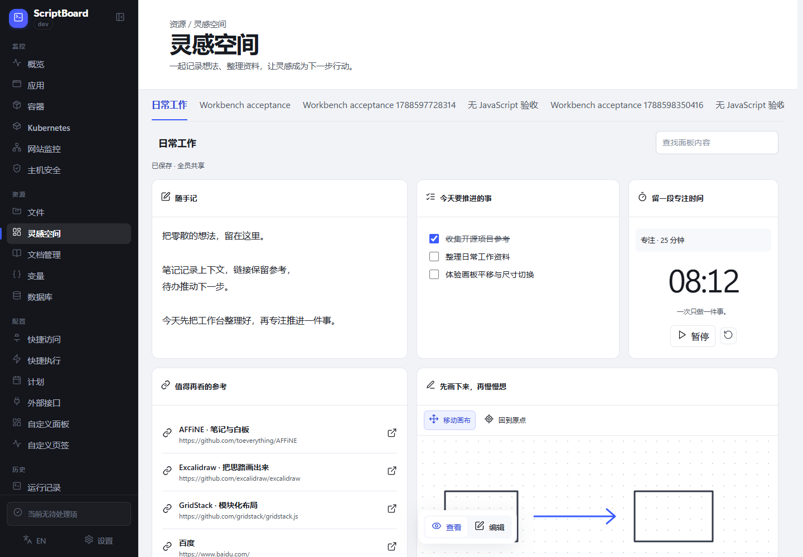
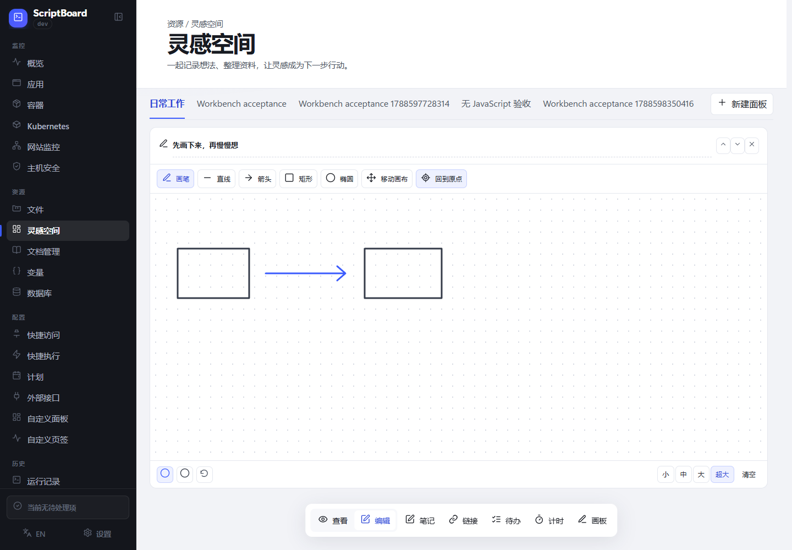
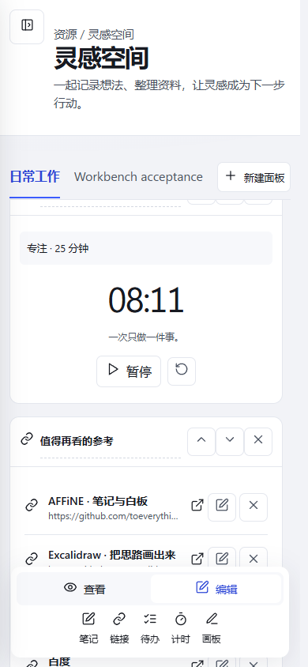
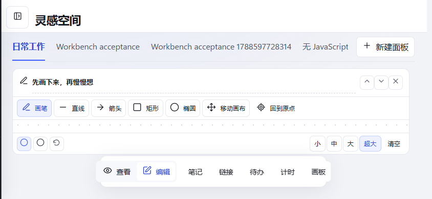

# 灵感空间验收报告

日期：2026-09-05

## 实现

- 入口和标题改为「灵感空间」，所有登录账号共同查看、编辑；匿名访问仍需登录。
- 顶部使用数据库页的标题结构与样式，保留固定面板栏、独立滚动和悬浮编辑工具栏。
- 画板新增直线、箭头、矩形、椭圆；支持拖拽预览、撤销、取消绘制，以及四档尺寸和平移。
- 保存后通过 SSE 通知其他客户端拉取状态；重连及网络恢复会重新同步。
- 模块独立比较版本并合并保存。不同模块互不阻塞，同模块冲突保留本地内容，可明确选择共享或本地版本。
- 编辑模式更新未编辑模块，保留正在输入的节点与焦点；输入期间延后远端排序，计时结束不重建其他编辑器。
- 面板新增、删除、名称与排序分别处理并发；删除不会丢弃他人刚保存的内容。
- schema 66 → 67 完整迁移个人面板，处理重复 ID，保留原始记录；聚合数据超过默认限额时保留足够的编辑容量。

## 验证结果

| 检查 | 结果 |
| --- | --- |
| 全量 Go 回归 | 本次功能及其余包通过；registryconnection 出现一次 Windows 临时文件重命名 Access denied，独立重跑通过 |
| 共享存储、迁移、模块合并和 SSE 专项 | 通过 |
| go vet ./... | 通过 |
| Windows 测试服务构建、Linux amd64 命令交叉构建 | 通过 |
| 仓库完整浏览器门禁 + 新增共享/同步用例 | 通过 |
| 双账号查看、普通账号编辑、匿名访问保护 | 通过 |
| 不同模块同时保存、同模块冲突及保留本地版本 | 通过 |
| 编辑期间接收其他模块更新、排序/计时不丢焦点 | 通过 |
| 断线后保存、网络恢复重新获取状态 | 通过 |
| 基础形状、取消、撤销、平移、刷新保留 | 通过 |
| 四档尺寸、桌面/移动/横屏布局 | 通过 |
| 标题字号、字重、行高及内边距与数据库页比对 | 通过 |

浏览器使用外部 Edge/Chromium。视口覆盖 1440×1000、390×844、844×390。Linux 完成交叉构建，未运行 Linux 测试；未推送远端或触发发布。

## 保留部署

- 地址：http://127.0.0.1:18786/resources/workbench
- 用户名：admin
- 密码：calibration-ledger-2026
- 数据目录：D:/Github/ScriptBoard/.scratch/inspiration-space-deployment/data
- 保留日常工作、绘图与多成员同步验收面板。原个人测试实例的数据副本仍保留。

## 截图

