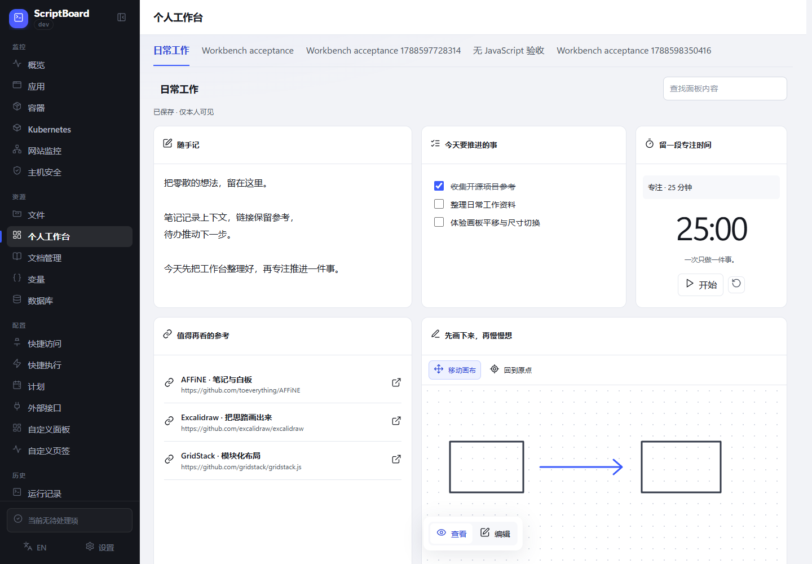
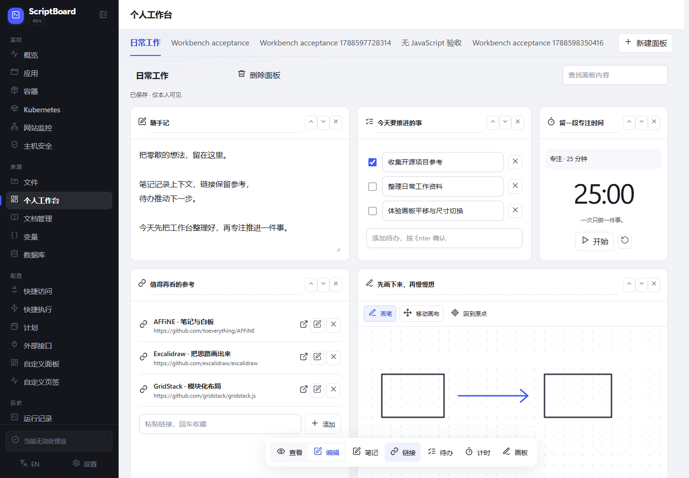
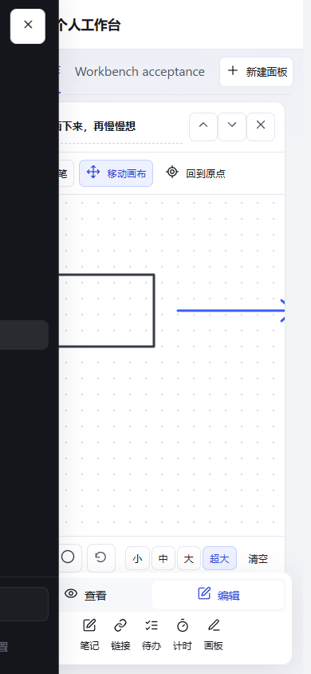

# 个人工作台本地验收报告

日期：2026-09-05

## 实现范围

- 入口：资源 → 个人工作台（`/resources/workbench`）。沿用原有应用侧栏，仅占用右侧工作区。
- 顶部和面板切换栏固定，下方内容独立滚动。底部悬浮工具栏保留查看/编辑入口。
- 支持多面板、模块标题修改、笔记、链接标题与地址编辑、待办编辑与勾选、正向及倒计时、模块排序和删除撤销。
- 画板四档视窗（小/中/大/超大），尺寸改变不缩放笔迹；超大适配可用区域。支持拖动、鼠标中键和方向键平移，回到原点、撤销笔迹和清空。
- 服务端按登录用户隔离，带版本比较的自动保存；冲突时保留当前内容并允许下载备份。普通 HTTP 可正常创建面板。
- 数据库 schema 65 → 66，现有用户保留。

## 验证结果

| 检查 | 结果 |
| --- | --- |
| `go test ./... -count=1` | 通过 |
| `go vet ./...` | 通过 |
| Windows 命令构建 | 通过 |
| Linux amd64 交叉构建 | 通过 |
| 仓库原有浏览器门禁 + 新增工作台用例 | 通过 |
| 页面访问、登录保护、CSRF 检查 | 通过 |
| 用户隔离、旧版本覆盖保护、危险链接拒绝 | 通过 |
| 笔记、链接、待办编辑与刷新后持久化 | 通过 |
| 计时开始/暂停、正计时零值刷新 | 通过 |
| 浏览器后退前完成保存、PJAX 再次进入 | 通过 |
| 四档画板尺寸、笔迹坐标不变、拖动平移 | 通过 |
| 桌面和移动端超大画板不超出内容视口 | 通过 |
| 固定面板栏、独立内容滚动、悬浮工具栏 | 通过 |
| 模拟不提供 randomUUID 的 HTTP 环境 | 通过 |
| 无 JavaScript 基础表单创建 | 通过 |
| schema 65 实际升级、保留已有用户 | 通过 |
| 外部 Edge 页面脚本异常 | 0 |

浏览器覆盖：桌面 1440×1000、移动视口 390×844。Windows 下完成测试；Linux 完成交叉构建，未在 Linux 运行测试。没有远程推送或触发 GitHub Actions。

## 保留部署

- 地址：http://127.0.0.1:18786/resources/workbench
- 用户名：`admin`
- 密码：`calibration-ledger-2026`
- 类型：本机测试实例，使用仓库 browser fixture。
- 持久化目录：`D:/Github/ScriptBoard/.scratch/personal-workbench-deployment/data`
- 保留“日常工作”、自动验收面板及无 JavaScript 验收数据。
- 该实例与原有服务分开，仅监听本机地址。

## 界面截图

